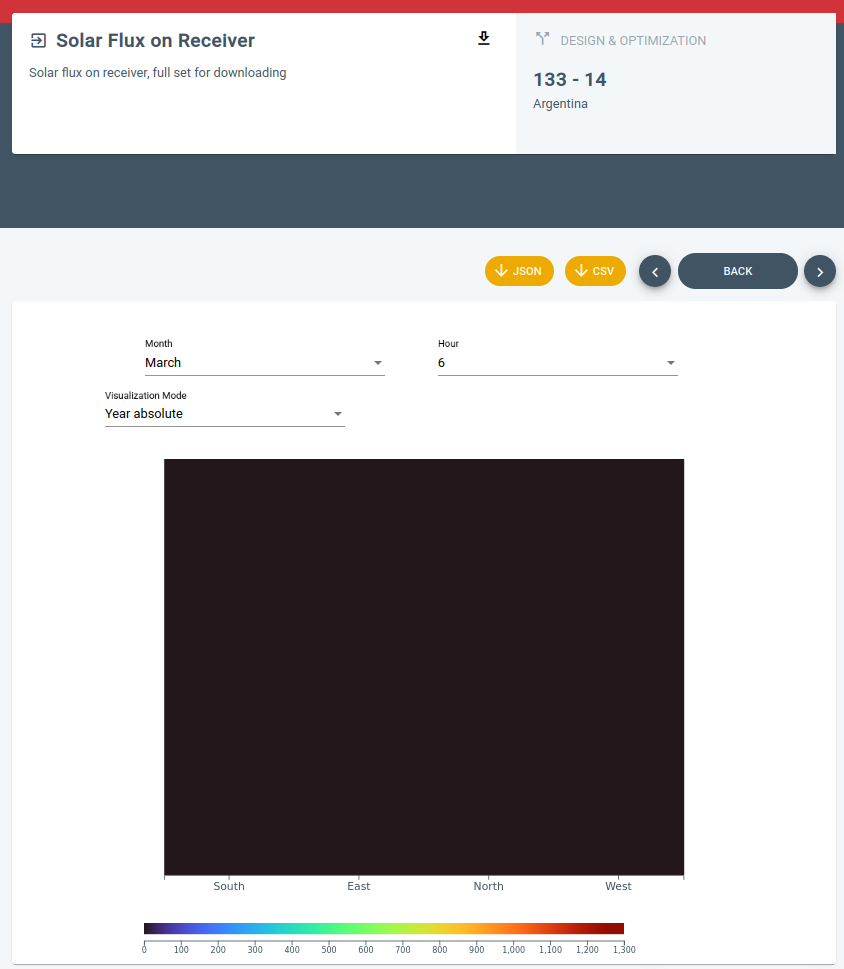

- DONE #[[Gestión general]]
  :LOGBOOK:
  CLOCK: [2022-10-31 Mon 08:15:40]--[2022-10-31 Mon 08:37:36] =>  00:21:56
  CLOCK: [2022-10-31 Mon 09:09:16]--[2022-10-31 Mon 09:12:18] =>  00:03:02
  CLOCK: [2022-10-31 Mon 09:54:56]--[2022-10-31 Mon 09:56:01] =>  00:01:05
  CLOCK: [2022-10-31 Mon 09:57:11]--[2022-10-31 Mon 10:03:14] =>  00:06:03
  CLOCK: [2022-10-31 Mon 12:14:57]--[2022-10-31 Mon 12:18:41] =>  00:03:44
  CLOCK: [2022-10-31 Mon 18:58:12]--[2022-10-31 Mon 19:15:27] =>  00:17:15
  CLOCK: [2022-10-31 Mon 19:18:04]--[2022-10-31 Mon 19:20:40] =>  00:02:36
  :END:
- DONE #Reunión #Work/Sunntics Alignment Meeting
  collapsed:: true
  :LOGBOOK:
  CLOCK: [2022-10-31 Mon 10:03:24]--[2022-10-31 Mon 10:06:00] =>  00:02:36
  CLOCK: [2022-10-31 Mon 10:06:05]--[2022-10-31 Mon 12:12:54] =>  02:06:49
  :END:
  - Nomac no hace nada, están hasta arriba pero siguen diciendo que van a echarle un vistazo a lo nuestro
- DONE #Reunión #Work/Sunntics
  :LOGBOOK:
  CLOCK: [2022-10-31 Mon 12:46:40]--[2022-10-31 Mon 13:09:06] =>  00:22:26
  :END:
- [#B] #Work/Toolsresearch Ahora que no estamos usando lo de Actividad diaria en el Journal, hacer que **mlkgraphclock** pueda buscar a qué tareas se le ha dedicado tiempo en un día concreto
- [#B] #Work/Sunntics/SunnSaaS/API Problemas en la descarga del **Heliostat Hourly Performance**: no se descargan las 24 horas, sólo 13. Probar a descarga completa del Field con los parámetros de eficiencia a ver si tira, dejar de descargar los parámetros de eficiencia si eso o poner dos botones para que se descarguen por separado (sólo coordenadas / parámetros de eficiencia).
- [#B] #Work/Sunntics/SunnSaaS Hay una serie de cambios de mispelling en un documento Drive que tenemos en **bookmarks/Sunntics/spelling errors in SunnSaaS**
- [#C] #Work/Sunntics/SunnSaaS Hay un documento en Bookmarks/Sunntics llamado **Steam optimization** que habla de una nueva operación que no tenemos muy claro si se trata de un UC aparte o de una opción. Hay que discutirlo.
- DONE #Work/Sunntics/SunnSaaS/Frontend Revisar los offsets en el frontend
  :LOGBOOK:
  CLOCK: [2022-10-31 Mon 16:11:58]--[2022-10-31 Mon 16:38:46] =>  00:26:48
  :END:
- [#C] #Work/Sunntics/SunnSaaS/Frontend Mejorar la visualización cuando no hay datos
  collapsed:: true
  - Aiming_FlatPlane
    collapsed:: true
    - 
  - FluxOnFlatPlane
    collapsed:: true
    - 