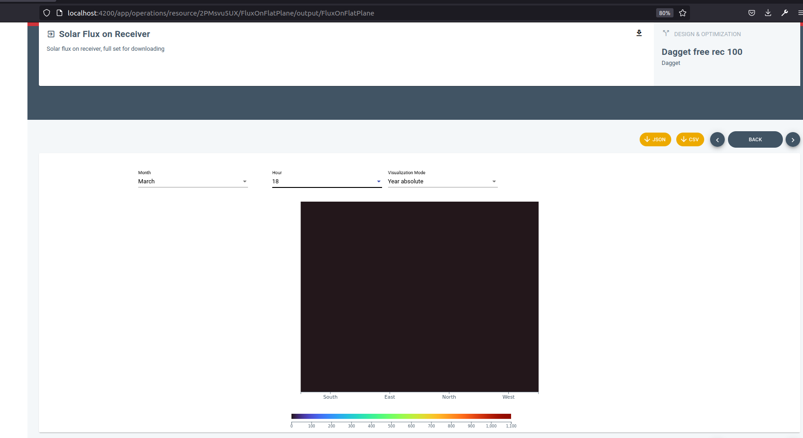
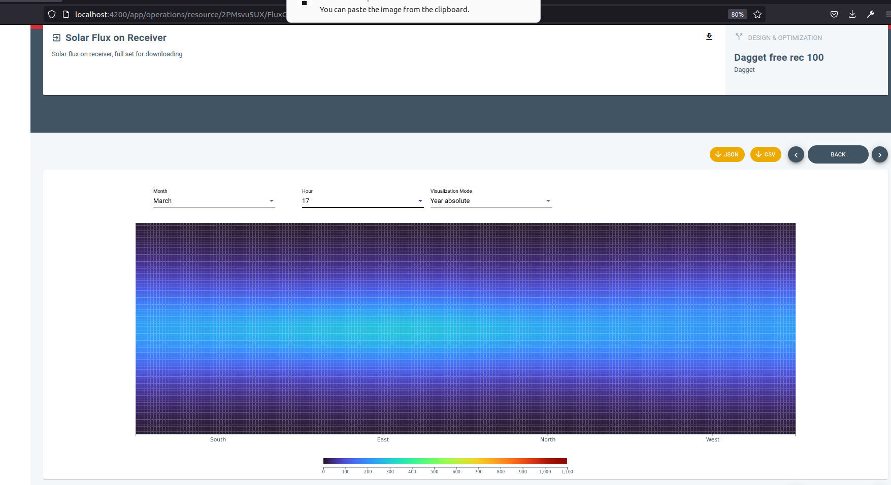
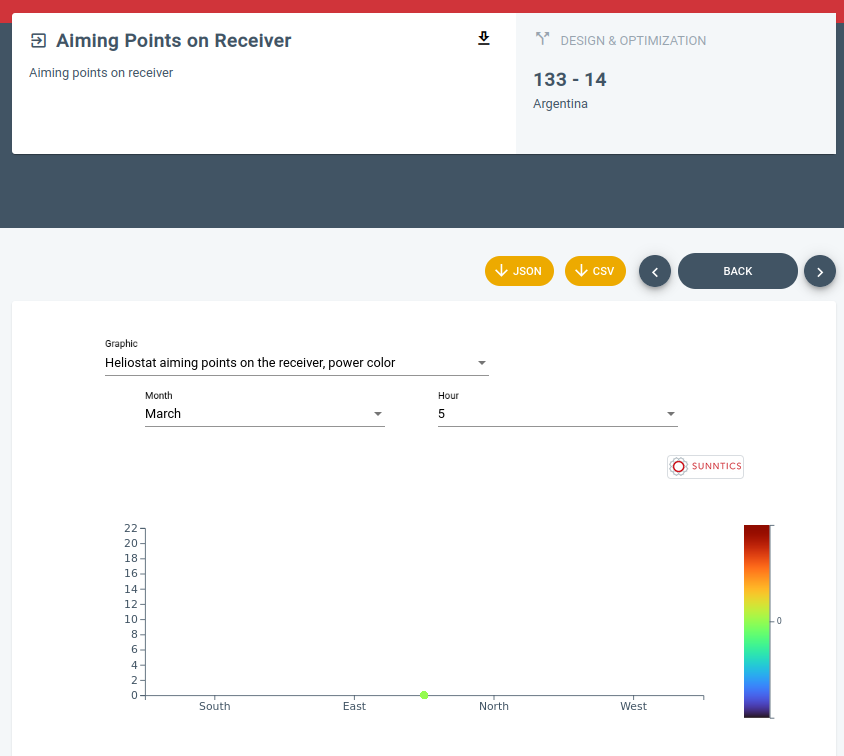

- DONE #[[Gestión general]]
  :LOGBOOK:
  CLOCK: [2022-11-15 Tue 08:45:00]--[2022-11-15 Tue 09:28:52] =>  00:43:52
  CLOCK: [2022-11-15 Tue 14:27:29]--[2022-11-15 Tue 14:40:09] =>  00:12:40
  CLOCK: [2022-11-15 Tue 14:40:30]--[2022-11-15 Tue 14:40:36] =>  00:00:06
  CLOCK: [2022-11-15 Tue 17:59:53]--[2022-11-15 Tue 18:07:22] =>  00:07:29
  CLOCK: [2022-11-15 Tue 18:59:17]--[2022-11-15 Tue 19:01:12] =>  00:01:55
  CLOCK: [2022-11-15 Tue 19:09:27]--[2022-11-15 Tue 19:15:01] =>  00:05:34
  :END:
- #Work/Sunntics/SunnSaaS Recordar que tenemos abiertas ramas 24H en todo el stack de SunnSaaS que habrá que cerrar en algún momento cuando se considere estable, esperar a lo que diga esta gente #BLK
- [#B] #Work/Toolsresearch Crear un script Python que extraiga una tag de [[Logseq]] y genere documentación en PDF y HTML con el Docker de LaTeX
- [#B] #Work/Sunntics/SunnSaaS/Frontend La pantalla FluxOnFlatPlane se queda así cuando no hay radiación
  collapsed:: true
  - 
  - Esto viene producido por encontrar como dato a renderizar un array de un sólo elemento 0. Para solventarlo, se podría mantener en memoria las dimensiones del receptor tal y como son recibidas para arrays que no son 0, aunque seguramente se están recibiendo en el paquete de datos, y crear una visualización con esas dimensiones pero con todo a 0.
  - 
- [#B] #Work/Sunntics/SunnSaaS/Frontend Arreglar este defecto en la visualizacion
  collapsed:: true
  - 
- DONE #Work/Freelancing/Cloudia Llamada Juanma
  :LOGBOOK:
  CLOCK: [2022-11-15 Tue 11:46:33]--[2022-11-15 Tue 12:36:36] =>  00:50:03
  :END:
- DONE #Work/Sunntics/SunnSaaS/Help Revisando y desplegando últimos cambios de [[Manolo Quero]]
  :LOGBOOK:
  CLOCK: [2022-11-15 Tue 12:39:52]--[2022-11-15 Tue 12:49:35] =>  00:09:43
  :END:
- #Referencia #D3 El repositorio del frontend de SunnSaaS, a pesar del Angular, tiene algunos D3 muy aprovechables en la carpeta **shared/d3-graphs**
- DONE #Work/Sunntics #Reunión
  :LOGBOOK:
  CLOCK: [2022-11-15 Tue 16:41:24]--[2022-11-15 Tue 17:57:21] =>  01:15:57
  :END:
- [#C] #Work/Freelancing/US Estudiar las capacidades de MapServer como servidor WFS en GeoJSON
- DONE #Work/Sunntics/SunnSaaS ¡OJO! Hemos estado trabajando en libsunnsaasdef en master, hay que ver en qué estado están las branches
  :LOGBOOK:
  CLOCK: [2022-11-16 Wed 10:31:49]--[2022-11-16 Wed 10:39:43] =>  00:07:54
  :END:
- #CSS Crop a una imagen
  collapsed:: true
  - ```css
    img {
        width: 200px;
        height: 200px;
        object-fit: cover;
        border-radius: 50%;       // To convert to a circle
    }
    ```
- #CSS Overlay de divs
  collapsed:: true
  - ```html
    <div id="image">
    
        
    
        <div id="project-description">{{_project.projectdescription}}</div>
    
    </div>
    ```
  - ```css
    div#image {
        position: relative;
    }
    
    div#project-description {
        top: 0px;
        left: 0px;
        position: absolute;
        background-color: $white;
    }
    ```
- #Maths Círculos #procesar
  collapsed:: true
  - ```txt
    a,b center of circle, r radius
    
    distance to point x,y is to be r:
    
    (a-x)²+(b-y)²=r²
    
    (a) Find P and Q, the points of intersection of the line y=3x−5 and the circle C1C1 with the equation x2+y2+2x−4y−15=0.
    
    (b) T is at the centre C1C1. Show PT and QT are perpendicular.
    
    (c) A second circle C2C2 passes through P, Q and T. Find the equation of C2C2.
    
    x²+(3x-5)²+2x-4(3x-5)-15=0
    
    x²+9x²+25-30x+2x-12x+20-15=0
    
    10x²-40x+30=0
    
    
    x = (-b+-sqrt(b²-4ac)) / 2a
    
    Solutions:
    x = 3 > 3*3-5=4 > Point (3,4)
    
    x = 1 > 3*1-5=-2 > Point (1,-2) (Absurd solution follows...)
    
    For x=3:
    
    9+y²+6-4y-15=0
    y²-4y=0
    y = 4, y=0
    
    For x=1:
    1+y²+2-4y-15=0
    y²-4y-12=0
    y = 6, y = -2
    
    Test for (x,y)=(3,4), (x,y)=(3,0) for being in line:
    
    3*3-5=4 > Point (3,4) belongs to line, (3,0) not
    
    Test for (x,y)=(1,6), (x,y)=(1,-2) for being in line:
    
    3*1-5=-2 > Point (1,-2) belongs to line, (1,6) not
    
    
    
    Find center:
    
    (a-x)²+(b-y)²=r²
    
    (a-3)²+(b-4)²=(a-1)²+(b+2)²
    
    a²+9-6a+b²+16-8b=a²+1-2a+b²+4+4b
    
    9-6a+16-8b=1-2a+4+4b
    
    25-6a-8b=5-2a+4b
    4a-12b+20=0 > this is the line of all the circles that passes on given points.
    
    
    Find center from canonical circle form:
    
    x²+y²+2x-4y-15=0
    
    (a-x)²+(b-y)²=r² > a²+x²-2ax+b²+y²-2by=r² > a²+b²-r²=-15, 2x=-2ax, -4y=-2by >
    
    > 2=-2a > a = -1
    
    > -4=-2b > b = 2
    
    > 1+4-r²=-15 > -r²=-20
    
    Canonical form for circle is:
    
    (-1-x)²+(2-y)²=20
    
    Circle center is at (-1, 2)
    ```
- #MacOS iMovie
  collapsed:: true
  - Projects: iMovies projects are stored at **~/Movies**. There an **imovelibrary.library** or something like that can be found. It is in fact a folder, but Finder hides its true nature. It is a self contained folder, including the imported assets. Move this "folder" to a back up site, along with the original assets. Restoration of this library into the original folder is enough to start iMovie and recover the project.
- #Referencia #HTML #CSS Ejemplo sencillo para páginas básicas: geo-patterns
- #Referencia #HTML #CSS #JavaScript #Mapbox Ejemplo sencillo de páginas básicas: iot_mapbox_waste
- #MacOS #procesar Atajos de teclado
  collapsed:: true
  - ```txt
    # MacOS Shortcuts
    
    Change shortcuts at Preferences / Keyboard / Shortcuts.
    
    Commands:
    
    -   **CMD + Tab:** switch between applications
    
    -   **ALT + Tab / CMD + ALT + Tab:** switch between current app windows
    
    -   **CTRL + Tab:** switch between application tabs
    
    
    
    | Shortcut              | Action                  |
    | --------------------- | ----------------------- |
    | CMD + H               | Hide window.            |
    | CMD + SHIFT + 3       | Capture screen.         |
    | CMD + SHIFT + 4       | Capture zone.           |
    | CMD + SHIFT + 4 Space | Capture window or menu. |
    | CMD + Space           | Spotlight.              |
    | CMD + Space (Hold)    | Siri.                   |
    | CTRL + F2             | Focus on menu.          |
    | CTRL + CMD + F        | Toggle full screen.     |
    | CTRL + F3             | Focus Dock.             |
    | CMD + m               | Minimize.               |
    | CMD + SHIFT + P       | Show preview in Finder. |
    
    ```
- #Linux #procesar Unidades CD / DVD
  collapsed:: true
  - ```txt
    
    
    
    
    If there's any problem with RLIMIT_MEMLOCK try with sudo.
    
    To mount the DVD drive:
    
    ```Shell
    mount -t iso9660 /dev/sr0 /mnt/mountpoint
    ```
    
    
    
    # Convert CUE Images to ISO
    
    Just:
    
    ```Shell
    apt-get install ccd2iso
    
    ccd2iso whatever.bin whatever.iso
    ```
    
    
    
    
    
    
    
    
    
    
    Linux CDROM / DVD
    ===
    __TAGS:__ linux, cdrom, dvd
    
    To mount:
    
    - check for cdrom symlink at /dev;
    
    - or use lsblk or dmesg to scan devices:
    
    ```Shell
    lsblk
    dmesg | grep cd
    ```
    
    - mount:
    
    ```Shell
    mount /dev/sr0 /whatever
    mount /dev/cdrom /whatever
    ```
    
    ```
- #Redis #Procesar
  collapsed:: true
  - ```txt
    # Redis
    
    Redis is a extremely usefull in-memory key / value storage.
    
    The most important thing to remember when dealing with Redis is that
    certain operations blocks a client:
    
    - **BRPOP** and **BLPOP**;
    
    - **SUBSCRIBE**.
    
    Therefore, those operations need their own client. Create as many
    clients as needed to operate with this facilities.
    
    
    
    ## Connecting
    
    Remember: to connect to a Redis without the Redis CLI, use the
    **redis://** protocol. Do not use this with Redis CLI: use the host
    as-is.
    
    ```
- #MacOS #procesar Sistemas de ficheros para llaves USB
  collapsed:: true
  - ```txt
    # File Systems for USB Keys
    
    It seems that Mac can write to ExFAT file systems. Linux and Windows can, too. So let it be ExFAT for the enjoyment of us all.
    
    In Linux some packages needs to be installed to mount ExFAT:
    
    ```Shell
    apt-get install exfat-fuse exfat-utils
    ```
    
    
    ## Formatting an USB Key with ExFAT in Mac
    
    Use the **Disk Utility > Erase**.
    
    ```
# List ordered by time:

 ls -lht
# Reversed:

 ls -lhrt
# Sort by file size

 ls -lhS
 ```

 Cookbook
 --------
 __TAGS:__ linux, bash, cookbook, permissions, chmod

 To change permissions only to folders within a tree:

 find /opt/lampp/htdocs -type d -exec chmod 755 {} \;

 to change to files:

 find /opt/lampp/htdocs -type f -exec chmod 644 {} \;


 Ubuntu systemd Usage
 ====================
 __TAGS:__ ubuntu, system, services, systemd, start

 To manage services in a modern Ubuntu, use __systemd__:

 | Command | Use |
 | ------- | --- |
 | systemctl start SERVICE | Use it to start a service. Does not persist after reboot. |
 | systemctl stop SERVICE | Use it to stop a service. Does not persist after reboot. |
 | systemctl restart SERVICE | Use it to restart a service. |
 | systemctl reload SERVICE | If the service supports it, it will reload the config files related to it without interrupting any process that is using the service. |
 | systemctl status SERVICE | Shows the status of a service. Tells whether a service is currently running. |
 | systemctl enable SERVICE | Turns the service on, on the next reboot or on the next start event. It persists after reboot. |
 | systemctl disable SERVICE | Turns the service off on the next reboot or on the next stop event. It persists after reboot. |
 | systemctl is-enabled SERVICE | Check if a service is currently configured to start or not on the next reboot. |
 | systemctl is-active SERVICE | Check if a service is currently active. |
 | systemctl show SERVICE | Show all the information about the service. |
 | systemctl mask SERVICE | Completely disable a service by linking it to /dev/null; you cannot start the service manually or enable the service. |
 | systemctl unmask SERVICE | Removes the link to /dev/null and restores the ability to enable and or manually start the service. |


 Formatting a EXT4 Partition
 ===
 __TAGS:__ mkfs.ext4, linux, partition, formatting, hard, disk, filesystem

 Creates an EXT4 filesystem on a partition:

 mkfs.ext4 /dev/sdc1


 Tuning a EXT4 Partition
 ---
 __TAGS:__ linux, ext4, tune2fs, file, system, label, hard, disk

 Basicly, two things we do with it:

 -m 0 : removes superuser reserved space

 tune2fs -m 0 /dev/sdc1

 -L [label] : assigns a label to the partition

 tune2fs -L ssd_256 /dev/sdc1

 -i : not tested yet, but changes the checking interval of the
 partition (me thinks).

 ```
- #Linux #Ubuntu #procesar Atajos de teclado
  collapsed:: true
  - ```txt
    # Linux: Ubuntu Desktop Shortcuts
    
    Some useful shortcuts for Ubuntu / Gnome. Custom-made ones are notated:
    
    | Shortcut                       | Function                                                                  |
    | ------------------------------ | ------------------------------------------------------------------------- |
    | SUPER + e                      | Home folder (custom)                                                      |
    | SUPER + t                      | Launch terminal (custom)                                                  |
    | SUPER + w                      | Launch web browser (custom)                                               |
    | CTRL + F1                      | Synapse (custom)                                                          |
    | SUPER + C                      | Visual Studio Code (custom)                                               |
    | SUPER + F                      | Gnome Clocks (custom)                                                     |
    | ALT + PrtSc (Tools)            | Window screenshot (custom)                                                |
    | SHIFT + PrtSc (Tools)          | Area screenshot (custom)                                                  |
    | SHIFT + CTRL + PrtSc (Tools)   | Full screenshot (custom)                                                  |
    | ALT + F4                       | Close window                                                              |
    | SUPER + h                      | Hide window                                                               |
    | SUPER + TAB                    | Switch applications                                                       |
    | ALT + TAB                      | Switch windows                                                            |
    | SUPER + º                      | Switch between windows of the same app                                    |
    | SUPER + [ NUMBERS ]            | Super + number switch to the apps opened at the Dock, launch apps at Dock |
    | SUPER + Start / End            | Go to first / last workspace                                              |
    | SUPER + Page Down / Up         | Moves window to Workspace down / up                                       |
    | SUPER + SHIFT + Page Down / Up | Moves window to Workspace down / up                                       |
    | ALT + F4                       | Alt + F4 closes window                                                    |
    | ALT + space                    | App menu                                                                  |
    | ALT + [ underscored letter ]   | Access app menu                                                           |
    | ALT + escape                   | Cycle windows directly                                                    |
    | SUPER + A                      | Show all apps                                                             |
    | SUPER                          | Show overview                                                             |
    | CTRL + F2                      | Yakuake (custom)                                                          |
    | ALT + F1                       | Dashboard                                                                 |
    | F11                            | Fullscreen                                                                |
    | SUPER + SHIFT + Left / Right   | Move window to another monitor                                            |
    | SUPER + F10                    | Open Ubuntu app menu (not the apps menus)                                 |
    | SPACE                          | Nautilus: preview with Gnome-Sushi installed                              |
    
    ```
- #JavaScript Patrones #procesar
  collapsed:: true
  - ```txt
    # JavaScript Patterns
    
    if a functuon encapsulates an asynch procedure, then return a promise.
    
    A loop of promises is hard to handle. For example:
    
    ```JavaScript
    for (i=0;i<10;i++) {
    
        asynchfunctionHere()
        .then(success => {
            // promise resolved
        })
        .catch(failure => {
            // promise rejected
        });
    
    }
    ```
    
    will be resolved in an asynchroneous way and will launch several promises that will be resolved at any time. To launch them in order and synchroneously:
    
    (async function loop() {
    
        for (let i = 0; i < 10; i++) {
            await new Promise(resolve => setTimeout(resolve, Math.random() * 1000));
            console.log(i);
        }
    
    })();
    
    
    
    ## Mix Objects
    
    SettingsService.config = {...environment, ...data};
    
    let out: any = {};
    
    out = { ...out, ...{
      a: 33,
      b: 45
    }};
    
    out = { ...out, ...{
      c: 43,
      d: 12
    }}
    
    ```
- #Git #Procesar
  collapsed:: true
  - ```txt
    
    Git
    ===
    __TAGS:__ git, version, control
    
    Stuff about Git, version control system by Linus Torvalds himself.
    
    Protocols
    ---------
    __TAGS:__ git, protocols, version, control
    
    All repos will be in /home/git. In Windows, in c:\git.
    
    Install
    -------
    __TAGS:__ git, install, version, control
    
    Just:
    
    ```Shell
    configure
    make
    make install
    ```
    
    Use BitBucket or GitHub. Configure Kompare and Emacs ediff as diff tool.
    
    Also from repos:
    
    ```Shell
    apt-get install git
    ```
    
    Configure Emacs ediff as Diff and Merge Tool
    --------------------------------------------
    __TAGS:__ git, diff, emacs, ediff
    
    Use __emacs --daemon__. Add to __~/.gitconfig__:
    
    ```Shell
    [difftool "ediff"]
         cmd = emacsclient --eval \"(ediff-files \\\"$LOCAL\\\" \\\"$REMOTE\\\")\"
    ```
    
    Also __Emacs__ can be use:
    
    ```Shell
    [difftool "ediff"]
         cmd = emacs --eval \"(ediff-files \\\"$LOCAL\\\" \\\"$REMOTE\\\")\"
    ```
    
    To invoke it:
    
    ```Shell
    git difftool --tool=ediff 40850edfa8c9208ac58f722a23e39272c9b30b1b..6b941e118487a1076862f8cb8b12a0460e9f45d1 -- Org-Mode/Things.org
    ```
    
    Configure Kompare as Diff and Merge Tool
    ----------------------------------------
    __TAGS:__ git, diff, merge, kompare, differences
    
    To configure Kompare as tool for diff and merge:
    
    ```Shell
    git config --global merge.tool kompare
    ```
    
    From this point on, files can be diff between commits like this:
    
    ```Shell
    git difftool 40850edfa8c9208ac58f722a23e39272c9b30b1b..6b941e118487a1076862f8cb8b12a0460e9f45d1 -- Org-Mode/Things.org
    ```
    
    Working with Local Branches
    ---------------------------
    __TAGS:__ git, branches, local
    
    To create a new branch and switch to it:
    
    ```Shell
    git checkout -b [branch name]
    ```
    
    To rename a local branch:
    
    ```Shell
    git branch -m [oldname] [newname]
    ```
    
    to rename the current branch, [oldname] can be omitted.
    
    To delete a local branch:
    
    ```Shell
    git branch -d [name]
    ```
    
    -D to delete without confirmation.
    
    Working with Remote Branches
    ----------------------------
    __TAGS:__ git, version, control, branches, remote
    
    If the remote branch was deleted by someone else, _prune_ untrack all of them:
    
    ```Shell
    git remote prune origin
    ```
    
    Finally, to push to the remote a new local branch and track it:
    
    ```Shell
    git push -u origin branch_name
    ```
    
    If a new blank GitHub repository is created and was to be merged with a local one, follow this steps:
    
    ```Shell
    git remote add -f --tags -t master origin git@github.com:malkab/Text-Workflows.git
    
    git fetch
    ```
    
    
    Working with Submodules
    -----------------------
    __TAGS:__ git, submodules
    
    To add a Git repo as a submodule:
    
    ```Shell
    git submodule add https://path/to/repo path/to/deploy/it/into
    ```
    
    use path/to/repo pointing to the GitHub repo, if any, always, ALWAYS, in __HTTPS format__. __path/to/deploy/it/into__ should not exists. The folder will be created and the submodule repo will be deployed right using it as root. This command can only by run in the root of the parent Git repo. This command creates a _.gitmodules_ files that needs to be tracked, as well as tracking the path where the submodule has been deployed. Both are automatically added to the next commit. Its changes are not tracked the usual way, however, unless you enter into the deployment folder. All submodules are tracked by the commit hash, they don't ever refere to its status with a symbolic reference like "master". When a submodule is commited, Git creates a new mode 160000 which is of exclusive use for submodules. All Git commands works indepently on both the parent project and the submodule. To check for deployed submodules, run at parent project root:
    
    ```Shell
    git submodule
    ```
    
    When cloning a project with a submodule, the deployment folders are created, but they are initially empty. To initialize them, an init command is to be issued at the superproject root:
    
    ```Shell
    git submodule init
    ```
    
    followed by a submodule update:
    
    ```Shell
    git submodule update
    ```
    
    This has to be done on a per submodule basis. If a submodule is added to the project early on and initialized, and another one is created later in the project, the new submodule should be initialized individually as the first one was, with a __init__. Subsequent __update__ will update both submodules. Submodules are not updated by default by commits and merges from the parent project. Only the pointer to the correct commit is pulled, but actual submodule update has to be done explicitly, entering at root:
    
    ```Shell
    git submodule update
    ```
    
    Of course, inside the submodule folder there is a whole __git__ repo, so we can operate switching branches and fetching the usual way:
    
    ```Shell
    git checkout branch_name
    git fetch
    git pull
    ```
    
    __/!\ However, NEVER, EVER__ make changes or make commits in the submodule. Do changes in the real git repo instead, all only pull and update in submodules.
    
    __No trailing slash in $path_to_submodule, beware.__ Commit. Then, remove submodule folder from the index:
    
    ```Shell
    git rm --cached path_to_submodule
    ```
    
    Commit and delete unused files:
    
    ```Shell
    rm -rf path_to_submodule
    
    rm -rf .git/modules/submodulepath
    ```
    
    Accessing Older Commits in a Branch
    -----------------------------------
    __TAGS:__ git, commit, revert, trash
    
    To change to an old commit, just look for it with log and checkout it:
    
        git log
      git checkout commithash
    
    this will put Git in Detached Head state, meaning a commit without link to any reference symbol like master or a branch name is the current active one. To return to the branch head, just:
    
        git checkout branchname
    
    The detached head can be relinked to a symbolic name by creating a new branch upon it:
    
        git checkout -b new_branch_name
    
    To delete unpublished commits:
    
        git reset --hard commithash
    
    it will destroy any changes. To keep them and apply to another commit:
    
        git stash
      git reset --hard commithash
      git stash pop
    
    to undo published commits, without reseting the branch (rewriting history), _revert_ is used. Reverting creates a new commit with the reverse patch to cancel the effects of the commits we'd like to revert. The commits to revert are those whose effects we'd like to eliminate:
    
        git revert commithash
      git revert HEAD~2..HEAD
      git revert -m 1
    
    To reset a changed file in the stash:
    
        git checkout -- path/to/file
    
    Looking for Files in Log
    ------------------------
    __TAGS:__ git, history, files, search, log, history
    
    This is the workflow to search for a deleted file in the log. First, get all log entries that contain deleted files:
    
    ```Shell
    git log --diff-filter=D --summary | grep delete
    ```
    
    Find the file and its path. To get the commits in which the file was subjected to changes:
    
    ```Shell
    git log --all -- FILEPATH
    ```
    
    Finally, to view those changes:
    
    ```Shell
    git show COMMIT_ID -- FILEPATH
    ```
    
    For fast recuperation, if it is not too big:
    
    ```Shell
    git show COMMIT_ID -- FILEPATH > file.diff
    ```
    
    Merges
    ------
    __TAGS:__ git, merges, undo, conflicts
    
    To undo a merge with conflicts, in a recent git:
    
        git merge --abort
    
    
    
    Cookbook
    --------
    __TAGS:__ git, cookbook, untrack
    
    To untrack an already committed folder:
    
    ```Shell
    git rm -r --cached folder
    ```
    
    To untrack an already commited file:
    
    ```Shell
    git rm --cached path_to_file
    ```
    
    To get all commits where a file was manipulated:
    
    ```Shell
    git log --follow Work-Packages/SymbolicGrids/
    ```
    
    To nuke a commit:
    
    ```Shell
    git reset --hard commit
    ```
    
    where commit is the hash of the previous commit.
    
    To remove a file from a commit (for example, when cannot push to GitHub due to size):
    
    ```Shell
    git reset --soft HEAD^
    ```
    
    then commit again.
    
    Stashing
    --------
    __TAGS:__ git, stash
    
    __Stashing__ allows to temporarily save changes in a branch without commiting them. For example, you have changes in a branch that you don't want to commit, but need to checkout another one. GIT won't allow you to do that until you commit the changes in the current branch or revert them. The answer is stashing.
    
    Stash usage:
    
    ```Shell
    git stash
    
    git stash list
    
    git stash show
    
    git stash apply
    
    git stash clear
    ```
    
    which makes:
    
    - stash changes in current branch;
    - list stashed phases;
    - shows info about different stashed phases;
    - applies again stashed stuff;
    - clears the stashes stuff, potentially causing data loss!
    ```
- #Procesar
  collapsed:: true
  - ```txt
    
    SSH
    ===
    __TAGS:__ ssh, security
    
    
    Configuring SSH & SFTP
    ----------------------
    __TAGS:__ ssh, configuring, access, user, sftp
    
    To configure a user to use SSH, simply create it this way:
    
    ```Shell
    adduser --home /whatever/home --ingroup whatevergroup --shell /bin/bash username
    ```
    
    Check user creation section for details on available shells.
    
    It is also possible to configure a user to log in only to the SFTP service. First, make sure that the SFTP "shell", __/usr/lib/openssh/sftp-server__, is listed in __/etc/shells__. Second, create the user this way or edit __/etc/passwd__:
    
    ```Shell
    adduser --home /whatever/home --ingroup whatevergroup --shell
    ```
    
    Don't forget to restart SSH service:
    
    ```Shell
    service ssh restart
    ```
    
    Don't forget also to add the user to __AllowUsers__ in __sshd_config__. To try access:
    
    ```Shell
    ssh -p 443 user@host
    sftp -P 443 user@host
    ```
    
    The first shouldn't work, the second should do.
    
    Service Management
    ------------------
    __TAGS:__ ssh, sftp, service, start, stop, restart
    
    The usual:
    
    ```Shell
    service ssh start
    service ssh stop
    service ssh restart
    ```
    
    Also manual start for Dockers:
    
    ```Shell
    /usr/sbin/sshd -D
    ```
    ```
- #Linux Unidades de CD / DVD
  collapsed:: true
  - Encontrar el nombre de la unidad
    - ```shell
      dmesg | egrep -i --color 'cdrom|dvd|cd/rw|writer'
      ```
  - Escribir en CD o DVD con **wodim**
    - ```shell
      wodim -v dev=/dev/sr0 -dao /home/user/file.iso
      ```