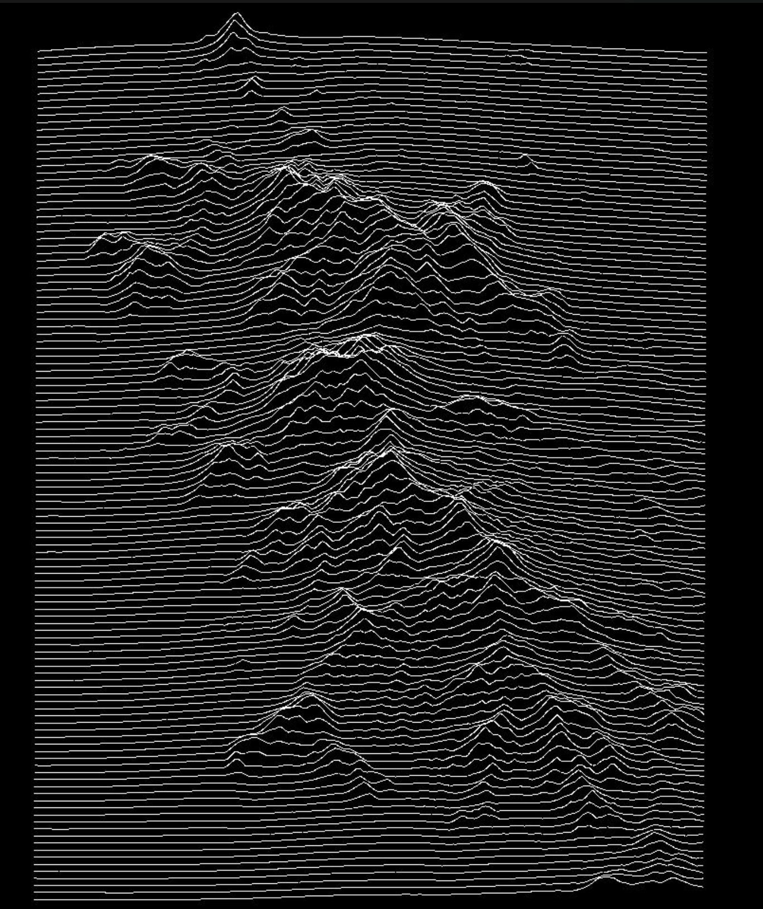

- DONE Organización [[Logseq]]
  :logbook:
  CLOCK: [2022-09-06 Tue 09:00:00]--[2022-09-06 Tue 10:00:00] =>  01:00:00
  CLOCK: [2022-09-06 Tue 10:30:00]--[2022-09-06 Tue 11:00:00] =>  00:30:00
  CLOCK: [2022-09-06 Tue 11:00:00]--[2022-09-06 Tue 11:45:00] =>  00:45:00
  :END:
- [#C] [How to Update to Newer Version of Logseq without losing plugins, etc ? Linux - Questions & Help - Logseq](https://discuss.logseq.com/t/how-to-update-to-newer-version-of-logseq-without-losing-plugins-etc-linux/7935)
- [#B] Ver el Thunder API client del [[Visual Studio Code]], parece útil (lo tenemos instalado)
- [#C] Reproducir
  collapsed:: true
  - 
- [#C] Ver qué extensiones y temas de [[logseq]] tenemos instalado y documentar
