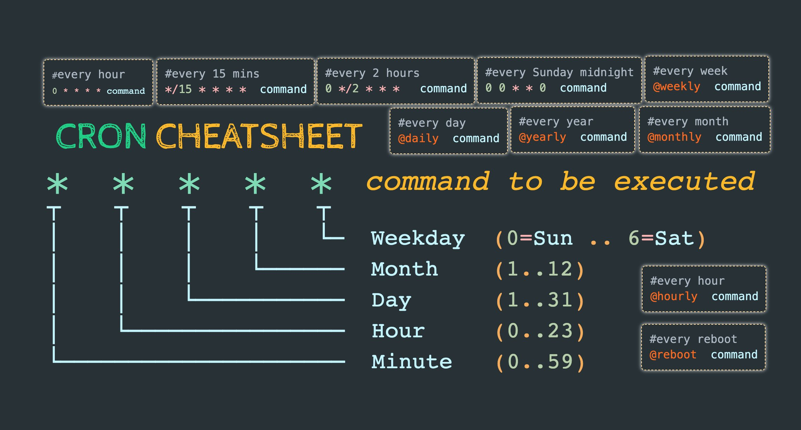

- [#C] Crear una aplicación que coja unas tags determinadas (por ejemplo, de un grafo y con prioridades de tarea) y haga un selector A/B para ir clasificando prioridades
- [#C] Crear una aplicación que use la API de Raindrop para hacer, según una tag, un proceso selector A/B
- [#C] Estudiar e intentar reproducir este artículo de [[Pilar Díaz Cuevas]]
  collapsed:: true
  - 
    -
  -
- [#C] Ver [[Docker]]
  collapsed:: true
  - 
  -
- [#C] [[CRON]]
  collapsed:: true
  - 
    -
- [#C] [[TypeScript]] timestamps
  collapsed:: true
  - ```TypeScript
    // Check malkab/ts-utils repo
    
    const humanReadableTs: () => string = () => {
    
      return new Date(Date.now()).toUTCString();
    
    }
    
    const humanReadableTs2: () => string = () => {
    
      const date: Date = new Date(Date.now());
    
      // Modify numbers
    
      const m: number = date.getUTCMonth();
      const month: string = m > 9 ? m.toString() : `0${m}`;
    
      const d: number = date.getUTCDay();
      const day: string = d > 9 ? d.toString() : `0${d}`;
    
      const h: number = date.getUTCHours();
      const hours: string = h > 9 ? h.toString() : `0${h}`;
    
      const mi: number = date.getUTCMinutes();
      const minutes: string = mi > 9 ? mi.toString() : `0${mi}`;
    
      const s: number = date.getUTCSeconds();
      const seconds: string = s > 9 ? s.toString() : `0${s}`;
    
      return `${date.getUTCFullYear()}-${month}-${day} ${hours}:${minutes}:${seconds}`;
    
    }
    ```
- [#C] Revisar repos:
  collapsed:: true
  - [Repo](https://github.com/malkab/didactica-master_us_bdg)
  - [Repo](https://github.com/malkab/didactica-postgis_geomodels-infraestructuras)
  - [Repo](https://github.com/malkab/DIDACTICA-GeoServer)
  - [Repo](https://github.com/malkab/Taak)
- [#C] Existe un repo llamado [Dissemination-Miscellanea](https://github.com/malkab/Dissemination-Miscellanea) que contiene información antigua pero aprovechable, entre ellos, un montón de showcases seleccionados y algún que otro tema que puede servir en el futuro para ejemplos y prácticas. DEPRECAR.
- [#C] Existe un repo llamado [DIDACTICA-Andalucia_Digital_Week-CARTO_Workshop](https://github.com/malkab/DIDACTICA-Andalucia_Digital_Week-CARTO_Workshop) que contiene cosas interesantes, posiblemente a deprecar.
- [#C] Este repo [DIDACTICA-Urban_Patterns](https://github.com/malkab/DIDACTICA-Urban_Patterns) tiene ideas interesantes, rescatar.
- [#C] Este repo [DIDACTICA-Linear_Programming](https://github.com/malkab/DIDACTICA-Linear_Programming) tiene ideas INTERESANTÍSIMAS que merece mucho la pena rescatar. Tenemos el libro acompañante por ahí.
- [#C] El directorio **valuable_legacy_stuff** tiene cosas interesantes que habría que mirar, como lo de CASER.
- [#C] El repositorio [Pressman](https://github.com/malkab/pressman) tiene ideas interesantes para hacer cosas curiosas con PG desde Python. Combinado con una idea que tenemos por ahí para controlar desde Python todo el levantamiento de contenedores Docker para hacer operaciones atómicas, puede ayudar en los flujos de trabajo de geociencia. El repo [https://github.com/malkab/coast](https://github.com/malkab/coast) va también en esa línea, pero centralizando todo el asunto en [[RabbitMQ]]. Mirar.
- [#C] El repo [https://github.com/malkab/tussam](https://github.com/malkab/tussam) tiene el concepto ese de la inversión de la red para ver lo de los giros que puede ser interesante, mirar.