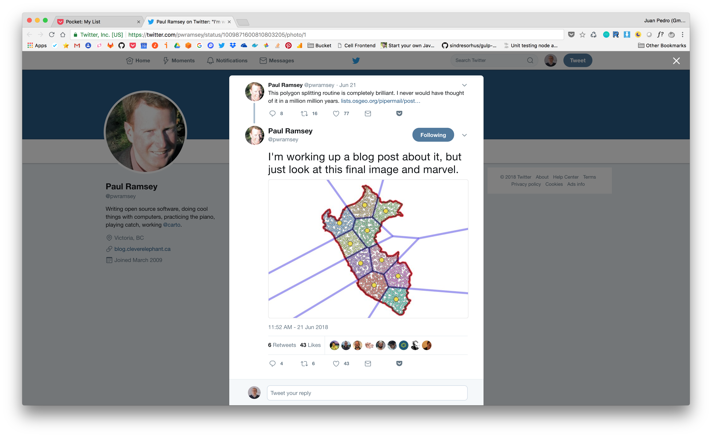
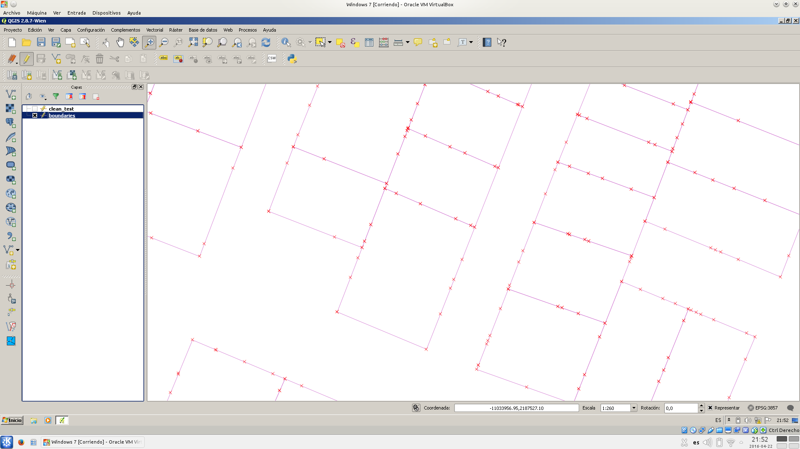
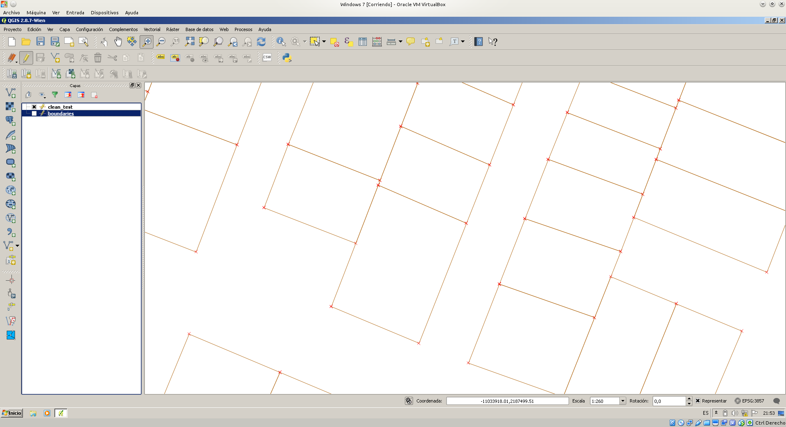

- DONE Documentando [[Ansible]] y haciendo una boilerplate con la nueva versión Ansible del proxy [[NGINX]].
  :LOGBOOK:
  CLOCK: [2023-03-07 Tue 14:04:26]--[2023-03-07 Tue 14:51:59] =>  00:47:33
  CLOCK: [2023-03-07 Tue 16:24:30]--[2023-03-07 Tue 16:47:48] =>  00:23:18
  CLOCK: [2023-03-07 Tue 17:03:34]--[2023-03-07 Tue 18:40:17] =>  01:36:43
  CLOCK: [2023-03-07 Tue 19:11:27]--[2023-03-07 Tue 20:07:39] =>  00:56:12
  :END:
- [#A] Normas [[Logseq]]: las etiquetas utilitarias que se suelen utilizar al principio de bloque como **reunión** o **work/x** y esas cosas que vayan siempre en minúscula y con acentos. No así las que son nombres propios como **Logseq** que se suelen utilizar inline.
  collapsed:: true
  - También intentar poner el bloque en su día si tiene un DEADLINE con el plugin de calendario.
- [#A] Documentar la exportación en cell_raw_data 080/gdal
- [#A] Nueva idea para herramienta: crear, a partir de los datos de mlkctxt, un constructor de contextos para PostgreSQL. Esta herramienta escribiría automáticamente los ficheros 010-contextsl.sql. La idea sería que todo estuviera centralizado en mlkctxt y que este, al ejecutar, así como busca ficheros .mlkctxt_template, también buscara ciertos ficheros de configuración que de contextos SQL en el que explicitara que variables definidas en mlkctxt se utilizan en el contexto SQL y de esta forma escribiera un 010-context con todos los contextos adecuados, además de dejar en la cabecera la lista de contextos disponibles y el contexto seleccionado.
  collapsed:: true
  - Quizás, mejor pensado, debería ser una herramienta separada que leyera el contexto generado por mlkctxt y accediera a sus variables de entorno con alguna expresión que le diga "y esta variable la sacas del entorno"
  - Los contextos pueden establecer variables a verdadero y falso para que los scripts que preparan los datos de prueba y demás hagan tareas comunes. Por ejemplo, si dos contextos preparan el 80% de sus fuentes de datos de forma análoga, debería haber una variable booleana en ambos que activara ese proceso, si nperjuicio de que cada contexto después pudiera habilitar acciones individuales
- #Referencia #TypeScript #JavaScript Buenas funciones de trabajo con ficheros y directorios en TS en los nuevos tests de libsunnsaasbackend
- [#A] Poner en orden la sección de templates de [[Logseq]], mirar las templates de Agenda, donde hay Deadline y Scheduled tanto generales como filtrados por proyecto
- [#B] Ver las novedades del mes del VSC
- DONE Poniendo en marcha de nuevo el script de copia de seguridad de las bases de datos de kepler
  :logbook:
  CLOCK: [2022-12-14 Wed 10:40:55]--[2022-12-14 Wed 11:21:27] =>  00:40:32
  CLOCK: [2022-12-14 Wed 11:40:51]--[2022-12-14 Wed 11:43:08] =>  00:02:17
  :END:
- DONE Evaluando Raindrop.io. Mola mucho, nos lo quedamos.
  :logbook:
  CLOCK: [2022-12-12 Mon 11:22:32]--[2022-12-12 Mon 12:02:41] =>  00:40:09
  CLOCK: [2022-12-12 Mon 12:33:44]--[2022-12-12 Mon 14:54:41] =>  02:20:57
  :END:
- [#B] #Work/Toolsresearch/GeoWhale Crear un interfaz gráfico para la validación de esquemas
- [#A] #Work/Toolsresearch/GeoWhale Hay un ejemplo en cell_raw_data_example que es lo que hay que transformar en workflow
- [#B] #Python #Referencia Documentar esto, **click** es una gran librería Python para CLI. Componer un ejemplo usable y colgarlo también en la boilerplate de Python.
  collapsed:: true
  - ``` python
        #!/usr/bin/env python3
        # coding=UTF8

        import sys
        import os
        sys.path.insert(0, os.path.abspath(os.path.join(os.path.dirname(__file__), '..')))
        import click

        from cli_helpers import debug_print as dp

        @click.group()
        def cli():
          dp("cli")

        @click.command()
        @click.option("--aaa", default=1, help="A help")
        @click.option("-a", prompt="Name here:", default="no name", help="A help")
        def hello(aaa, a):
          dp("D: ", aaa, a)

          for x in range(aaa):
            click.echo(f"D: {a}")

        @click.command()
        @click.argument("name", default="YYY", required=True)
        def another_command(name):
          """Command documentation, talk about NAME (defaults to YYY) here.

          Can be multiline, command help only takes the first line above, full
          command help shows this paragraph too."""
          dp("another_command", name)

        cli.add_command(hello)
        cli.add_command(another_command)

        cli()
    ```
- [#B] Ampliar la funcionalidad de helpers_cli Python para tener un control basado en TreeInput que vaya enlazando categorías como listas enlazadas: primero se hace una selección, que lleva a otra, que lleva a otra, y así hasta la final que ya no tenga hojas. En forma de árbol.
- [#B] helpers_cli Python: crear un nuevo componente input de pulsación única usando la librería sshkeyboard para ahorrarnos la pulsación del ENTER en preguntas que precisan de sólo una pulsación, como SI/NO
- [#C] #Work/Toolsresearch/GeoWhale Source mapping: ir a la tabla de metadatos de columnas y ver si existen las que tienen que estar, escribir un yaml para generar el mapping con alias y orden.
  collapsed:: true
  :LOGBOOK:
  CLOCK: [2022-11-22 Tue 10:54:44]--[2022-11-22 Tue 10:55:19] =>  00:00:35
  CLOCK: [2022-11-22 Tue 11:50:26]--[2022-11-22 Tue 12:07:17] =>  00:16:51
  CLOCK: [2022-11-22 Tue 12:11:40]--[2022-11-22 Tue 13:57:55] =>  01:46:15
  CLOCK: [2022-11-22 Tue 16:15:17]--[2022-11-22 Tue 19:29:58] =>  03:14:41
  CLOCK: [2022-11-23 Wed 11:20:37]--[2022-11-23 Wed 11:22:03] =>  00:01:26
  CLOCK: [2022-11-23 Wed 12:35:34]--[2022-11-23 Wed 14:09:34] =>  01:34:00
  CLOCK: [2022-11-23 Wed 16:08:48]--[2022-11-23 Wed 18:12:47] =>  02:03:59
  CLOCK: [2022-11-23 Wed 18:22:46]--[2022-11-23 Wed 19:22:30] =>  00:59:44
  CLOCK: [2022-11-24 Thu 09:25:44]--[2022-11-24 Thu 09:28:23] =>  00:02:39
  CLOCK: [2022-11-24 Thu 10:58:48]--[2022-11-24 Thu 11:07:41] =>  00:08:53
  CLOCK: [2022-11-24 Thu 11:21:58]--[2022-11-24 Thu 12:33:27] =>  01:11:29
  CLOCK: [2022-11-24 Thu 12:52:48]--[2022-11-24 Thu 13:51:08] =>  00:58:20
  CLOCK: [2022-11-24 Thu 14:00:00]--[2022-11-24 Thu 14:20:00] =>  00:20:00
  CLOCK: [2022-11-24 Thu 16:36:44]--[2022-11-24 Thu 20:06:03] =>  03:29:19
  CLOCK: [2022-11-25 Fri 10:08:03]--[2022-11-25 Fri 11:59:40] =>  01:51:37
  CLOCK: [2022-11-25 Fri 12:19:30]--[2022-11-25 Fri 13:36:46] =>  01:17:16
  CLOCK: [2022-11-25 Fri 13:50:17]--[2022-11-25 Fri 14:49:52] =>  00:59:35
  :END:
  - Continuar con el validador de esquemas, ficheros **schemavalidator**, **basecolumn**, **workflow** y **table**, tests en **test**
  - El objetivo es poner en marcha dos productos:
    - un script para sacar el esquema en YAML compatible con corta y pega del YAML que define el workflow
    - un ejecutador de workflows que cubra el caso del comparador de esquemas de tabla en base de datos y esquema con el que tiene que coincidir. Ver claves primarias y unicidad de campos.
    - Continuar creando los tests en test / 040 y 100
- DONE Ver lo de Mar: Proxy, en Gmail
  :logbook:
  CLOCK: [2022-11-22 Tue 10:23:14]--[2022-11-22 Tue 10:54:24] =>  00:31:10
  :END:
- DONE Trasteo Logseq
  :LOGBOOK:
  CLOCK: [2022-11-21 Mon 09:46:02]--[2022-11-21 Mon 09:51:20] =>  00:05:18
  CLOCK: [2022-11-21 Mon 09:51:20]--[2022-11-21 Mon 10:11:41] =>  00:20:21
  CLOCK: [2022-11-21 Mon 10:11:48]--[2022-11-21 Mon 10:20:10] =>  00:08:22
  :END:
- DONE Repasar cambios en Marvel Champions y documentar, pasar el inputtree a su sitio
  :logbook:
  CLOCK: [2022-11-22 Tue 10:55:45]--[2022-11-22 Tue 11:08:28] =>  00:12:43
  :END:
- [#C] #Work/Toolsresearch/GeoWhale GeoWhale
  collapsed:: true
  :LOGBOOK:
  CLOCK: [2022-11-18 Fri 11:54:13]--[2022-11-18 Fri 12:10:00] =>  00:15:47
  CLOCK: [2022-11-18 Fri 12:27:25]--[2022-11-18 Fri 14:01:13] =>  01:33:48
  CLOCK: [2022-11-23 Wed 11:22:04]--[2022-11-23 Wed 11:22:44] =>  00:00:40
  CLOCK: [2022-11-23 Wed 11:42:30]--[2022-11-23 Wed 12:10:28] =>  00:27:58
  :END:
  - Deprecar el repo de PGHelpers e incluirlo en GeoWhale
  - Hemos incluido todo el material en GeoWhale, incluido el programa **mlkpghfromasprefixed.sh**
  - Habría que poner de nuevo este script en marcha y deprecar el repo postgresql_helpers
- [#B] Mejorar la comunicación de la información de solape en **mlkgraphlog**: mostrar la tarea, el fichero en la que está y los lapsos temporales involucrados de una forma más clara, en varias líneas
- DONE Cosas varias
  :LOGBOOK:
  CLOCK: [2022-11-17 Thu 17:35:34]--[2022-11-17 Thu 18:05:33] =>  00:29:59
  CLOCK: [2022-11-17 Thu 18:09:15]--[2022-11-17 Thu 19:26:51] =>  01:17:36
  :END:
- [#C] Aprender C y C++ con Qt5
- [#B] Crear un script Python que extraiga una tag de [[Logseq]] y genere documentación en PDF y HTML con el Docker de LaTeX
- DONE Hacer un script Python que construyera el select conformado correctamente a partir de N tablas
  :logbook:
  CLOCK: [2022-11-16 Wed 12:34:35]--[2022-11-16 Wed 12:35:21] =>  00:00:46
  CLOCK: [2022-11-16 Wed 12:42:06]--[2022-11-16 Wed 14:25:04] =>  01:42:58
  :END:
- [#C] COMMAND="SELECT pg_terminate_backend(pid) FROM pg_stat_get_activity(NULL::integer) WHERE datid=(SELECT oid from pg_database where datname = '${DATABASE}');" #Work/Toolsresearch
- [#C] Crear un comando Python que recorra los repositorios Git viendo su tamaño y la fecha del último commit. Los más grandes más allá de una determinada fecha son los candidatos a ser puestos en copia de seguridad y en el refrigerador y borrado de las máquinas.
- [#B] Python Geo Folium, H3, GeoPandas
- [#B] Hay que hacer otra herramienta [[Logseq]] para limpiar assets que no estén referenciados en la KB
- DONE Instalar las VSC snippets en helios
- [#B] Revisar los GIST de GitHub, poner en orden, limpiar y traer cosas aquí a [[Logseq]]
- [#B] Crear una herramienta para [[Logseq]] para hacer el listado de tags (jerárquicas también) presentes y su número en la KB
- DONE Documentar un poco las vistas materializadas. Ver ejemplos en [[G/freelancing_us/cell_db_2022/070-adscripcion_variable_a]] y aquí: [postgresql - Create primary key on materialized view in Postgres - Stack Overflow](https://stackoverflow.com/questions/54154897/create-primary-key-on-materialized-view-in-postgres)
  :logbook:
  CLOCK: [2022-11-09 Wed 21:52:31]--[2022-11-09 Wed 21:56:12] =>  00:03:41
  :END:
- DONE Documentar en #Gestión/IT lo del **dvc_storage** en Dropbox
  :logbook:
  CLOCK: [2022-11-09 Wed 21:39:34]--[2022-11-09 Wed 21:51:11] =>  00:11:37
  :END:
- [#C] Posibles categorías de gastos
  collapsed:: true
  - category_id|name
  - ALM|Alimentación
  - APE|Aparatos electrónicos
  - APR|Aportación doméstica (bidireccional)
  - BAN|Gastos bancarios
  - CBL|Balance
  - CEX|Cash no contabilizado
  - EDU|Educación
  - ING|Otros ingresos
  - MED|Medicinas / salud
  - NOM|Nómina
  - OCI|Ocio
  - OGS|Otros gastos
  - PEN|Aportación Plan de Pensiones
  - PRO|Servicios profesionales
  - REG|Regalos
  - ROP|Ropa
  - SAL|Salud
  - SEG|Seguros
  - TRA|Transportes
  - TRP|Traspaso entre cuentas
  - IMP|Impuestos y tasas gubernamentales
- Creación de divisiones a lo largo de una línea #PostgreSQL #postgis
  collapsed:: true
  - 
- Urban compactness  #Work/Toolsresearch
- [#C] Docker Soologic #procesar
  collapsed:: true
  - Hablar de la instalación del Docker Engine en una máquina: el repositorio, el registro, los volúmenes y demás.
  - Es un curso de Docker más o menos adaptado a las necesidades de SOLOGIC. Lo hacen sobre CENTOS6. Utilizan mucho TOMCAT y MySQL. No SWARM práctico, sólo teórico. Mirar Kubernetes. En dos fases: primero una con la base (unas 10 horas) y después se les deja y se vuelve a intentar solucionar cuestiones que les hayan surgido.
  - Cerrar estructura de contenidos de la primera fase y calendario.
  - Deployments to servers with Docker: always create a "docker-compose-start/stop" script to encapsulate the start and stop procedures. CD to the project folder and launch them.
  - Introducción a Docker: qué es y en qué tecnologías se apoya. Usos. Conceptos. (0.5 horas)
  - Contenedores: uso de imágenes preexistentes, gestión de contenedores (1 hora)
  - Imágenes: creación de imágenes personalizadas y contenedores (2.5 horas)
  - Persistencia de datos en el host: volúmenes (0.5 horas)
  - Orquestación de contenedores: Docker Compose y Docker Swarm (2 horas)
  - Buenas prácticas y ejemplo de despliegues (1 horas)
  - Control de contenedores en una red: Kubernetes (1.5 horas)
- #postgis Clustering por distancia
  collapsed:: true
  - This is the result of this SQL:
    ```
        	  create view trash.test as
        	  SELECT DISTINCT ON (a.nombre)
        	  a.gid,
        	  a.nombre AS anombre,
        	  b.nombre AS bnombre,
        	  st_distance(a.geom, b.geom) AS d,
        	  a.geom AS ageom,
        	  b.geom AS bgeom,
        	  st_setsrid(st_makeline(a.geom, b.geom), 25830) AS geom_line
        	  FROM
        	  test.nucleo_pun a INNER JOIN
        	  test.nucleo_pun b ON
        	  st_dwithin(a.geom, b.geom, 5000) AND a.gid<>b.gid
        	  ORDER BY
        	  a.nombre, d;
    ```
  - Could be used as an urban system clustering of sorts?
  -  #Work/Toolsresearch
- DONE Mover el almacén de dvc_storage con un vínculo a **/home/dvc_storage**. Crear un directorio similar en **helios** > NO, dvc_storage está en Dropbox. Mover lo que se hizo ayer en cell_db_2022 y moverlo a D/dvc_storage
  :logbook:
  CLOCK: [2022-11-08 Tue 14:08:10]--[2022-11-08 Tue 14:14:36] =>  00:06:26
  CLOCK: [2022-11-09 Wed 12:16:39]--[2022-11-09 Wed 12:17:54] =>  00:01:15
  :END:
- #Logseq [Quote Storage System - Logseq Queries + Smartblock Plugin - YouTube](https://www.youtube.com/watch?v=55s-K1uAUc0)
- https://circular.io/
- [#C] **Master US** #procesar
  collapsed:: true
  - ``` txt
        	- Develop and write an article / resolved exercise about the masas de agua exercise

        	  Intro postgis: la solución frl 0080 está mal porque nontiene en cuenta que los núcleos están repetidos.

        	  "Practica database

        	  Una red de distribución de paquetes.

        	  Coger el grid de la población para caracterizar a los clientes más cercanos a cada centro de reparto.

        	  Simulacro de recogidas y entregas, con el exterior, entre los centros de reparto y con el exterior del sistema.

        	  Clasificar los envíos con ciertas características: particular / empresa, retrasos en la entrega / recogida para evaluar el stress del punto de reparto.

        	  Distribución zonal del reparto en el tiempo: verano bascula a la costa.

        	  Áreas de influencia de centros y zonas de reparto.

        	  Estadísticas zonales por barrio y distrito.

        	  Estudios de deficits en el servicio.

        	  Indicador entre los portales y los datos de población. Probabilidad de encontrar estructuras de hogares en dichos portales.

        	  Los centros de reparto tienen una categoría.

        	  Contenidos:
    ```
- [#C] #Work/Toolsresearch
  collapsed:: true
  - tune2fs sirve para muchas cosas, entre otras cambiar la label:
  - tune2fs -L [ Label ] [ partición ]
  - vol_id [ partición ] da información sobre la misma.
- docker network prune -f, añadir a Docker y a la limpieza de Docker antiguo
- #PostgreSQL #postgis Forma de dividir un polígono en áreas más o menos equivalentes por un proceso de k-means
  collapsed:: true
  - 
- [#C] Círculos
  collapsed:: true
  - ``` shell
        ;; This buffer is for notes you don't want to save, and for Lisp evaluation.
        ;; If you want to create a file, visit that file with C-x C-f,
        ;; then enter the text in that file's own buffer.

        docker run -d --name whatever -e "PIP_PACKAGES=ipython;psycopg2;pytest" \
        -e "CONTAINER_USER_UID=1001" -e "CONTAINER_GROUP_ID=1002" \
        -e "ADDTOPYPATH=/home/python-dev/src" \
        -v /home/testuser/:/home/python-dev/ geographica/python_development:2.7.11


        a,b center of circle, r radius

        distance to point x,y is to be r:

        (a-x)²+(b-y)²=r²

        (a) Find P and Q, the points of intersection of the line y=3x−5 and the circle C1C1 with the equation x2+y2+2x−4y−15=0.

        (b) T is at the centre C1C1. Show PT and QT are perpendicular.

        (c) A second circle C2C2 passes through P, Q and T. Find the equation of C2C2.

        x²+(3x-5)²+2x-4(3x-5)-15=0

        x²+9x²+25-30x+2x-12x+20-15=0

        10x²-40x+30=0


        x = (-b+-sqrt(b²-4ac)) / 2a

        Solutions:
        x = 3 > 3*3-5=4 > Point (3,4)

        x = 1 > 3*1-5=-2 > Point (1,-2) (Absurd solution follows...)

        For x=3:

        9+y²+6-4y-15=0
        y²-4y=0
        y = 4, y=0

        For x=1:
        1+y²+2-4y-15=0
        y²-4y-12=0
        y = 6, y = -2

        Test for (x,y)=(3,4), (x,y)=(3,0) for being in line:

        3*3-5=4 > Point (3,4) belongs to line, (3,0) not

        Test for (x,y)=(1,6), (x,y)=(1,-2) for being in line:

        3*1-5=-2 > Point (1,-2) belongs to line, (1,6) not


        Find center:

        (a-x)²+(b-y)²=r²

        (a-3)²+(b-4)²=(a-1)²+(b+2)²

        a²+9-6a+b²+16-8b=a²+1-2a+b²+4+4b

        9-6a+16-8b=1-2a+4+4b

        25-6a-8b=5-2a+4b
        4a-12b+20=0 > this is the line of all the circles that passes on given points.


        Find center from canonical circle form:

        x²+y²+2x-4y-15=0

        (a-x)²+(b-y)²=r² > a²+x²-2ax+b²+y²-2by=r² > a²+b²-r²=-15, 2x=-2ax, -4y=-2by >

        > 2=-2a > a = -1

        > -4=-2b > b = 2

        > 1+4-r²=-15 > -r²=-20

        Canonical form for circle is:

        (-1-x)²+(2-y)²=20

        Circle center is at (-1, 2)
    ```
- [#B] [[Logseq]] shortcuts
  collapsed:: true
  :LOGBOOK:
  CLOCK: [2022-11-08 Tue 08:32:59]--[2022-11-08 Tue 08:33:06] =>  00:00:07
  :END:
  - [Logseq Cheat Sheet by bgrolleman - Download free from Cheatography - Cheatography.com: Cheat Sheets For Every Occasion](https://cheatography.com/bgrolleman/cheat-sheets/logseq/)
- DONE Probando exa. Instalar el binario desde fuente. Meter en la boilerplate de setup de un Desktop Linux.
  :logbook:
  CLOCK: [2022-11-07 Mon 11:39:54]--[2022-11-07 Mon 11:50:58] =>  00:11:04
  :END:
- [#C] Reproducir
  collapsed:: true
  - 
  - 
- [#B] Documentar e instalar en todos los ordenadores las extensiones de [[Logseq]]
- [#B] Añadir a los scripts **mlkgraph** un aviso de cuando el time lapse es inferior a un minuto, solo entorpecen e introducen errores
- [#B] Documentar el flujo de etiquetas: todo entra como B a no ser que haya una muy buena razón para que lo haga como A, LATER muestra inmediatez en el switching, y en cuanto algo se pone a trabajarse en el día se le pone un TODAY para que aparezca en las referencias
- DONE Documentar la gestión en el KB de los WP de tags y de repos, ver la template **Documentación WP**
  :LOGBOOK:
  CLOCK: [2022-11-09 Wed 22:05:28]--[2022-11-09 Wed 22:09:01] =>  00:03:33
  :END:
- DONE Describir la tag **Referencia**. Revisar las tags para darles una cierta estructura.
  :logbook:
  CLOCK: [2022-11-09 Wed 21:59:47]--[2022-11-09 Wed 22:04:21] =>  00:04:34
  :END:
- [#B] Desplegar los snippets desde [[G/boilerplates/boilerplates]] al resto de las máquinas (ya sólo erebus)
- [#C] Check tests and documentations for libraries_ts/ts_utils
- [#C] Convert the GitHub Jeckyll pages template / example at didactica-carto_barcelona_dental_location_web into a boilerplate	Try to mix it with LaTeX output. Check also how a GitHub pages like this integrates into a folder of a repo and how GitHub is able to publish the page taking that folder as the document root. Prepare also the boilerplate to work with a local Docker tool chain of Jeckyll to produce the web site locally to upload to wherever it's needed.
- [#C] Documentar el Game Bar Windows: windows + G
- [#C] Add to the docker-grass the virtualenv like the Python Docker has
- [#C] Guardar la configuración del VSC en las rutinas de montaje y desmontaje de sistemas
- [#C] GeoWhale	"Might be interesting to consider again a chain tool based on Docker to perform Geo stuff, the GeoWhale. Consider the freelancing-us/secciones_censales/wp-2021-11-24-00 workflow for importing a shapefile to PG. A tool can be created that from a YAML do the steps based on mlkctxt and the GRASS image:
  - define a PG datasource
  - define a SHAPEFILE datasource
  - define a command that runs a simple SQL command on the DB (create schema)
  - define a command that runs a GDAL import of SHP to PG
  - define a command that runs a SQL script on the DB
- [#C] Review dev-misc management notes
- [#C] Probar el Docker de PGAdmin4, dpage/pgadmin4, para ver si se puede utilizar conectado a una PostGIS en red Docker
- DONE Vamos a probar a tener un único grafo Logseq con TODO, a ver qué tal. A lo mejor hay que partirlo en años, no sé, ya veremos. Pero la potencia es tenerlo todo junto. Dejamos los otros tranquilitos, no les quitamos nada, los congelamos. Hacemos una tag en Git. Esto es una copia del antiguo **000-Gestión**. Se ha guardado una copia de seguridad de los grafos originales congelados en **graphs-BACKUP** mientras los que quedan en **graphs** se van procesando. La copia de seguridad la hemos dejado en **D/docs/technical/backups**. Procesar material de los antiguos e incorporarlos a este, **15 min**.
  :logbook:
  CLOCK: [2022-11-08 Tue 17:26:27]--[2022-11-08 Tue 17:47:50] =>  00:21:23
  :END:
- [#B] Ahora que no estamos usando lo de Actividad diaria en el Journal, hacer que **mlkgraphclock** pueda buscar a qué tareas se le ha dedicado tiempo en un día concreto
- [#B] Darle a la parte ¿Python? de mlkctxt un tratamiento pyinstaller
- [#C] Generar información poligonal, lineal y puntual de prueba con distintos ejemplos de mala calidad topológica y probar el clean de [[GRASS]]
- DONE Experimentos con [[Logseq]]
  :logbook:
  CLOCK: [2022-10-27 Thu 18:43:04]--[2022-10-27 Thu 18:47:29] =>  00:04:25
  :END:
- [#C] Sería muy útil que tanto **[[mlkctxt]]** como el script **[[rsync.sh]]** puedan darle permisos 755 a todos los .ssh en el arbol de ficheros hijos
- [#B] Cuando [[mlkctxt]] tiene una variable para las plantillas .mlkctxt_template que es numérica (como por ejemplo en los casos de versiones) como puede ser 15.0 el ".0" se pierde. Mirar qué puede estar pasando, parece que tiene un tratamiento numérico en algún momento que hace que pierda el .0. Por ejemplo, en 3.1.1 no pasa.
- DONE En **mlkgraphclock** filtrar de las tags las siguientes: BLK, A], B] y C]
  :LOGBOOK:
  CLOCK: [2022-10-25 Tue 22:20:10]--[2022-10-25 Tue 23:01:06] =>  00:40:56
  :END:
- Notas
  collapsed:: true
  - grass -c EPSG:25830 /ext_src/location/mapset
  - grass -text /ext_src/location/mapset/PERMANENT
- DONE **mlkgraphclock**: limitar las tags a tener en cuenta a **Work/*** y Gestión general
  :logbook:
  CLOCK: [2022-10-26 Wed 08:09:44]--[2022-10-26 Wed 08:38:03] =>  00:28:19
  CLOCK: [2022-10-26 Wed 09:28:57]--[2022-10-26 Wed 09:51:09] =>  00:22:12
  :END:
- [#B] Ver el Kafka para el control de proceso, así como el GRPC de Google
- [#B] Cortar conexiones a una base de datos
  collapsed:: true
  - ``` sql
        SELECT pg_terminate_backend(pg_stat_activity.pid)
        FROM pg_stat_activity
        WHERE pg_stat_activity.datname = 'cell'
        AND pid <> pg_backend_pid();
    ```
- [#B] Subir a GitHub devops en Dropbox tras ver que no lleva nada chungo
- [#B] Montar discos duros en helios
- [#C] Crear una nueva versión de las imágenes Docker de **PostGIS** y **GRASS**, con todas las nuevas versiones.
- [#C] Ver hashicorp Terraform a ver si nos sirve para algo
- [#C] Probar MongoDB con R-Tree o Cassandra con R-Tree o Clickhouse
- [#C] Añadir a la boilerplate **python-programs** algún sistema de documentación de código para Python. Echarle un ojo a cómo desplegar el proyecto de esta boilerplate si aplica. Revisar el README_boilerplate.md.
- [#C] Hay que abrir un debate sobre el DVC. En realidad, las fuentes de información grandes no están sujetas por lo general a control de versiones, sino que si hay cambios tan sólo se substituyen. Por ello, deberíamos tener una herramienta basada en rsync o similar (S3, por ejemplo) con lo que hacer una copia remota. Deberíamos hacerla en Python e integrar en ella a DVC para lo que sí que queramos que esté sujeto a control de versiones. Además, debería ser capaz de integrarse en **mlkgitstatus** para indicar que faltan cosas, o tener un comando de status para ver si la cosa está actualizada o no.
- [#C]  Pasar el boilerplate/devops/system_setup_procedures a logseq/Toolsresearch, revisar
- [#C] Añadir a la inicialización de Linux Desktop los atajos de teclado de lanzamiento rápido de aplicaciones (gnome-clocks a super-z)
- #Work/Toolsresearch
  :logbook:
  CLOCK: [2022-10-04 Wed 10:45:00]--[2022-10-04 Wed 11:30:00] =>  00:45:00
  	CLOCK: [2022-10-04 Wed 11:45:00]--[2022-10-04 Wed 13:15:00] =>  01:30:00
  	CLOCK: [2022-10-04 Wed 13:30:00]--[2022-10-04 Wed 13:35:00] =>  00:15:00
  :END:
- [#C] Revisar mlktools-mlkdck
- [#C] Hay que echarle un vistazo a mlktools-scripts
- [#C] Revisar mlktools-scripts
- DONE Echarle un vistazo al bashrc porque hace referencias a scripts que ya no utilizamos, limpiar un poco.
  :logbook:
  CLOCK: [2022-10-03 Mon 18:47:25]--[2022-10-03 Mon 18:57:27] =>  00:10:02
  :END:
- #Work/Toolsresearch
  :logbook:
  CLOCK: [2022-10-03 Wed 18:15:00]--[2022-10-03 Wed 18:45:00] =>  00:30:00
  :END:
- [#C] mlkmaintenance: ponerle sudo a las instrucciones que lo precisen
- [#C] Seguir trabajando el despliegue del Desktop en Boilerplates
- [#C] libraries_node-node_utils sigue estando limitada en la versión Node que utiliza, mirar. Mirar lo que hace.
- DONE Documentar extensiones de Logseq en euler para ponerlos en erebus
  :logbook:
  CLOCK: [2022-09-29 Thu 12:11:24]--[2022-09-29 Thu 12:24:49] =>  00:13:25
  :END:
- [#C]  Pasar el **euler/dvc_storage** a **Amazon S3** y ver cuánto nos va costando.
- [#C] Dejar madurar el node-appian y publicar una nueva versión 0.0.X
- [#C] Hacer el algoritmo de quitar vértices innecesarios de geometrías en PostGIS si forman un ángulo muy pequeño
- [#C] Test the dev-misc Express boilerplate, update it, and add to the boilerplate repo
- [#C] apt-get iotop for general Docker images
- [#C] We got an answer at GRASS user group regarding the loss of the PK, make more experiments
- [#C] Material Angular para desechar en 10-desktop, echarle un vistazo
- [#C] Test again the mlkdckpgdump and mlkdckpsql scripts	Don't know why, exactly.
- [#B] Crear una nueva versión de [[Docker]] [[GRASS]] idiosyncratic ibex basado en la nueva versión de la PostGIS
- [#C] Documentar extensiones VSC
- [#C] Seguir etiquetando emails -has:userlabels
- [#C] Volver a revisar los mlktools-scripts, hay algunos que no sabemos lo que hacen
- [#C] Drop empty groups at our GitLab account, there are still there
- [#C] Organize the node_utils TypeScript library in modules with export module {}, check documentation and tidy it up
- [#C] Revisar que guardamos los settings de VSC en Linux y en Windows y en MacOS
- [#C] When mature, extract React libraries from Airo Experiments.
- DONE Funcionalidad log en mlkgraphclock
  :logbook:
  CLOCK: [2022-11-02 Wed 16:29:31]--[2022-11-02 Wed 16:43:59] =>  00:14:28
  CLOCK: [2022-11-02 Wed 16:51:48]--[2022-11-02 Wed 16:59:32] =>  00:07:44
  CLOCK: [2022-11-02 Wed 18:09:32]--[2022-11-02 Wed 19:25:52] =>  01:16:20
  CLOCK: [2022-11-03 Thu 10:50:49]--[2022-11-03 Thu 10:57:51] =>  00:07:02
  CLOCK: [2022-11-03 Thu 10:58:03]--[2022-11-03 Thu 11:00:24] =>  00:02:21
  CLOCK: [2022-11-03 Thu 11:12:29]--[2022-11-03 Thu 11:43:09] =>  00:30:40
  CLOCK: [2022-11-03 Thu 11:58:37]--[2022-11-03 Thu 12:23:18] =>  00:24:41
  CLOCK: [2022-11-03 Thu 16:37:02]--[2022-11-03 Thu 17:25:29] =>  00:48:27
  CLOCK: [2022-11-03 Thu 17:26:10]--[2022-11-03 Thu 17:39:00] =>  00:01:50
  CLOCK: [2022-11-03 Thu 17:40:54]--[2022-11-03 Thu 18:04:00] =>  00:17:14
  CLOCK: [2022-11-03 Thu 18:11:42]--[2022-11-03 Thu 18:22:04] =>  00:10:22
  :END:
  - Ponerle un lazo, volver a compilar y publicar el mlkgraphclock
- [#C] Create a GIST about DVC, check boilerplates at mlk-dev
- [#C] Correo Antonio: gamer.campos
