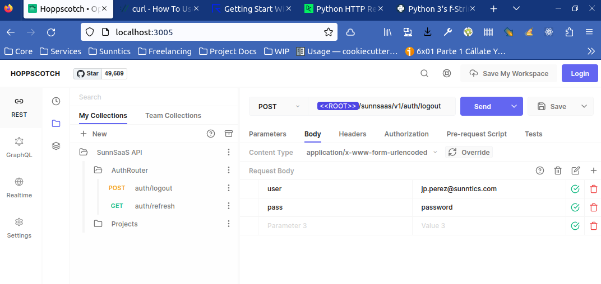
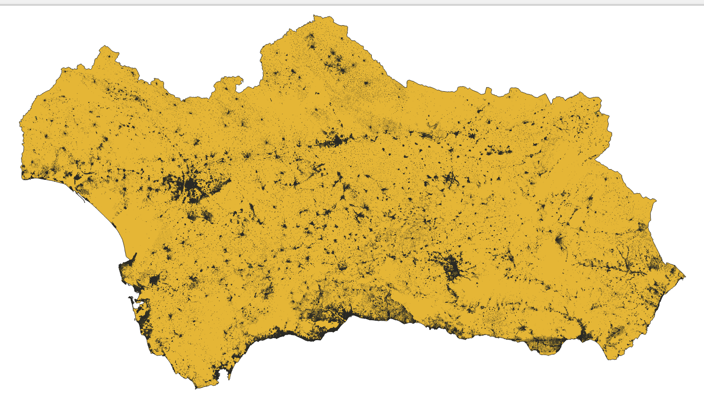

- [#A] TL/toolsresearch
  collapsed:: true
  - VSC keyboard: C + A + b abre / cierra panel de símbolos
  - C + A + click sobre símbolo: lo abre en el otro panel
- [#C] Hay material para revisar en AWS S3. Lo único que está siendo realmente utilizado por ahora es mlk-lfs/didactica y malkab. El resto debería ser descargado y procesado convenientemente. TL/toolsresearch
- [#A] Toolsresearch Utilizar en las tareas una estructura de diario, por ejemplo:
  collapsed:: true
  - Tarea X
    - FECHA CON ENLACE: descripción de la actividad ese día
    - OTRO DÍA CON ENLACE
      - Descripción de la actividad ese día
      - Otro apunte
  - Y así se va haciendo un diario de la actividad.
- Referencia Toolsresearch Ejemplo de interfaz
  collapsed:: true
  - 
- [#A] Toolsresearch Hay que llegar a una serie de acuerdos acerca de cómo usar Logseq. Por ejemplo, no mezclar la recepción de tareas en bloques que documentan conversaciones y reuniones, pero dejarlas marcadas para crear bloques con las tareas en sí. De esta manera, se separa el tiempo dedicado a lo que son comunicaciones de la realización de tareas en sí, si no, van mezcladas. También hay que llegar a un protocolo acerca de qué debe llevar un DONE y demás. Llevar también en cada tarea un diario con la macro TODAY de lo que se va haciendo o va pasando hasta que se concluya, para las tareas de varios días. Las tareas que comienzan y terminan en un sólo día no necesitan este tipo de diario dentro de la tarea.
- [#C] Toolsresearch Complemento a mlkctxt: crear una librería en Python para que Python pueda parsear y leer directamente desde las configuraciones (aunque esto implica procesar el perfil de sistema, hacerlo resistente)
- [#C] Toolsresearch El perfil de configuración de sistema es algo demasiado duro e inflexible. Las configuraciones deberían ser capaces de "importar" otras configuraciones, por lo que la de sistema se convierte en un caso de uso específico de algo más generalista
- [#A] Toolsresearch/mlkctxt Parece ser que Ansible requiere de una revisión para DevOps. Ver Raindrop.io.
- [#A] Toolsresearch/mlkctxt Tenemos un repo llamado [GitHub - malkab/Jinja2-Extensions: A serie of Jinja2 testing extensions. Jinja2 extensions seems to be great!](https://github.com/malkab/Jinja2-Extensions) con cosas que pueden ser de interés
- [#C] Toolsresearch Encontrar los lugares (círculo) más alejados de cualquier construcción con 125 metros de resolución (datos en cell_db_2020)
  collapsed:: true
  - 
- [#C] Toolsresearch/mlkctxt Eliminar el contexto por defecto default. Todos los contextos deben llevar nombre, y si no, no hay contexto. Eso sí, el nombre default queda reservado para marcar los valores por defecto cuando hay opciones contextuales.
- [#C] Toolsresearch/mlkctxt Si lo pensamos bien, muchas de las configuraciones afecta a cómo se acceden a los diferentes recursos desde diferentes máquinas. Por ejemplo, tenemos un servidor A y otro B con recursos, y estamos trabajando en una máquina C. Gran parte de los parámetros de configuración se van en configurar como C ve a los recursos A y B. Otra cosa es configurar detalles como los diferentes usuarios de acceso a recursos de A y B, que tendrán que ir por otros perfiles de configuración aparte.
- [#C] Toolsresearch/mlkctxt La funcionalidad de templates de mlkctxt no es demasiado potente. Lo mejor es que mlkctxt sea una aplicación basada en Python y que sea capaz de rastrear plantillas [Jinja](https://jinja.palletsprojects.com/) para hacer el templating. Por supuesto, debe cargar en el entorno de la consola las variables leidas. Ver [GitPython](https://gitpython.readthedocs.io), una librería para interaccionar con repos, la propia Jinja, y [esto](https://git-scm.com/docs/gitignore) para tener varios .gitignore. Por supuesto, dejar la antigua mlkctxt y crear la nueva herramienta con otro nombre.
- [#A] Toolsresearch Hay que crear una nueva herramienta para los repos Git para manejar los ficheros grandes
  collapsed:: true
  - Tiene que ser capaz de encontrar los ficheros grandes que no estén registrados aún en el sistema (crear un directorio de datos de aplicación como el .git)
  - Tiene que ser capaz de meter un fichero grande en el sistema. Se registra con su hash, se mueve al almacén de datos y se registra su hash y se hace un .gitignore
- [#C] Toolsresearch Añadir a las fuentes a DEPRECATE la revisión de todas las carpetas que hay en los Gmail, que se han quedado obsoletas
- Linux exa, un ls mejorado
  collapsed:: true
  - Instalar directamente el binario desde su página web, la versión de APT no viene con soporte Git. Tenemos una copia en G/boilerplates/boilerplates devops.
  - Ejemplos
    - ``` shell
            # Con árbol, heading e indicativo Git
            exa -lTh --git
      ```
- kepler
  collapsed:: true
  - Aplicaciones instaladas
    - cell_raw_data: una PostGIS autónoma para datos de rejilla;
    - erosionvisor5: versión de hace 5 años del visor de erosión para revisión de Pepe, sirviéndose en http://37north00.ddns.net/ y http://37north01.ddns.net/ (GeoServer);
    - renta_gridding: grideo de la renta;
    - secciones_censales: trabajo con las secciones censales.
- euler
  collapsed:: true
  - Creada una base de datos cell_raw_data para contener los datos de la rejilla. Es la base de datos que estaba anteriormente en kepler pero que con la mudanza a Arcadia hemos desplegado aquí. Su directorio de control está en devops. No instalarla como SWARM porque entonces estará siempre activa y no es lo que queremos.
- Referencia PostgreSQL Modification of a geometry column from a create table as select from to show up correctly at the geometry_columns view at freelancing_us_secciones_censales/wp-2021-06-12-00/050
- Referencia PostgreSQL Modification of a geometry column from a create table as select from to show up correctly at the geometry_columns view at freelancing_us_secciones_censales/wp-2021-06-12-00/050
- Referencia curl api cURL scripts to interact with API: sunnsaas_v1, including securized ones
- Referencia d3 react D3: interesantes desarrollos en SunnSaaS Frontend para pasar a React
- Referencia Mapbox Mapbox: SunnSaaS y Airo Experiments
- Referencia Mocha Mocha testing assets: a good collection of them at libsunnsaasbackend
- Referencia PostgreSQL Un buen ejemplo de flujo de trabajo está el repo G/freelancing_us/cell_db_2022, especialmente en el WP 070 que usa los contextos SQL
- Visual Studio Code Extensión lorem ipsum de Daniel Imms para generar texto
- Visual Studio Code Extensión fundamental para la documentación de Python autoDocstring de Nils Werner. El comando principal se activa con CTRL + SHIFT + 2.
  collapsed:: true
  - La documentación puede ser multipárrafo, como en este ejemplo. Ayuda mucho la extensión Visual Studio Code Rewrap
    - ``` python
            """
            Fire the input process.
      
            Mollit labore nisi eiusmod consectetur eu. Anim amet officia non in sint
            nostrud Lorem voluptate Lorem. Esse veniam nostrud ipsum id occaecat
            excepteur ad incididunt nulla. Ut dolore aute voluptate ut nulla dolore esse
            ut Lorem labore officia magna. Nulla dolor ullamco aute est fugiat deserunt
            dolore cillum nisi laboris. Ea nisi ex pariatur voluptate eu officia nostrud
            excepteur adipisicing non.
      
            Consequat commodo labore ullamco ea aute exercitation dolor laborum nulla
            ullamco consequat enim dolore. Aute esse ea do cillum sunt eu ad duis
            deserunt. Pariatur cillum do in deserunt et laborum laborum incididunt.
      
            Args:
            	choices (string list): Esta primera línea es la que se muestra íntegra en Intellisense.
                	El resto de los párrafos se muestran abajo. Pueden estar organizados con
                    hard wrap.
      
            		reprehenderit anim magna incididunt veniam. Laboris dolore ipsum et qui
            		nulla cupidatat voluptate reprehenderit nulla cillum.
      
            		Fugiat eiusmod esse quis duis deserunt eu exercitation voluptate dolor.
            		Nisi cillum excepteur laborum deserunt ex velit ad aliqua irure
            		consectetur. Consequat consequat adipisicing anim duis ullamco eu amet
            		fugiat do minim aliqua Lorem fugiat.
      
            Returns:
            	string: The final choice
                	Veniam elit non excepteur sint nostrud elit.
            		Eu voluptate esse irure magna aliqua occaecat esse officia qui laboris
            		sit. Nulla est ullamco aute veniam mollit laboris pariatur incididunt
            		consequat minim.
      
            		Do deserunt irure exercitation anim dolore consequat minim minim. Veniam
            		ut voluptate tempor tempor veniam ad reprehenderit anim esse aliquip
            		excepteur ipsum occaecat do. Est deserunt mollit ipsum exercitation
            		velit quis pariatur anim deserunt reprehenderit elit. Irure anim quis ex
            		eu et consectetur proident exercitation mollit quis veniam. Quis elit
            		proident reprehenderit commodo.
            """
      ```
- Visual Studio Code Extensión muy útil para editar líneas largas con saltos de línea duros llamada Rewrap. El comando principal se activa con ALT + Q.
- Web/Geo/PostGIS Lista de correo de desarrolladores: postgis-devel@lists.osgeo.org
- [#C] PostgreSQL Soologic Truco: para ver el esquema de una tabla de una consulta sin lanzarla, componer la consulta y ponerle where 1=0. Se obtendrá el esquema pero no se consumirá proceso. Comentar con Soologic.
- [#C] PostgreSQL Soologic En un flujo automático de generación automática de procesos, que los resultados de las tablas intermedias vayan a tablas con un hash que describe la operación y su parametrización, con lo que ya se sabe si se ha hecho ya  o no. Para seguir el desarrollo del flujo de trabajo, ir añadiendo comentarios de log entre las operaciones que escriben en tablas de seguimiento. Comentar con Soologic.
- Web/TypeScript Frontend TL/toolsresearch Excelente librería para cajas de flujo: [React Flow - Build interactive node-based UIs](https://reactflow.dev/)
- Referencia PostGIS GRASS Ejemplo de limpieza topológica con estos sistemas e intersección en euler/valuable_legacy_stuff/others/ejemplo_topologia_grass
- #Web/Linux exa, un reemplazo de ls [exa · a modern replacement for ls](https://the.exa.website/)
- G/libraries/postgresql_lib PostgreSQL PostGIS SQL
  collapsed:: true
  - Repositorio para contener diversas librerías de SQL
- PostgreSQL Existe una librería de funciones sencillitas en G/libraries/postgresql_lib llamada mlk_clocking que es de ayuda para logear los tiempos de ejecución de los scripts
  collapsed:: true
  - Es muy importante entender que estas funciones tienen que ser llamadas fuera de transacciones, si no, los now() van a la hora del commit
  - ``` sql
        select * from mlk_clockstart('test');
    
        begin;
    
        SELECT pg_sleep(1);
    
        commit;
    
        select * from mlk_clockstep('step 0', 'test');
    
        begin;
    
        SELECT pg_sleep(1);
    
        commit;
    
        select * from mlk_clockstep('step 1', 'test');
    
        begin;
    
        SELECT pg_sleep(1);
    
        commit;
    
        select * from mlk_clockstop('test');
    
        select * from mlk_clocklog('test');
    ```
- PostgreSQL SQL Ejemplo de funciones ventana
  collapsed:: true
  - ``` shell
        select
        	step_name as step,
        	a.time,
    
            -- Coge el a.time de la siguiente fila
        	coalesce(a.time - lead(a.time) over (order by a.time desc),
        		interval '0 seconds') as elapsed,
    
            -- Coge el último valor de a.time de la consulta
        	a.time - last_value(a.time) over () as accumulated
        from
        mlk_clocking a
        where clock_name = _clock_name
        order by a.time desc;
    ```
- Reference Redis Configuración
  collapsed:: true
  - ``` txt
        port 6379
    
        bind 0.0.0.0
    
        save 300 1
        save 150 10
        save 60 1
    
        maxmemory 0
    
        requirepass XXX
    
        dir /data
    
        logfile /data/redis-log.log
        loglevel notice
    ```
- Referencia Pandoc LaTeX Markdown Un buen ejemplo de cómo plantear una publicación de libro con estos sistemas está en commits antiguos del fun-fun_book (este más modernizado) y en phd-thesis
- #Logseq Las URL se abren con el explorador por defecto de Ubuntu #TL/toolsresearch
- #Web/Geo Proxi Maps, una aplicación aparentemente gratuíta para hacer mapas de chinchetas colaborativos: [Easy, Free Interactive Maps in Minutes - Start and Use Now](https://www.proxi.co/)