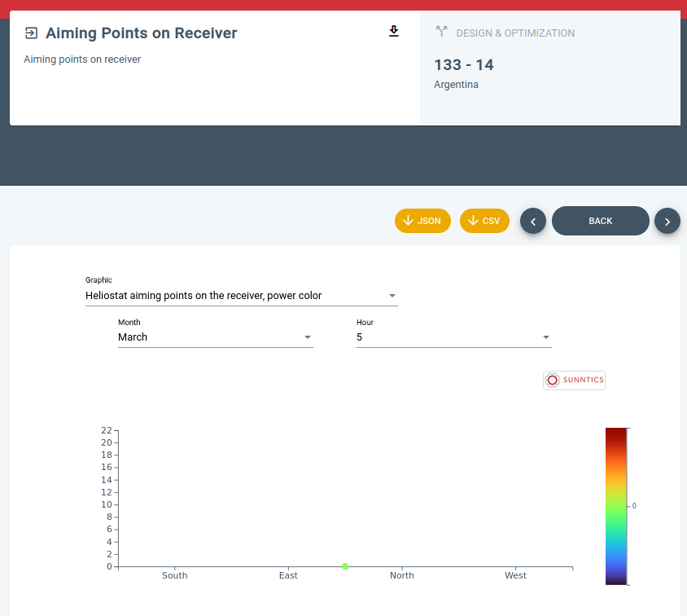
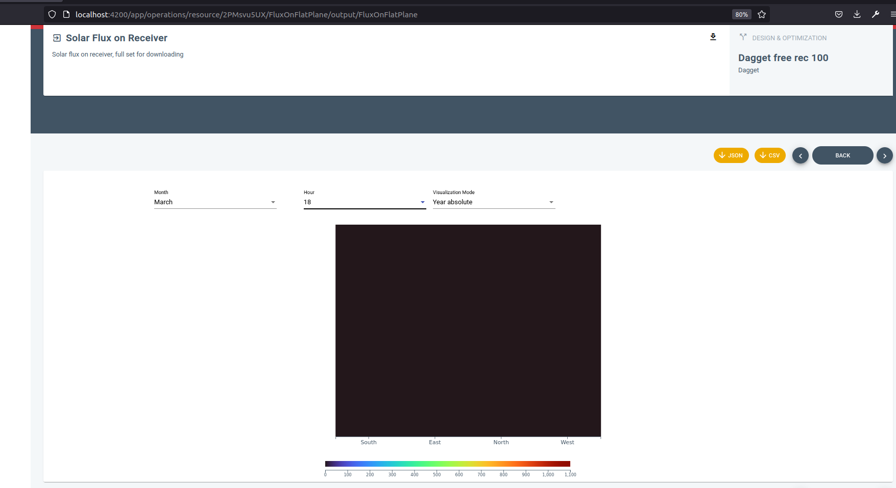
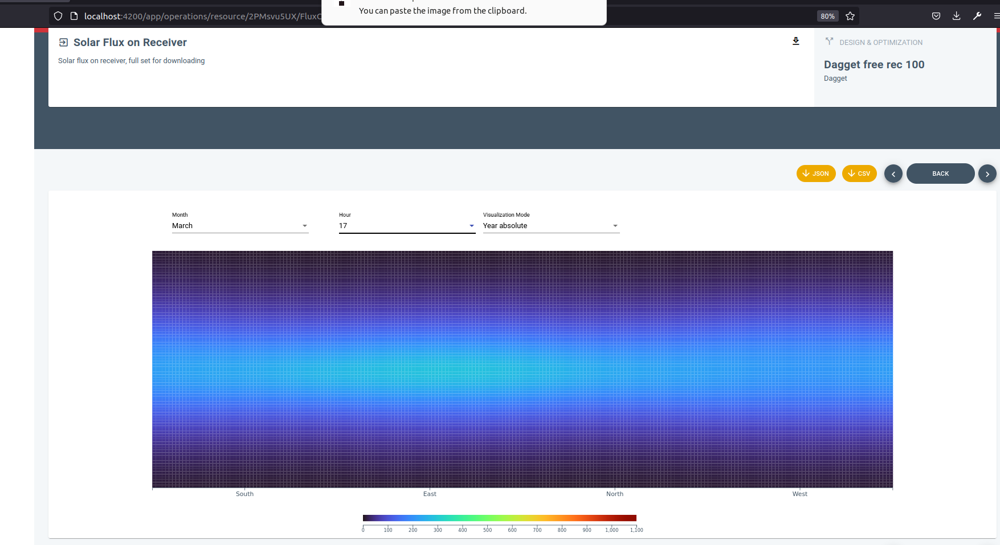

- DONE #Reunión Board Meeting
  :LOGBOOK:
  CLOCK: [2023-03-03 Fri 10:02:16]--[2023-03-03 Fri 10:25:27] =>  00:23:11
  CLOCK: [2023-03-03 Fri 10:32:12]--[2023-03-03 Fri 12:16:38] =>  01:44:26
  :END:
- [#A] **Subida nuevo algoritmo:** script para subir material al S3, API para cargar un nuevo binario desde ahí y API para decir qué versión del binario está desplegada.
- DONE #SunnSaaS Dataset del campo de heliostatos y sus eficiencias: poner un botón para descargar sólo el campo de heliostatos y olvidarse de las eficiencias
  collapsed:: true
  :LOGBOOK:
  CLOCK: [2022-12-07 Wed 11:52:05]--[2022-12-07 Wed 12:26:08] =>  00:34:03
  CLOCK: [2022-12-07 Wed 17:33:34]--[2022-12-07 Wed 19:35:11] =>  02:01:37
  CLOCK: [2023-02-07 Tue 11:45:28]--[2023-02-07 Tue 13:19:20] =>  01:33:52
  CLOCK: [2023-02-07 Tue 13:28:25]--[2023-02-07 Tue 14:42:36] =>  01:14:11
  CLOCK: [2023-02-07 Tue 16:31:36]--[2023-02-07 Tue 18:58:30] =>  02:26:54
  CLOCK: [2023-02-08 Wed 10:07:21]--[2023-02-08 Wed 10:57:22] =>  00:50:01
  CLOCK: [2023-02-08 Wed 13:38:32]--[2023-02-08 Wed 14:30:03] =>  00:51:31
  CLOCK: [2023-02-08 Wed 17:27:23]--[2023-02-08 Wed 20:12:10] =>  02:44:47
  CLOCK: [2023-02-09 Thu 10:07:12]--[2023-02-09 Thu 10:14:09] =>  00:06:57
  CLOCK: [2023-02-09 Thu 11:11:37]--[2023-02-09 Thu 11:18:25] =>  00:06:48
  CLOCK: [2023-03-08 Wed 09:40:44]--[2023-03-08 Wed 09:42:35] =>  00:01:51
  CLOCK: [2023-03-08 Wed 09:52:30]--[2023-03-08 Wed 12:43:04] =>  02:50:34
  CLOCK: [2023-03-08 Wed 13:00:00]--[2023-03-08 Wed 15:00:00] =>  02:00:00
  CLOCK: [2023-03-08 Wed 16:32:20]--[2023-03-08 Wed 16:54:44] =>  00:22:24
  CLOCK: [2023-03-13 Mon 13:55:48]--[2023-03-13 Mon 13:55:59] =>  00:00:11
  CLOCK: [2023-03-16 Thu 11:28:19]--[2023-03-16 Thu 11:54:21] =>  00:26:02
  CLOCK: [2023-03-16 Thu 12:20:00]--[2023-03-16 Thu 12:35:00] =>  00:15:00
  CLOCK: [2023-03-16 Thu 12:59:22]--[2023-03-16 Thu 14:23:01] =>  01:23:39
  CLOCK: [2023-03-16 Thu 15:53:33]--[2023-03-16 Thu 16:37:45] =>  00:44:12
  CLOCK: [2023-03-16 Thu 16:54:19]--[2023-03-16 Thu 19:05:36] =>  02:11:17
  CLOCK: [2023-03-20 Mon 12:12:02]--[2023-03-20 Mon 13:18:17] =>  01:06:15
  CLOCK: [2023-03-20 Mon 17:25:00]--[2023-03-20 Mon 18:30:00] =>  01:05:00
  CLOCK: [2023-03-21 Tue 11:38:55]--[2023-03-21 Tue 12:11:22] =>  00:32:27
  CLOCK: [2023-03-21 Tue 12:30:09]--[2023-03-21 Tue 12:33:49] =>  00:03:40
  CLOCK: [2023-03-21 Tue 17:42:51]--[2023-03-21 Tue 18:10:25] =>  00:27:34
  CLOCK: [2023-03-21 Tue 18:21:47]--[2023-03-21 Tue 18:36:04] =>  00:14:17
  CLOCK: [2023-03-21 Tue 20:15:49]--[2023-03-21 Tue 20:23:17] =>  00:07:28
  CLOCK: [2023-03-22 Wed 09:43:57]--[2023-03-22 Wed 10:00:15] =>  00:16:18
  CLOCK: [2023-03-22 Wed 14:15:00]--[2023-03-22 Wed 14:30:00] =>  00:15:00
  CLOCK: [2023-03-22 Wed 15:59:42]--[2023-03-22 Wed 16:00:15] =>  00:00:33
  :END:
  - [[2023/03/20 Monday]]
    - En [[G/sunntics-generic-libraries/libsunnsaasbackend]], el nuevo método **getHeliostatField** se ha añadido tanto al EYA como al DO (ficheros **analysisucdesignoptimization.ts** y **analysisuceya.ts**). Probado en los **tests news**, funciona correctamente.
    - En [[G/sunnsaas/sunnsaas_v1]], el esqueleto del método **API** para descarga está hecho, se llama **/analysislist** y está en el fichero **analysisrouter.ts**. Se le ha hecho una entrada API en los cURL, funciona.
  - [[2023/03/21 Tuesday]]
    - Reformulando la API para que acepte CSV y JSON. Nos olvidamos del mecanismo general de descarga de CSV y JSON de los Datasets.
  - [[2023/03/22 Wednesday]]
    - Desplegado y funcionando.
- DONE #SunnSaaS Corrección de errores ortográficos
  collapsed:: true
  :LOGBOOK:
  CLOCK: [2023-03-20 Mon 13:19:16]--[2023-03-20 Mon 13:39:42] =>  00:20:26
  CLOCK: [2023-03-20 Mon 16:09:09]--[2023-03-20 Mon 17:23:27] =>  01:14:18
  :END:
  - Están aquí: [Error 403 (Forbidden)!!1](https://docs.google.com/presentation/d/111MJg-UnudtWlUkMT9t-AxNdHmxQx_1s-q05G1EXw1w/edit#slide=id.g60a1ec3113_2_33)
  - [[2023/03/20 Monday]]
    collapsed:: true
    - Las correcciones están hechas, todas en [[G/sunntics-generic-libraries/libsunnsaasdef]]. Está en la branch **text_fixes**. El módulo está compilado y se ha metido en [[G/sunntics-generic-libraries/libsunnsaasbackend]] y en [[G/sunnsaas/sunnsaas_v1]]. Versión 4.3.130.
- [#A] #SunnSaaS/API Tenemos en Dropbox algunos ficheros de testing de operaciones exportadas, incorporar a LFS con un script
- [#A] #SunnSaaS Para los logs de la PG estaría bien que los workers se identificaran correctamente con la app name para ver si alguno se cae o falla
- [#A] #SunnSaaS Existe un D: en los workers, mirar
- [#C] #SunnSaaS/API La llamada apiinfo debería sacar la información sobre la versión de los binarios en las plantillas
- #SunnSaaS/API La contraseña que usamos es **HElioS21** en producción, pero **password** en desarrollo local.
- #SunnSaaS #G/sunnsaas/sunnsaas_api_tests
  collapsed:: true
  - Este repo se encuentra en [[GitLab]]
  - Contiene los tests [[Python]] de la [[SunnSaaS/API]]
- [#C] #SunnSaaS/Frontend Se podría hacer una visualización gráfica de los resultados del EYA, que son los siguientes
  collapsed:: true
  - ``` shell
        {
          "day": 11,
        	"hour": 23,
        	"month": 8,
        	"minute": 0,
        	"wind_ms": 3.29999995,
        	"dni_w_m2": 0,
        	"hel_used": 0,
        	"plan_auxiliary": 0,
        	"electric_auxiliary_mw": 12.9345322,
        	"electric_net_output_mw": 97.0654678,
        	"receiver_inlet_power_mw": 0,
        	"solar_power_on_field_mw": 0,
        	"receiver_outlet_power_mw": 0,
        	"stored_thermal_energy_mwh": 2927.29248,
        	"heliostat_field_eff_percent": 0,
        	"steam_generation_system_out_mw": 274.486298
        }
    ```
- [#C] #SunnSaaS/API Parece ser que la API es capaz de arrancar y no hacer nada si no encuentra la base de datos **sunnsaas**
- [#C] #SunnSaaS/API El método API de logout en realidad no desloguea al usuario en el backend, es sólo a nivel de frontend
- [#C] #SunnSaaS Ideas
  collapsed:: true
  - [[libsunnsaasdef]] no puede tener toda la info que tiene en un fichero de código duro. Las funciones de validación puede ser que sea necesario mantenerlos en código, lógicamente, pero todos los metadatos de nombre, descripciones, unidades y demás debe estar en la base de datos.
- [#C] #SunnSaaS Hay que atomizar más la base de datos, y no almacenar JSON que no sean necesarios. La tabla **warehouse.properties** tiene 21GB, mirar y trocear. Curiosamente no tiene índices sobre el campo **data** donde están los JSON.
- [#C] #SunnSaaS Tenemos que tener un conocimiento mucho más amplio sobre los pools de conexiones a la PG. Las sesiones de los workers duran menos de 5 minutos. Se supone que esas conexiones deben permanecer abiertas. Es fácil de depurar en los logs de PG.
  collapsed:: true
  - sunnsaas_controller postgres sunnsaas 10.0.2.4(58434) 10.0.2.4 2023-02-01 00:05:38.000 UTC idle 00000LOG:  disconnection: session time: 0:04:18.202 user=postgres database=sunnsaas host=10.0.2.4 port=58434
  - Los workers están constantemente abriendo 10 conexiones y cerrándolas
- [#C] #SunnSaaS Pasar los logs de PG a una hora, más cómodo para depurar
- [#C] #SunnSaaS Si se rehiciera, hacerlo con MongoDB y mirar muy mucho la atomicidad de los datos, es un tostón en PostgreSQL
- [#C] #SunnSaaS La llamada API apiinfo da como SUNNSAAS_VERSION la versión de la última tag de imágenes Docker, pero no el hash u otros detalles del algoritmo. La API debería ser capaz de leer el **versions.json** del algoritmo y asimilarlo.
- #SunnSaaS Desplegada nueva versión en [**LATEST**](https://beta.sunnsaas.sunntics.com)
  collapsed:: true
  - ``` json
        {
          "gitBranch": "24_polar_dev_slope_inarow",
          "hashGitCommit": "980542d",
          "hashMeteoBinary": "ab628a26ed44efdd7d32d57c883fda86",
          "hashStfieldwBinary": "ae103e9220edc7283e78bfa49d3ae599",
          "time": "2023-01-25 08:53:40"
        }
    ```
- [#C] #SunnSaaS La branch **develop** de **monolith** está totalmente jodido y no se puede hacer un merge desde branches avanzadas como **24_polar_dev_slope_inarow**. Habría que ponerla en pié y centralizar el develop.
- [#C] #SunnSaaS Versión del backend: debe ser más consistente. Va a ser de la siguiente forma: MAYOR.MINOR.BUGFIX-BUILD-ALGORITHM_COMMIT_HASH_DEPLOYED. El M.M.B hará referencia específicamente a la estabilidad de la API pública, exclusivamente. No tener en cuenta el efecto de **libsunnsaasbackend** ni **libsunnsaasdef** porque es demasiado. El BUILD será simplemente un timestamp YYYYMMDDHHMM, mientras que el ALGORITHM_COMMIT_HASH_DEPLOYED será el HASH del commit del algoritmo desplegado. La versión del frontend va por su lado.
- [#C] #SunnSaaS La base de datos en máquinas pequeñas como las que utilizamos en Beta y Stable tiene serios problemas para hacer operaciones de backup y reindexación, la conexión con el servidor se cae. Esto seguramente se debe a que la máquina es pequeña. De todas formas habría que pensar en pasar a una MongoDB o similar.
- [#C] #SunnSaaS Cuando se despliega una nueva instancia de [[SunnSaaS]] la base de datos no se despliega ni se configura sola. Habría que automatizar el despliegue y meter un paso automático para montar la base de datos a partir de los scripts, o que algún servicio en tiempo de ejecución se diera cuenta de que la base de datos no existe y la creara a partir de scripts.
- [#C] #SunnSaaS Vamos a montar una instancia de [[SunnSaaS]] en [[helios]]
  collapsed:: true
  :LOGBOOK:
  CLOCK: [2023-01-17 Tue 17:00:43]--[2023-01-17 Tue 18:41:26] =>  01:40:43
  CLOCK: [2023-01-23 Mon 14:20:06]--[2023-01-23 Mon 14:27:40] =>  00:07:34
  CLOCK: [2023-01-24 Tue 09:59:39]--[2023-01-24 Tue 11:12:46] =>  01:13:07
  CLOCK: [2023-01-24 Tue 16:18:38]--[2023-01-24 Tue 16:31:47] =>  00:13:09
  CLOCK: [2023-01-24 Tue 17:58:58]--[2023-01-24 Tue 18:44:25] =>  00:45:27
  CLOCK: [2023-01-30 Mon 17:02:57]--[2023-01-30 Mon 17:27:28] =>  00:24:31
  CLOCK: [2023-01-31 Tue 10:14:07]--[2023-01-31 Tue 10:21:52] =>  00:07:45
  CLOCK: [2023-01-31 Tue 10:23:46]--[2023-01-31 Tue 10:33:30] =>  00:09:44
  CLOCK: [2023-01-31 Tue 10:57:45]--[2023-01-31 Tue 11:11:57] =>  00:14:12
  CLOCK: [2023-01-31 Tue 13:43:14]--[2023-01-31 Tue 14:00:45] =>  00:17:31
  CLOCK: [2023-01-31 Tue 16:52:22]--[2023-01-31 Tue 17:30:00] =>  00:37:38
  CLOCK: [2023-02-01 Wed 10:56:43]--[2023-02-01 Wed 11:38:06] =>  00:41:23
  CLOCK: [2023-02-02 Thu 16:25:00]--[2023-02-02 Thu 17:30:00] =>  01:05:00
  CLOCK: [2023-02-02 Thu 17:35:15]--[2023-02-02 Thu 18:49:58] =>  01:14:43
  CLOCK: [2023-02-09 Thu 10:14:13]--[2023-02-09 Thu 11:11:31] =>  00:57:18
  CLOCK: [2023-02-09 Thu 14:08:07]--[2023-02-09 Thu 14:55:27] =>  00:47:20
  CLOCK: [2023-02-10 Fri 10:35:00]--[2023-02-10 Fri 11:30:00] =>  00:55:00
  :END:
  - Vamos a actualizar las imágenes de back y frontend.
  - Ejecutar un EYA de los nuevos y ver cómo reacciona el frontend.
  - Tenemos una nueva instancia funcionando en [[helios]]. Traer la base de datos de stable que es la que se está utilizando en estos momentos y probar la nueva funcionalidad.
  - Seguir adaptando el frontend.
  - Crear un volcado de la base de datos con lo que hay en stable y guardarlo para futuras referencias. Crear scripts buenos de backup y recuperación de la base de datos.
  - Estamos reproduciendo todo en helios. Los tres componentes API / Controller / Worker han compilado por ahora, hacerlos andar y poner una copia local de producción
  - Ya tenemos una instancia local corriendo. Ahora lo que se está intentando es traer un dump de la base de datos de STABLE, que ha fallado. Estamos reindexando la base de datos completa porque dicen que puede ser una de las causas. La base de datos va muy al límite, habría que cambiarla por otro tipo de sistema (ElasticSearch, Mongo, etc.).
  - La reindexación también ha fallado. Está claro que la máquina que es demasiado pequeña para manejar la bestialidad de datos que hay ahí. Vamos a intentar como último recurso traernos directamente el volumen de datos tal como está y soltarlo en helios.
  - El script **backups_data_retrieval/050** está listo para hacer TAR remoto de un directorio PG y traerlo a local. Hacerlo sobre **LATEST** para desplegar en local y seguir desarrollando la adaptación del frontend a la nueva Property del EYA.
  - Corriendo el backup del volumen **PG** localmente en helios sobre **LATEST** para despliegue local
  - [#C] Ver logs de la base de datos a ver si averiguamos por qué las operaciones largas cascan
    - La reindexación ha fallado. No entendemos muy bien por qué. Hay que volver a probarlo. La conexión se corta. Los índices son pequeños, no debería petar. La operativa normal de la base de datos se ve muy afectada por los locks.
    - No llegamos a ninguna conclusión. La base de datos ha pasado de 37 GB a 22 GB, supongo que por haber hecho algo de vacuum. Necesitamos tener la instancia **LATEST** tranquila para volver a lanzar un vacuumdb (hacer script) y un reindexdb (ya tenemos el script) y ver qué tal.
    - [#C] Volver a lanzar ahora que el servidor está tranquilo una reindexación y un vacuum full desde consola, usar el time para cronometrar el tema
      - Ahora mismo se está ejecutando un reindex, controlar
      - Lanzar despues un vacuum desde línea de comando, crear un script
      - La base de datos tiene 22GB inicialmente
    - Hemos solucionado lo de los cortes de conexión. Un parámetro del postgresql.conf mal puesto. La reindexación está hecha, ahora se está haciendo el vacuum.
  - [#C] El vacuumdb se corta a los 120 minutos, no sabemos por qué. Tendremos que preguntar en algún foro.
- DONE #SunnSaaS Renovar los certificados Lets Encrypt de SunnSaaS
  collapsed:: true
  :LOGBOOK:
  CLOCK: [2023-03-06 Mon 10:49:09]--[2023-03-06 Mon 11:10:21] =>  00:21:12
  CLOCK: [2023-03-06 Mon 11:29:45]--[2023-03-06 Mon 11:45:39] =>  00:15:54
  CLOCK: [2023-03-06 Mon 12:36:20]--[2023-03-06 Mon 14:50:13] =>  02:13:53
  CLOCK: [2023-03-06 Mon 17:38:41]--[2023-03-06 Mon 19:30:53] =>  01:52:12
  CLOCK: [2023-03-07 Tue 10:11:11]--[2023-03-07 Tue 11:11:08] =>  00:59:57
  CLOCK: [2023-03-07 Tue 12:40:09]--[2023-03-07 Tue 12:51:05] =>  00:10:56
  CLOCK: [2023-03-07 Tue 12:56:37]--[2023-03-07 Tue 13:56:50] =>  01:00:13
  :END:
  - Transformado el proceso a [[Ansible]], está en **devops/sunnsaas_instances**.
- [#C] #SunnSaaS El borrado de las AnalysisTasks de Analysis que ya están terminadas tarda horrores. Hay varios factores que se discuten aquí: [performance - Very slow DELETE in PostgreSQL, workaround? - Database Administrators Stack Exchange](https://dba.stackexchange.com/questions/37034/very-slow-delete-in-postgresql-workaround). Mirar.
- [#C] #SunnSaaS/Frontend Arreglar este defecto en la visualizacion
  collapsed:: true
  - 
- [#C] #SunnSaaS/Frontend La pantalla FluxOnFlatPlane se queda así cuando no hay radiación
  collapsed:: true
  - 
  - Esto viene producido por encontrar como dato a renderizar un array de un sólo elemento 0. Para solventarlo, se podría mantener en memoria las dimensiones del receptor tal y como son recibidas para arrays que no son 0, aunque seguramente se están recibiendo en el paquete de datos, y crear una visualización con esas dimensiones pero con todo a 0.
  - 
- [#A] **1 semana:** hay mucha información aún en **G/logseq/000-informacion_revisar/Antiguo diario 00-bb-log-md.md**, pero no perder **más de 15 min al día** trayéndola aquí.
  SCHEDULED: <2023-04-25 Tue>
  :LOGBOOK:
  CLOCK: [2023-03-13 Mon 13:58:21]--[2023-03-13 Mon 14:13:21] =>  00:15:00
  :END: