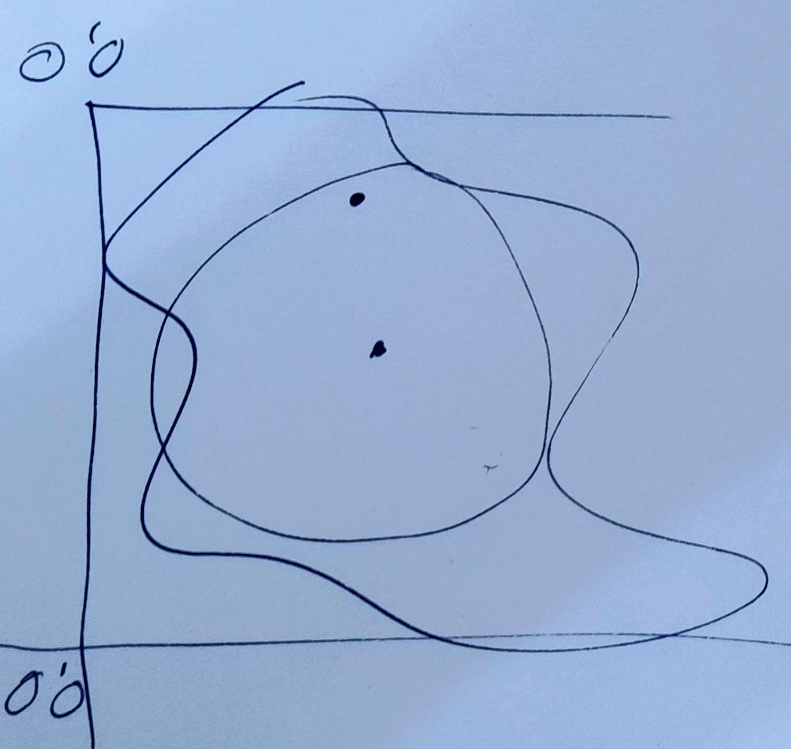

- [#C] #reunión Conversación con [[Manolo Quero]]
  collapsed:: true
  :LOGBOOK:
  CLOCK: [2023-03-07 Tue 11:35:00]--[2023-03-07 Tue 12:05:00] =>  00:30:00
  :END:
  - [#C] Sacar tareas de aquí
  - Centrarse en el interfaz y en los glitches
  - Esta es la algoritmia Python que habría que desarrollar:
    collapsed:: true
    - 
    - Nosotros nos encargamos de la traslación de coordenadas polígono / torre.
  - Le daríamos a [[Manolo Quero]] la coordenada del centro del círculo de más ajuste, automático.
  - También, por supuesto, estaría la oportunidad de dar la coordenada de dicho punto.
  - En función a ese punto central del círculo de mayor inscripción (CMI) (ideal para campos circulares) [[Manolo Quero]] podrá hacer una traslación norte/sur para encajar un campo polar.
  - Por lo tanto, la idea sería crear una función Python que hiciera estos cálculos, y otra que, dando [[Manolo Quero]] unas coordenadas de heliostato torre, diga si está dentro o fuera del polígono.