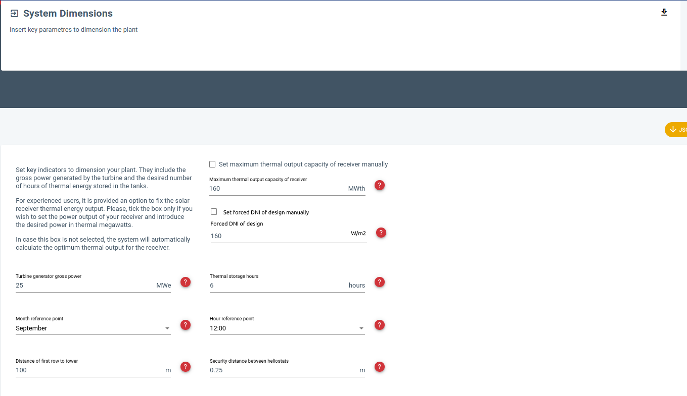

- [#A] #SunnSaaS Entrada API que permita la subida de un algoritmo en ZIP, escribir en la base de datos los metadatos de la versión desplegada. Entrada API que permita ver los metadatos de la versión desplegada.
- [#B] #SunnSaaS Evaluar lo de la nueva rama **sigma_2d**
  SCHEDULED: <2023-04-25 Tue>
  collapsed:: true
  :LOGBOOK:
  CLOCK: [2023-03-27 Mon 18:16:26]--[2023-03-27 Mon 18:16:34] =>  00:00:08
  CLOCK: [2023-03-27 Mon 18:30:04]--[2023-03-27 Mon 18:48:20] =>  00:18:16
  :END:
  - Ver los cambios.
  - Evaluar los posibles cambios en [[libsunnsaasbackend]].
  - ```txt
    @JPPA
    hay una nueva rama, que sale del 24 polar dev, llamada “sigma_2d”. Es la que ya tiene
    la lectura de la DNI de diseño impuesta.Como ya comentamos, no todo es caja negra debido
    a que el inpF se ha tocado. Hay dos nuevas variables:
    
    Línea 12 -> DNIDesg :   Forced DNI of design      :      850.   W/m2.
    Este será el valor por defecto o el que imponga el usuatio.
    
    Línea 26 -> FDNIDes :  Fix DNI Design (1-2)       :        1.   No = 1, Yes = 2.
    Es lo que corresponderá a marcar la casilla o no. Si la casilla no se marca (no
    se impone DNI de diseño), entonces = 1. Si se marca (el usuario quiere imponer si
    DNI de diseño), entonces = 2.
    
    No es urgente. Al menos, no más urgente/importante que lo que hemos hablado esta
    mañana. Pero como necesito una nueva rama para los nuevos “sigmas”, pues ya he
    aprovechado y he metido esto.
    ```
  - [#B] Sería algo así a nivel de interfaz
    - [[2023/03/27 Monday]]: [[Manolo Quero]] lo ha revisado y se lo queda. Ahora hay que ver cuándo lo hacemos. Se le ha dicho que implementar esto es entre 6 y 12 horas de trabajo. A la espera de su reevaluación de prioridades.
    - 
- DONE Revisión de usuarios en [[SunnSaaS]]: que funcione la foto y el cambio de contraseña, desactivar opciones que no son pertinentes. Desconectar la gestión de usuarios de SunnSaaS, adormecerla, eliminar del frontend.
  collapsed:: true
  :LOGBOOK:
  CLOCK: [2023-03-27 Mon 18:49:29]--[2023-03-27 Mon 20:14:14] =>  01:24:45
  CLOCK: [2023-04-18 Tue 17:18:26]--[2023-04-18 Tue 18:28:30] =>  01:10:04
  :END:
  - [[2023/03/27 Monday]]
    collapsed:: true
    - Hecho, funciona todo, incluyendo la corrección de errores que también había con los proyectos.
  - [[2023/04/14 Friday]]
    collapsed:: true
    - [[Manolo Quero]] ya tiene el algoritmo listo, desplegar todo, desplegado.
  - [[2023/04/18 Tuesday]]
    collapsed:: true
    - Desplegado nuevo algoritmo y todo el stack.