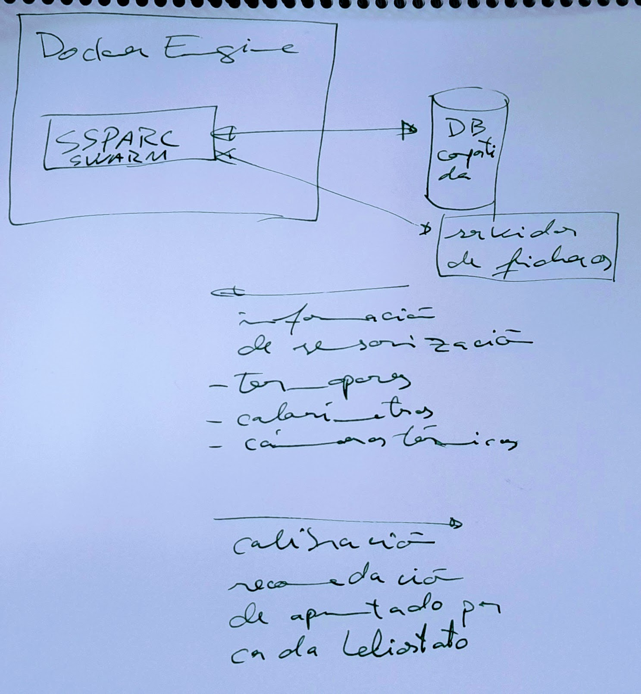
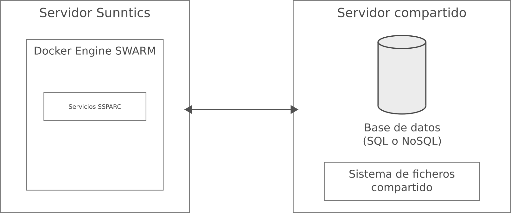

- DONE #Reunión #BlueSolar #[[Ghenova Digital]] Sistema control planta piloto BS
  collapsed:: true
  :LOGBOOK:
  CLOCK: [2023-04-14 Fri 10:02:47]--[2023-04-14 Fri 11:22:47] =>  01:20:00
  CLOCK: [2023-04-14 Fri 11:31:20]--[2023-04-14 Fri 11:49:40] =>  00:18:20
  CLOCK: [2023-04-14 Fri 12:57:45]--[2023-04-14 Fri 13:10:27] =>  00:12:42
  :END:
  - ## Asistentes
    collapsed:: true
    - **Ghenova Digital**
      - [[Sandra Pinon Rodríguez]]
      - [[Enrique Cárdenas Topf]]
      - [[Antonio Cabrera]]
    - **Sunntics**
      - [[Manolo Quero]]
      - Yo
  - ## Desarrollo
    collapsed:: true
    - Nosotros ahora mismo damos un objetivo de apuntado en coordenadas de receptor como salida del algoritmo. Para calcular este apuntado previamente se han calculado las normales de los heliostatos, que es lo que parece ser que necesitaría el sistema de control de [[Ghenova Digital]] para apuntar. Por lo tanto, parece ser que sería preciso sacar del algoritmo estas normales de alguna manera.
    - [[Enrique Cárdenas Topf]] tienes muchas dudas sobrecómo es el sistema de actuación de los heliostatos. No se sabe nada puesto que los heliostatos son nuevos, y nosotros tampoco tenemos ni idea. Los controladores son de una empresa que se llama [[SAT Control]], de Eslovenia. Éstos han entregado un documento técnico que tienen que entender [[Sandra Pinon Rodríguez]] y [[Enrique Cárdenas Topf]].
    - El campo necesita un sistema de calibración de heliostatos que ha generado bastante discusión. El sistema se necesita para la instalación y el mantenimiento. Este sistema tiene que estar incluido en el sistema de control. Se hace, como el campo es pequeño, para cada heliostato individual. En plantas grandes se hace por grupos. Las plantas grandes tienen una diana en la torre para el recalibramiento.
    - La planta va a tener instrumentación:
      - **termopares:** miden la temperatura;
      - **calorímetros o radiómetros:** miden la radiación;
      - **cámaras térmicas:** miden la intensidad de luz, se utilizan para ayudar a la calibración sobre el objetivo.
    - Hay problemas teóricos en cómo se ajusta la calibración de los heliostatos. En plantas piloto se hace manualmente. La calibración lleva una serie de etapas:
      - **apuntar;**
      - **medición de error** con los sensores, como las cámaras;
      - **recalibración:** aquí está el problema para hacerlo automáticamente, de hecho es el producto de varias empresas, como [[Heliogen]]. Se haría manualmente.
    - Los heliostatos nuevos como éstos son problemáticos porque hay que conocerlos. Para eso se hacen las plantas piloto.
    - Nosotros necesitamos recibir información de vuelta de los sensores para ajustar el modelo.
    - Hay que tener cuidado al comunicarnos con [[Enrique Cárdenas Topf]] porque por nuestro desconocimiento utilizamos términos como SCADA y similares de forma imprecisa, que le generan dudas.
    - El único **peligro** de la planta sería quemar los radiómetros.
    - El sistema de control debe implementar un **sistema de seguridad de desenfocado**.
    - [[Manolo Quero]] ve el calendario de [[BlueSolar]] muy optimista, en los rangos de la [[PV]], que son más cortos que para [[termosolar]].
  - ## Siguientes pasos
    - [[Enrique Cárdenas Topf]] necesita tener más detalles técnicos del PLC. [[Antonio Cabrera]] dice que en realidad es una de las tareas de [[Ghenova Digital]]: **proponer una arquitectura** PLC, SCADA, etc.
    - Mandar un **resumen** de la reunión para ver que estamos alineados.
    - DONE Diseñar nosotros nuestra parte de la **arquitectura**. #SUN
      collapsed:: true
      :LOGBOOK:
      CLOCK: [2023-04-18 Tue 13:00:32]--[2023-04-18 Tue 13:06:04] =>  00:05:32
      CLOCK: [2023-04-18 Tue 13:38:30]--[2023-04-18 Tue 14:34:06] =>  00:55:36
      CLOCK: [2023-04-18 Tue 16:44:18]--[2023-04-18 Tue 16:54:18] =>  00:10:00
      :END:
      - [[2023/04/18 Tuesday]]
        - Propuesta boceto
          - 
        - Final
          collapsed:: true
          - 
            -
        - Trabajando en [Drive](https://docs.google.com/document/d/1RqRjEFoiPjrTQXSSL7qqvzf66MXzP_SRjQgmT-kZG9Q/edit).
- DONE #Reunión Conversación con [[Manolo Quero]]
  collapsed:: true
  :LOGBOOK:
  CLOCK: [2023-04-14 Fri 13:12:39]--[2023-04-14 Fri 13:56:53] =>  00:44:14
  :END:
  - Despliegue del nuevo algoritmo ahora que [[Manolo Quero]] tiene el nuevo algoritmo.
  - Algoritmo de punto dentro / fuera sin islas. Hay que crear un sistema para que [[Manolo Quero]] meta la torre en el contexto del perímetro para hacer las traslaciones de sistemas de referencia. El origen 0,0 será la torre para todo lo demás. Hacer el algoritmo en Fortran.
  - Campo de alturas.