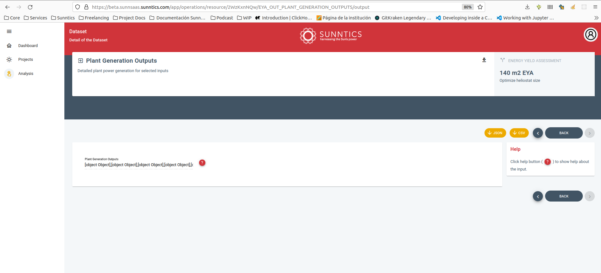

- #[[Actividad diaria]] **Actividad**
  - **2022-10-17 - Dedicación acumulada semanal**
    - **Desglose horas**
      - **Lunes:** 6.75 / 7
      - **Martes:** 0 / 7
      - **Miércoles:** 0 / 7
      - **Jueves:** 0 / 7
      - **Viernes:** 0 / 5
      - **TOTAL (sin contar hoy):** 0 / 33
  - **Dedicación diaria**
    - **07:45 - 08:00:** #[[Gestión general]] > 0.25x
    - **10:15 - 10:30** ((6348f65a-c26b-4225-bc23-bfbefae6b34d)) > 0.25x
    - **10:30 -11:00:** #Reunión #Work/Sunntics > 0.5x
    - **11:00 - 11:30:** ((6348f65a-c26b-4225-bc23-bfbefae6b34d)) > 0.5x
    - **12:00 - 12:45:** #[[Gestión general]] > 0.75x
    - **13:15 - 13:45:** #[[Gestión General]] > 0.5x
    - **13:45 - 14:15:** ((63492a43-0093-4913-8b88-08dde6557239)) > 0.5x
    - **17:00 - 19:00:** ((63492a43-0093-4913-8b88-08dde6557239)) > 2x
    - **22:30 - 23:30:** ((63491bda-bd91-4df6-b584-a4f285029078)) > 1
      id:: 634dbc3b-cc32-4e06-9186-6a6ebd56628d
- LATER #Work/Sunntics/SunnSaaS/API Mejorar el output frontend del EYA
  collapsed:: true
  :LOGBOOK:
  CLOCK: [2022-11-15 Tue 09:59:40]--[2022-11-15 Tue 10:27:42] =>  00:28:02
  CLOCK: [2022-11-15 Tue 14:13:26]--[2022-11-15 Tue 14:27:25] =>  00:13:59
  CLOCK: [2022-11-15 Tue 16:20:31]--[2022-11-15 Tue 16:28:07] =>  00:07:36
  CLOCK: [2022-11-15 Tue 18:07:42]--[2022-11-15 Tue 18:52:47] =>  00:45:05
  CLOCK: [2022-11-15 Tue 18:53:11]--[2022-11-15 Tue 18:58:22] =>  00:05:11
  CLOCK: [2022-11-16 Wed 10:40:54]--[2022-11-16 Wed 10:42:33] =>  00:01:39
  CLOCK: [2022-11-16 Wed 11:39:43]--[2022-11-16 Wed 11:40:25] =>  00:00:42
  CLOCK: [2022-11-16 Wed 11:42:46]--[2022-11-16 Wed 11:56:45] =>  00:13:59
  CLOCK: [2022-11-16 Wed 17:33:37]--[2022-11-16 Wed 17:33:48] =>  00:00:11
  CLOCK: [2022-11-16 Wed 17:33:51]--[2022-11-16 Wed 19:48:13] =>  02:14:22
  CLOCK: [2022-12-07 Wed 11:21:22]--[2022-12-07 Wed 11:32:09] =>  00:10:47
  :END:
  - 
    - Ya están hechos los EYA, ya se puede seguir comprobando el resultado
  - Debe mostrar el escalar que sale del fichero el_total.csv, en output, cuya unidad es MWh.
  - Parece ser que [[libsunnsaasbackend]] no lee este fichero.
  - Se abre una nueva branch en [[libsunnsaasbackend]] llamada **feature_24h_el_total_csv** sobre **feature/24h** para leer el contenido de este fichero al final del procesamiento de los EYA
  - Ejecutando un EYA en testing para ver su estructura de ficheros y comprender mejor lo que hay que hacer, puesto que el fichero **el_total.csv** no se lee al finalizar el EYA
  - El fichero **el_total.csv** está mal formado, [[Manolo Quero]] ha hecho cambios en el algoritmo para que escriba un CSV de verdad. Volver a compilar el algoritmo, y desplegar. El fichero del EYA **analysistaskuceya111.ts** ya está leyendo el fichero, hay que hacer algo con él. Tiene una marca de no ejecución **AQUÍ** puesta, seguir por ahí y volver a lanzar un EYA a ver si procesa el fichero bien conformado.
  - Cuando el EYA lea ese nuevo dato habrá que tenerlo en cuenta en **libsunnsaasdef**
  - Actualizado el **libsunnsaasdef**, ejecutando los tests de **libsunnsaasbackend**, esperando. Debe sacar D: para ver si ha leído correctamente el nuevo dato, debe volcarlo en **response.json**
  - Sí lo hace pero no consigue dejar el análisis a **COMPLETED**. Hay que revisar la metodología de tests.
-
- [#C] #Work/Sunntics/SunnSaaS Que la API informe de la información sobre la versión de los algoritmos en la llamada apiinfo
- DONE #Work/Sunntics/SunnSaaS Habría que consolidar lo que tenemos en las ramas **develop** en **main**, que está consolidada con la tag v2022-06-28-0a4f5e2
  id:: 634e4e87-b627-4206-ba2c-5df6d261a58d
  :LOGBOOK:
  CLOCK: [2022-10-18 Tue 13:42:49]--[2022-10-18 Tue 14:02:38] =>  00:19:49
  :END: