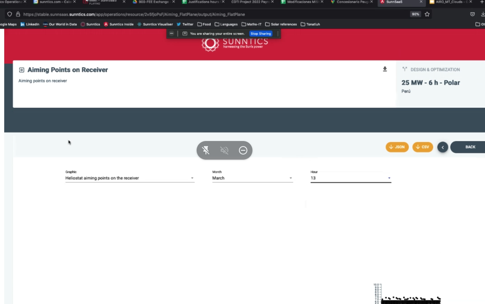
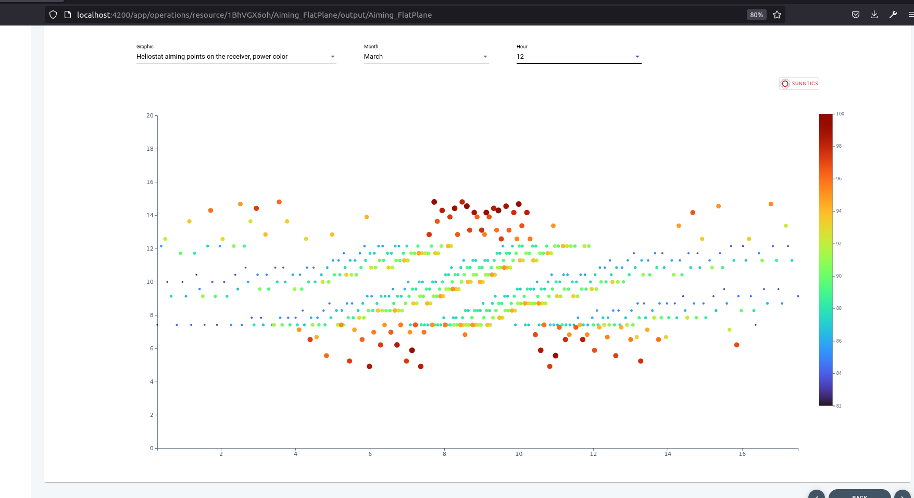
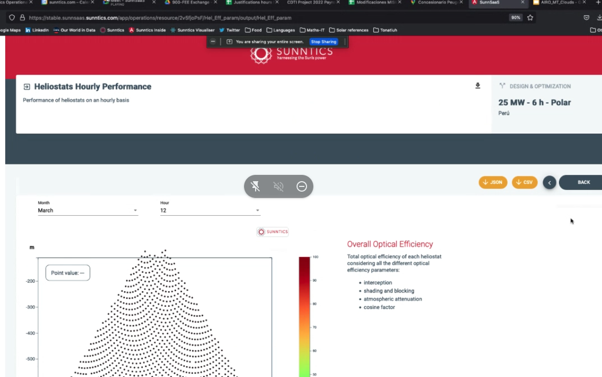

- #[[Actividad diaria]] **Actividad**
  collapsed:: true
  - **DÍA NO PROCESADO AÚN.** Borrar cuando lo sea.
  - **2022-10-24 - Dedicación acumulada semanal**
    - **Desglose horas**
      - **Lunes:** 0 / 7
      - **Martes:** 0 / 7
      - **Miércoles:** 0 / 7
      - **Jueves:** 0 / 7
      - **Viernes:** 0 / 5
      - **TOTAL (sin contar hoy):** 0 / 33
    - **Horas acumuladas por proyectos (sin contar hoy)**
      - **Gestión general:** 0
      - **#Work/Dummy:** 0
  - **Dedicación diaria**
    - DONE #[[Gestión general]]
      :LOGBOOK:
      CLOCK: [2022-10-24 Mon 07:54:14]--[2022-10-24 Mon 08:26:28] =>  00:32:14
      CLOCK: [2022-10-24 Mon 14:23:43]--[2022-10-24 Mon 14:27:43] =>  00:04:00
      CLOCK: [2022-10-24 Mon 17:29:11]--[2022-10-24 Mon 17:33:55] =>  00:04:44
      :END:
    - ((6356292d-d6b8-48bc-b04c-f5424db349d7))
    - ((6356292d-387e-4a89-b0cd-62f6efcecffd))
    - ((6356af77-5ef0-435c-b1d3-656761183663))
- DONE #Work/Sunntics/SunnSaaS Lanzar nuevos tests en el monolítico
  id:: 6356af77-5ef0-435c-b1d3-656761183663
  :LOGBOOK:
  CLOCK: [2022-10-24 Mon 17:33:59]--[2022-10-24 Mon 17:41:29] =>  00:07:30
  CLOCK: [2022-10-25 Tue 12:51:36]--[2022-10-25 Tue 12:55:39] =>  00:04:03
  CLOCK: [2022-10-25 Tue 16:01:26]--[2022-10-25 Tue 16:14:08] =>  00:22:42
  CLOCK: [2022-10-26 Wed 12:12:12]--[2022-10-26 Wed 12:34:48] =>  00:22:36
  CLOCK: [2022-10-26 Wed 13:31:35]--[2022-10-26 Wed 13:44:43] =>  00:13:08
  CLOCK: [2022-10-26 Wed 17:53:36]--[2022-10-26 Wed 18:08:40] =>  00:15:04
  :END:
  - Estamos partiendo los tests para poder probar las operaciones JSON aparte, sin tener que rehacer el análisis
  - Parece que ya tenemos la causa: el JSON de exportación es demasiado grande y hay alguna versión de JSON.stringify que no es capaz de solventarlo (el de la librería antigua @malkab/node-utils)
- DONE #Work/Sunntics/SunnSaaS/Frontend Errores varios en visualizaciones en el frontend
  id:: 635f7612-b55f-4db3-8f20-7a462c54f0a6
  collapsed:: true
  :LOGBOOK:
  CLOCK: [2022-10-31 Mon 16:06:48]--[2022-10-31 Mon 16:10:51] =>  00:04:03
  CLOCK: [2022-10-31 Mon 17:18:07]--[2022-10-31 Mon 17:58:28] =>  00:40:21
  CLOCK: [2022-10-31 Mon 18:00:28]--[2022-10-31 Mon 18:00:29] =>  00:00:01
  CLOCK: [2022-10-31 Mon 18:17:35]--[2022-10-31 Mon 18:58:03] =>  00:40:28
  CLOCK: [2022-11-15 Tue 11:00:00]--[2022-11-15 Tue 11:46:20] =>  00:46:20
  CLOCK: [2022-11-15 Tue 12:38:03]--[2022-11-15 Tue 12:39:44] =>  00:01:41
  CLOCK: [2022-11-15 Tue 12:51:13]--[2022-11-15 Tue 13:04:06] =>  00:12:53
  CLOCK: [2022-11-15 Tue 13:11:34]--[2022-11-15 Tue 13:52:19] =>  00:40:45
  CLOCK: [2022-11-15 Tue 14:03:10]--[2022-11-15 Tue 14:10:38] =>  00:07:28
  :END:
  - DONE Aiming_FlatPlane
    collapsed:: true
    - Se ha abierto una rama sobre **feature/24h** llamada **feature_24h_solar_flux_viz** para intentar arreglar este horror
    - Probando en **1BhVGX6oh (25 MW - 6 h - Polar)**
    - Este es mortal de necesidad. Estamos intentando comprenderlo. Los ficheros implicados parecen ser:
      - solar-flux-on-receiver
      - d3-scatter-plot
      - Estamos centrados en intentar sacarlo adelante en el modo Colored Dots, después tendremos que hacer los otros
      - Resulta que esta vista personalizada usa dos componentes distintos para visualizar según el tipo de receptor (circular / no circular). En el primer caso usa **d3-scatter-plot** (que va perfecto) y en el segundo **d3-scatter-plot-colored-dots** (que no parece ir bien). Se va a intentar utilizar sólo el primero. De hecho, se ha borrado el último, que era defectuoso e inútil. El primero es capaz de manejar los dos casos perfectamente.
        collapsed:: true
        - 
      - Hemos dado pasos significativos. Hemos dejado de usar d3-scatter-plot-colored-dots (lo hemos borrado, de hecho) y responde bien. Sólo un detalle, las escalas de los ejes (ambos son metros) no son equivalentes y tienen que serlo. Hay que hacer un encaje proporcional del tamaño del gráfico tal y como se hace en el campo de heliostatos para solucionar esto:
        collapsed:: true
        - 
      - Se cierra por ahora la rama **feature_24h_solar_flux_viz**
  - DONE Hel_Eff_param
    collapsed:: true
    - 