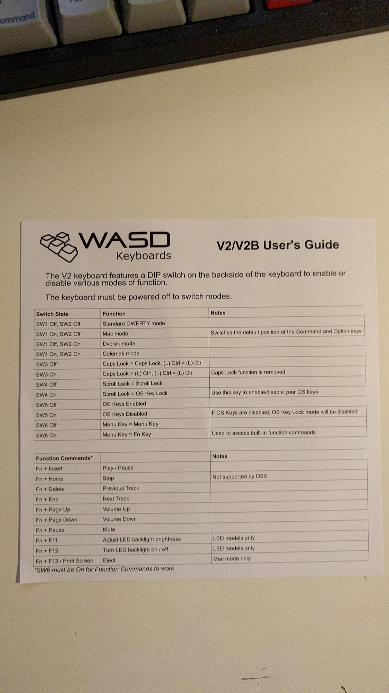
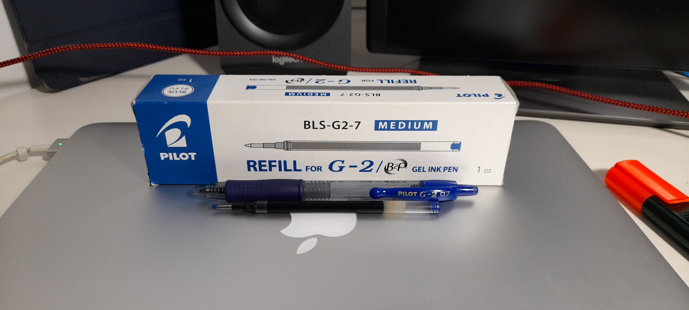

- Las bombillas LED que estamos comprando son las GU10, Warm, de 450 lumen y 2700K. Buscarlas más suaves.
- **iPad**
  collapsed:: true
	- PIN: 639805
	- Name: Terror
	- Model: iPad (6th generation)
	- Model number: MR7K2TY/A
	- Serial number: GG7XQ5U5JF8N
	- Capacity: 128GB
	- WIFI: 8C:FE:57:C5:0A:1D
	- Bluetooth: 8C:FE:57:CC:FD:49
- Bolis María: Pilot Gel G2
- Censo electoral
  collapsed:: true
	- Municipio: Tomares
	- Distrito: 01 Sección: 009 Mesa: B
	- Local electoral: Colegio Bilingüe Tomas Ybarra, c/ Estacada del Rosario, 53
- **Erebus details**
  collapsed:: true
	- MacBook Pro 13 - inch
	- Model Name: MacBook Pro
	- Model Identifier:   MacBookPro12,1
	- Processor Name: Intel Core i5
	- Processor Speed:    2,9 GHz
	- Number of Processors:   1
	- Total Number of Cores:  2
	- L2 Cache (per Core):    256 KB
	- L3 Cache:   3 MB
	- Memory: 16 GB
	- Boot ROM Version: MBP121.0167.B17
	- SMC Version (system):   2.28f7
	- Serial Number (system): C02SK2SGFVH8
	- Hardware UUID:  F04A10D4-9B17-519F-839D-2CF324385858
	- (1P) Part No. Z0QP000BZ
	- (S) Serial No. C02SK2SGFVH8
	- Model No: A1502
	- Family ID: Z0QP
	- MBP 13.3/2.9GHz/16GB/512GB/ESP/INT
	- AirPort ID: C4:B3:01:D6:C3:FD
	- Bluetooth ID: C4:B3:01:D6:C3:FE
- Bombilla: Leroy Merlin GU10 2700k-3000k
- **Impresora Canon Pixma MG3550**
  collapsed:: true
	- Cartuchos:
		- CL-541 Color
		- PG-540 BN
- **Ropa**
  collapsed:: true
	- Calzoncillos: talla M-48 (o 44, depende)
	- Polos Dustin: talla 5
- **Nombres de máquinas**
  collapsed:: true
	- ettil > Deceased
	- titan > Deceased
	- bering > Deceased
	- r2d2 > Sony Vaio Laptop, Deceased
	- tie > Home tower
	- sheep > University / Geographica tower
	- erebus > MacBook Pro laptop
	- euler > Torre actual en casa
	- helios > Torre Sunntics
- **Teclado WASD**
  collapsed:: true
	- 
- **Boligrafo Pilot G2**
  collapsed:: true
	- 
