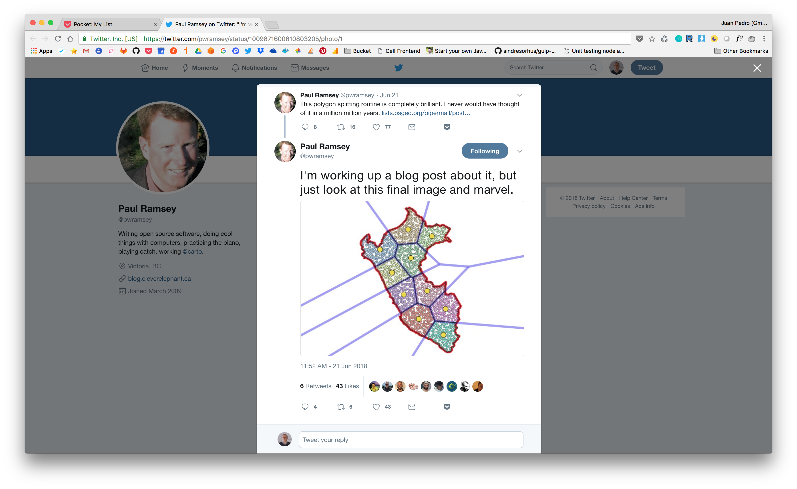
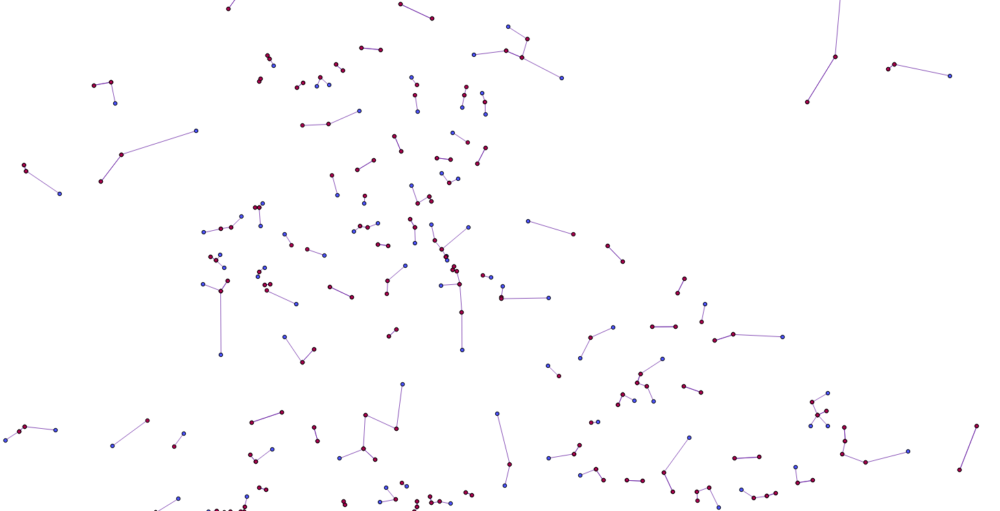
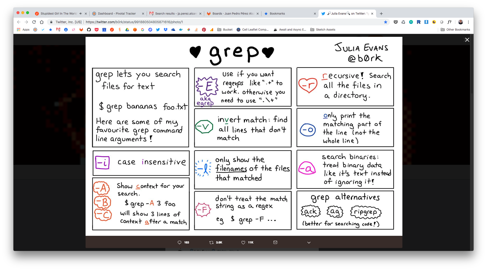
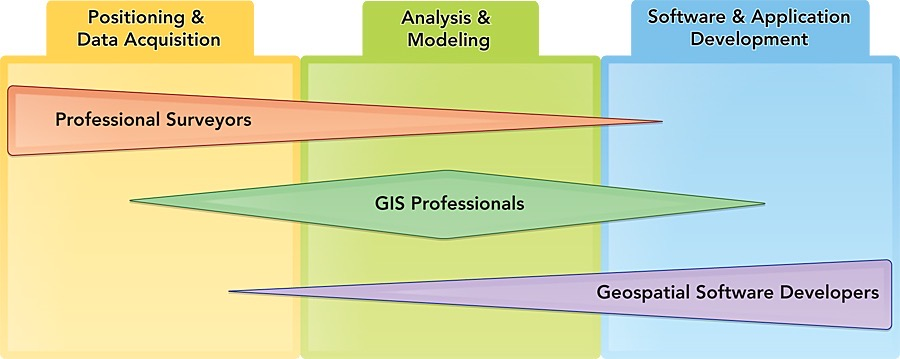
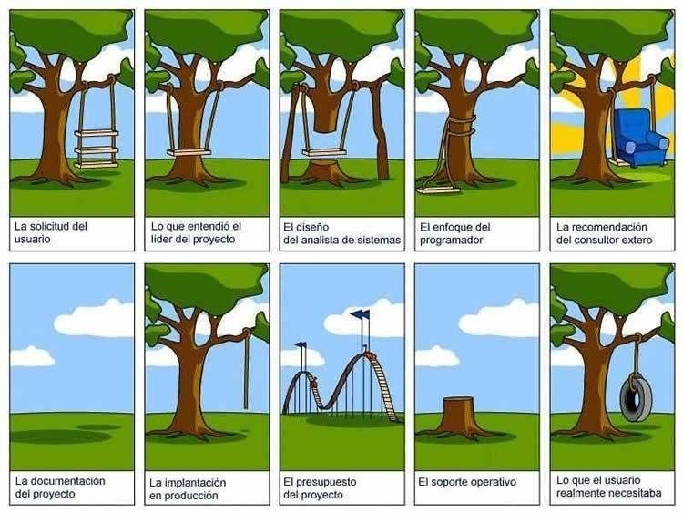
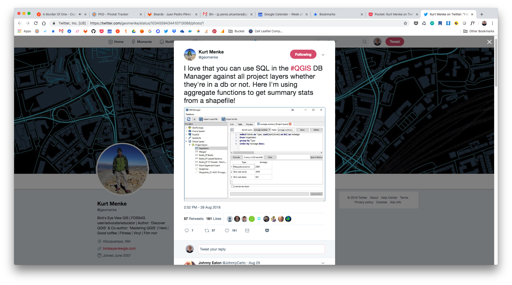
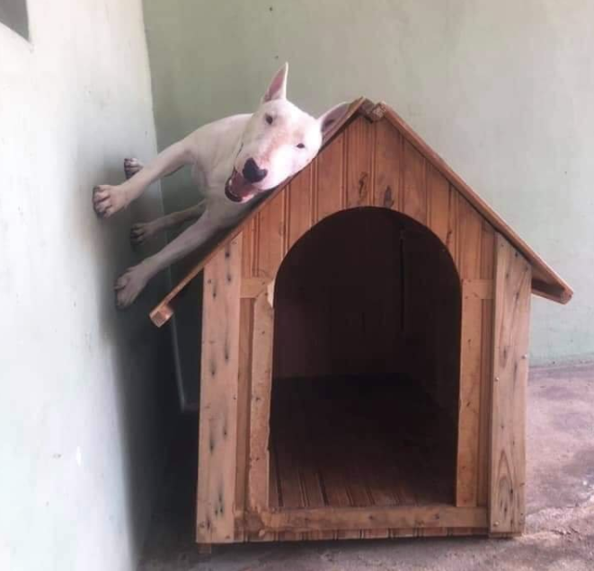
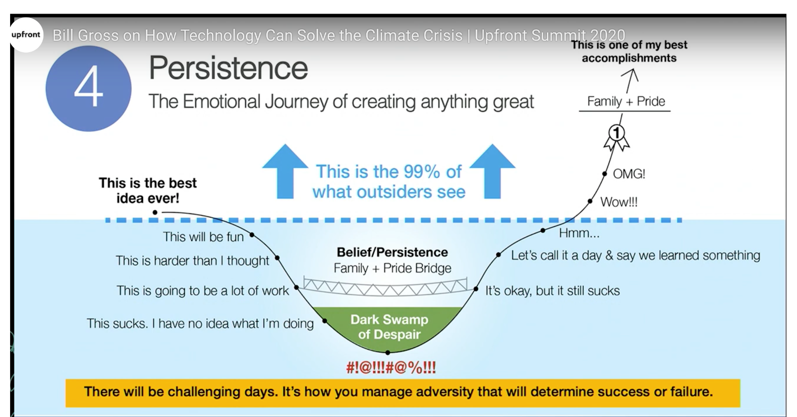
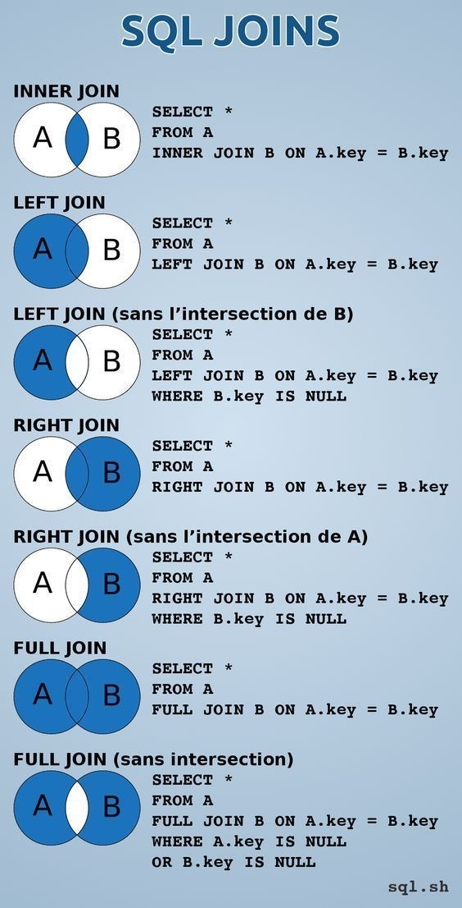

- DONE #[[Gestión general]]
  :LOGBOOK:
  CLOCK: [2022-11-08 Tue 07:50:00]--[2022-11-08 Tue 08:12:18] =>  00:22:23
  CLOCK: [2022-11-08 Tue 08:30:39]--[2022-11-08 Tue 08:30:53] =>  00:00:14
  CLOCK: [2022-11-08 Tue 08:31:42]--[2022-11-08 Tue 08:32:53] =>  00:01:11
  CLOCK: [2022-11-08 Tue 08:33:11]--[2022-11-08 Tue 08:34:31] =>  00:01:20
  CLOCK: [2022-11-08 Tue 08:36:42]--[2022-11-08 Tue 08:38:25] =>  00:01:43
  CLOCK: [2022-11-08 Tue 09:17:28]--[2022-11-08 Tue 09:18:13] =>  00:00:45
  CLOCK: [2022-11-08 Tue 09:45:27]--[2022-11-08 Tue 09:46:00] =>  00:00:33
  CLOCK: [2022-11-08 Tue 11:27:43]--[2022-11-08 Tue 11:29:16] =>  00:01:33
  CLOCK: [2022-11-08 Tue 12:57:21]--[2022-11-08 Tue 12:58:45] =>  00:01:24
  CLOCK: [2022-11-08 Tue 14:03:12]--[2022-11-08 Tue 14:07:55] =>  00:04:43
  CLOCK: [2022-11-08 Tue 14:29:14]--[2022-11-08 Tue 14:37:33] =>  00:08:19
  CLOCK: [2022-11-08 Tue 15:47:38]--[2022-11-08 Tue 15:48:07] =>  00:00:29
  CLOCK: [2022-11-08 Tue 16:36:23]--[2022-11-08 Tue 16:37:10] =>  00:00:47
  CLOCK: [2022-11-08 Tue 16:56:03]--[2022-11-08 Tue 16:58:04] =>  00:02:01
  CLOCK: [2022-11-08 Tue 17:04:13]--[2022-11-08 Tue 17:07:23] =>  00:03:10
  CLOCK: [2022-11-08 Tue 17:53:40]--[2022-11-08 Tue 18:04:25] =>  00:10:45
  CLOCK: [2022-11-08 Tue 18:15:37]--[2022-11-08 Tue 18:15:41] =>  00:00:04
  CLOCK: [2022-11-08 Tue 19:22:42]--[2022-11-08 Tue 19:33:15] =>  00:10:33
  :END:
- DONE #Work/Freelancing/US Varios
  :LOGBOOK:
  CLOCK: [2022-11-08 Tue 18:16:05]--[2022-11-08 Tue 18:26:07] =>  00:10:02
  CLOCK: [2022-11-08 Tue 19:09:02]--[2022-11-08 Tue 19:22:41] =>  00:13:39
  :END:
- DONE #Work/Freelancing/US Seguir trabajando en la extracción del esquema de catastro de Jesús de kerdes. Hemos dejado un tmux en kerdes intentando hacer psql local a la base de datos con un idiosyncratic ibex (es posible que el holistic_hornet local tenga un bug al lanzar el psql)
  :LOGBOOK:
  CLOCK: [2022-11-08 Tue 09:46:06]--[2022-11-08 Tue 11:13:35] =>  01:27:29
  CLOCK: [2022-11-08 Tue 11:26:44]--[2022-11-08 Tue 11:27:40] =>  00:00:56
  CLOCK: [2022-11-08 Tue 12:27:14]--[2022-11-08 Tue 12:48:01] =>  00:20:47
  CLOCK: [2022-11-08 Tue 12:56:19]--[2022-11-08 Tue 12:57:05] =>  00:00:46
  CLOCK: [2022-11-08 Tue 13:49:53]--[2022-11-08 Tue 13:59:42] =>  00:09:49
  CLOCK: [2022-11-08 Tue 14:14:47]--[2022-11-08 Tue 14:29:12] =>  00:14:25
  :END:
- DONE #Work/Freelancing/US Backup de datos de catastro de [[Jesús Rodríguez]] **backup de los datos de [[Jesús Rodríguez]]:** están en la base de datos [[data]] común de [[kerdes]] en un esquema llamado [[dat_catastro_2020]]. Para extraerlo se ha creado un script **110** diseñado para ejecutarse de forma local en [[kerdes]] con el contexto **kepler_localhost**. Activar contexto, ir al servidor (directorio de trabajo **/opt/transito_jpperez**) y ejecutar. Esto dejará un dump grande en el mismo directorio de trabajo que se trae a local con **120**, dejándose en **data/000_in**. Borrar del remoto al terminar y haber dumpeado con éxito en [[kepler]].
  :LOGBOOK:
  CLOCK: [2022-11-08 Tue 15:48:08]--[2022-11-08 Tue 16:36:22] =>  00:48:14
  CLOCK: [2022-11-08 Tue 18:09:02]--[2022-11-08 Tue 18:11:27] =>  00:02:25
  CLOCK: [2022-11-08 Tue 18:13:41]--[2022-11-08 Tue 18:14:41] =>  00:01:00
  :END:
- DONE #Work/Freelancing/US Poner en pié el análisis final y documentarlo en [[GitRepo/freelancing_us/cell_db_2022/070-adscripcion_variable_a]]
  collapsed:: true
  :LOGBOOK:
  CLOCK: [2022-11-09 Wed 12:18:23]--[2022-11-09 Wed 12:20:42] =>  00:02:19
  CLOCK: [2022-11-09 Wed 17:58:42]--[2022-11-09 Wed 18:44:33] =>  00:45:51
  CLOCK: [2022-11-09 Wed 18:46:13]--[2022-11-09 Wed 19:47:21] =>  01:01:08
  CLOCK: [2022-11-09 Wed 19:47:54]--[2022-11-09 Wed 20:10:14] =>  00:22:20
  CLOCK: [2022-11-10 Thu 12:53:46]--[2022-11-10 Thu 13:06:43] =>  00:12:57
  CLOCK: [2022-11-10 Thu 13:12:11]--[2022-11-10 Thu 14:22:23] =>  01:10:12
  CLOCK: [2022-11-10 Thu 16:23:12]--[2022-11-10 Thu 19:45:36] =>  03:22:24
  CLOCK: [2022-11-11 Fri 09:17:36]--[2022-11-11 Fri 10:00:54] =>  00:43:18
  CLOCK: [2022-11-11 Fri 11:14:05]--[2022-11-11 Fri 12:05:56] =>  00:51:51
  CLOCK: [2022-11-11 Fri 12:22:14]--[2022-11-11 Fri 13:39:36] =>  01:17:22
  CLOCK: [2022-11-11 Fri 13:41:27]--[2022-11-11 Fri 14:41:35] =>  01:00:08
  CLOCK: [2022-11-12 Sat 12:33:15]--[2022-11-12 Sat 14:06:15] =>  01:33:00
  CLOCK: [2022-11-14 Mon 10:29:16]--[2022-11-14 Mon 11:07:27] =>  00:38:11
  :END:
  - A la espera de lo que diga [[Pepe Ojeda]] , entregado
  - Visto bueno de [[Pepe Ojeda]]
- #gameideas A Monkey with Two Guns
- [#C] #Work/Toolsresearch Posibles categorías de gastos
  collapsed:: true
  - category_id|name
  - ALM|Alimentación
  - APE|Aparatos electrónicos
  - APR|Aportación doméstica (bidireccional)
  - BAN|Gastos bancarios
  - CBL|Balance
  - CEX|Cash no contabilizado
  - EDU|Educación
  - ING|Otros ingresos
  - MED|Medicinas / salud
  - NOM|Nómina
  - OCI|Ocio
  - OGS|Otros gastos
  - PEN|Aportación Plan de Pensiones
  - PRO|Servicios profesionales
  - REG|Regalos
  - ROP|Ropa
  - SAL|Salud
  - SEG|Seguros
  - TRA|Transportes
  - TRP|Traspaso entre cuentas
  - IMP|Impuestos y tasas gubernamentales
- [#C] #Work/Toolsresearch Círculos
  collapsed:: true
  - ```shell
    ;; This buffer is for notes you don't want to save, and for Lisp evaluation.
    ;; If you want to create a file, visit that file with C-x C-f,
    ;; then enter the text in that file's own buffer.
    
    docker run -d --name whatever -e "PIP_PACKAGES=ipython;psycopg2;pytest" \
    -e "CONTAINER_USER_UID=1001" -e "CONTAINER_GROUP_ID=1002" \
    -e "ADDTOPYPATH=/home/python-dev/src" \
    -v /home/testuser/:/home/python-dev/ geographica/python_development:2.7.11
    
    
    a,b center of circle, r radius
    
    distance to point x,y is to be r:
    
    (a-x)²+(b-y)²=r²
    
    (a) Find P and Q, the points of intersection of the line y=3x−5 and the circle C1C1 with the equation x2+y2+2x−4y−15=0.
    
    (b) T is at the centre C1C1. Show PT and QT are perpendicular.
    
    (c) A second circle C2C2 passes through P, Q and T. Find the equation of C2C2.
    
    x²+(3x-5)²+2x-4(3x-5)-15=0
    
    x²+9x²+25-30x+2x-12x+20-15=0
    
    10x²-40x+30=0
    
    
    x = (-b+-sqrt(b²-4ac)) / 2a
    
    Solutions:
    x = 3 > 3*3-5=4 > Point (3,4)
    
    x = 1 > 3*1-5=-2 > Point (1,-2) (Absurd solution follows...)
    
    For x=3:
    
    9+y²+6-4y-15=0
    y²-4y=0
    y = 4, y=0
    
    For x=1:
    1+y²+2-4y-15=0
    y²-4y-12=0
    y = 6, y = -2
    
    Test for (x,y)=(3,4), (x,y)=(3,0) for being in line:
    
    3*3-5=4 > Point (3,4) belongs to line, (3,0) not
    
    Test for (x,y)=(1,6), (x,y)=(1,-2) for being in line:
    
    3*1-5=-2 > Point (1,-2) belongs to line, (1,6) not
    
    
    
    Find center:
    
    (a-x)²+(b-y)²=r²
    
    (a-3)²+(b-4)²=(a-1)²+(b+2)²
    
    a²+9-6a+b²+16-8b=a²+1-2a+b²+4+4b
    
    9-6a+16-8b=1-2a+4+4b
    
    25-6a-8b=5-2a+4b
    4a-12b+20=0 > this is the line of all the circles that passes on given points.
    
    
    Find center from canonical circle form:
    
    x²+y²+2x-4y-15=0
    
    (a-x)²+(b-y)²=r² > a²+x²-2ax+b²+y²-2by=r² > a²+b²-r²=-15, 2x=-2ax, -4y=-2by >
    
    > 2=-2a > a = -1
    
    > -4=-2b > b = 2
    
    > 1+4-r²=-15 > -r²=-20
    
    Canonical form for circle is:
    
    (-1-x)²+(2-y)²=20
    
    Circle center is at (-1, 2)
    ```
- [#C] #Work/Toolsresearch Docker Soologic #procesar
  collapsed:: true
  - Hablar de la instalación del Docker Engine en una máquina: el repositorio, el registro, los volúmenes y demás.
  - Es un curso de Docker más o menos adaptado a las necesidades de SOLOGIC. Lo hacen sobre CENTOS6. Utilizan mucho TOMCAT y MySQL. No SWARM práctico, sólo teórico. Mirar Kubernetes. En dos fases: primero una con la base (unas 10 horas) y después se les deja y se vuelve a intentar solucionar cuestiones que les hayan surgido.
  - Cerrar estructura de contenidos de la primera fase y calendario.
  - Deployments to servers with Docker: always create a "docker-compose-start/stop" script to encapsulate the start and stop procedures. CD to the project folder and launch them.
  - Introducción a Docker: qué es y en qué tecnologías se apoya. Usos. Conceptos. (0.5 horas)
  - Contenedores: uso de imágenes preexistentes, gestión de contenedores (1 hora)
  - Imágenes: creación de imágenes personalizadas y contenedores (2.5 horas)
  - Persistencia de datos en el host: volúmenes (0.5 horas)
  - Orquestación de contenedores: Docker Compose y Docker Swarm (2 horas)
  - Buenas prácticas y ejemplo de despliegues (1 horas)
  - Control de contenedores en una red: Kubernetes (1.5 horas)
- [#B] #Work/Freelancing/EOI Freelancing - EOI #procesar
  collapsed:: true
  - For the Big Data session, the document for the CARTO practice must be redone with a Markdown publishing system.
  - Prepare an example with PostGIS.
  - Actionable emails for EOI
  - usar ID propios en los datos y prescindir de seguir los object id de CARTO, es muy confuso. Saltar paso de geocodificacion, no aporta nada, dar los puntos. Ver si se pueden cambiar los nombres de las columnas. Hacer un anexo con una solucion 100x100 sql. Hacer una guia esquematica de pasos clave guion de profe para lleva ren el aipad.
  - Hacer esquemas de topologia y de tecnologias para apoyar la exposición.
  - Hacer video de gis escritorio.
  - Completar el perfil del Blackboard
  - Review bb-log entry for 2020-06-15, review Pivotal Tracker project
  - Aumentar sección de LIDAR, poner videos, buscar ejemplo en vivo del Guadiana
  - EOI session: check Phys/2020-06-15
  - Python: dejar de dar el 010 preparación y comenzar directamente con lasbcomposiciones de color con el scene.ipy ya hecho
  - eoi bog data: añadir un esuqema de las princupales fuentes de datos a nivel autonómico etc
  - Reconfigurar el módulo EOI: primero una ligera introduccíón, aligerar. Después inmediatamente jercico carto, muy simplificado eliminando pasos (por ejemplo, no geocodificar). Despues hacer ese mismo ejercicio en QGIS, PostGIS, Python y algo distribuido y empaquetado en forma API y web
  - Big Data Geo project is in ill state and not finished. Work on it, simplifying the data for the exercise (no more geocoding) and rewriting the exercise more concisely and adapted to the new flow.
  - Crear un ejemplo impactante de análisis en tiempo real con PostGIS para el Big Data Geo
  - Review CV
  - Drop the QGIS requirement, no sirve para nada. Enseñarlo yo si acaso.
  - Repasar el currículum EOI que está en eoi-management/2019-09
  - Review the Carto exercise
- [#C] #procesar #Work/Freelancing/EOI
  collapsed:: true
  - Cambiar el enfoque de la práctica. Comenzar por ¿qué es la información geográfica? ¿de dónde viene? ¿cuáles son sus características? Poner un topográfico para reflejar el hecho de localización + alfanumérico a partir de foto aérea y tirar de ahi
    
    "Legacy notes from OmniFocus about the GEO BIG DATA:
    
    La entrada 2019-01-25 del cuaderno CartoDB tiene un resumen de ejecución - guión de la práctica CARTO que valdría la pena escribir en digital para tenerlo impreso en papel para las clases
    
    Rehacer el módulo con ejemplos más learning by doing, demasiadas explicaciones descontextualizadas
    
    Corregir el texto de la práctica, hay un error
    
    EOI, práctica clínicas dentales, se habla del norte de madrid y es el oeste
    
    El ejercicio de los puntos de prestación de Barcelona se puede hacer con solo tres widgets: nombres de puntos de prestación, sumatorio agrupado del índice por ID del punto de prestación e histograma de distancia"
  - Carga de información en PostGIS desde QGIS a un esquema import. Punto, línea, polígono.
  - Familiarización con el campo geom
  - Estadísticas de población a partir de la rejilla
    
    "
    
    "Database
    
    Aún hay rastros de idoneidad en algunos PDF
    
    Rehacer los materiales PDF
    
    Hacer un manual cohesionado
    
    "
    
    Check Phys/UGR/2019-03-26
    
    Eliminar la cuenta de GitHub mastersigus
    
    Create a full site describing a problem or topic with several linked pages and viewers created with GEOJSON
    
    Reformulate all JS code, create less objects, they tend to confuse people, do more configuration with JSON instead of creating previous objects. Clean the code of anything unnecessary. Use more simple jQuery selectors based on ID.
    
    Tanto el master como el grado necesitanbuna revisión. El mastet tiene muchos ejemplos de css supeflrfluos
    
    Master, siguientes sesiones: crear un ejemplo final bien cohesionado con el ejemplo de las vistas parametrizadas. Preparar un Docker con el stack y asegurarse que la base de datos va bien.
    
    Cuando termine este año, rehacer un nuevo repositorio con el material del máster. Se ha manchado la máster.
    
    Ficheros SQL: hacerlos más fragmentarios, con una sola transacción por fichero
    
    Existen errores en los ficheros SQL porque con el corta/pega desde el ejercicio del curso CFP algunos nombres de campos que deberían rezar ed50_utm_30n rezan etrs89_utm_30n
    
    Ver el make query table de ejemplo 3, que falla. Al cargar la consulta en ArcGIS desde el Access ésta se ve vacía.
    
    El módulo BDG tiene en tags un apartado con dudas planteadas por los alumnos y resueltas sobre el ejercicio final, incorporarlas a un posible libro
- #procesar #Work/Freelancing/IoT
  collapsed:: true
  - Ir deprecando el repo antiguo en otros más atómicos. Ver el tag de IOT en Dropbox.
  - El año próximo, reformular todo el módulo. Sacar material del repo antiguo y reformular la secuenciación e incluso el título del módulo. Hacer un ejemplo completo con middleware en Node y visualización, dándole a los alumnos la posibilidad de centrarse o bien en el modelo / backend o bien en la parte de visualización.
  - Utilizar VSC con la extensión HTTP Server (¿Simple HTTP Server?) / HTML preview.
  - Modificar el esquema de datos para que los campos de las tablas tengan más sentido. Por ejemplo, en arboles, en lugar de nombre, que sea especie, hacer un ¿catálogo de especies? Usar los ID en lugar de los nombres para los join, revisar el modelo y hacer un pequeño esquema ERM
  - La topología de los barrios no es limpia, limpiarla con GRASS.
- [#C] #Work/Toolsresearch **Master US** #procesar
  collapsed:: true
  - ```txt
    	- Develop and write an article / resolved exercise about the masas de agua exercise
    
    	  Intro postgis: la solución frl 0080 está mal porque nontiene en cuenta que los núcleos están repetidos.
    
    	  "Practica database
    
    	  Una red de distribución de paquetes.
    
    	  Coger el grid de la población para caracterizar a los clientes más cercanos a cada centro de reparto.
    
    	  Simulacro de recogidas y entregas, con el exterior, entre los centros de reparto y con el exterior del sistema.
    
    	  Clasificar los envíos con ciertas características: particular / empresa, retrasos en la entrega / recogida para evaluar el stress del punto de reparto.
    
    	  Distribución zonal del reparto en el tiempo: verano bascula a la costa.
    
    	  Áreas de influencia de centros y zonas de reparto.
    
    	  Estadísticas zonales por barrio y distrito.
    
    	  Estudios de deficits en el servicio.
    
    	  Indicador entre los portales y los datos de población. Probabilidad de encontrar estructuras de hogares en dichos portales.
    
    	  Los centros de reparto tienen una categoría.
    
    	  Contenidos:
    ```
- [#C] #Work/Toolsresearch
  collapsed:: true
  - tune2fs sirve para muchas cosas, entre otras cambiar la label:
  - tune2fs -L [ Label ] [ partición ]
  - vol_id [ partición ] da información sobre la misma.
- [#C] #Work/PhD #procesar
  collapsed:: true
  - ```txt
    title:: Work/PhD
    
    - #procesar
      collapsed:: true
    	- Cell repo is still at GitLab, steps to migrate and publish to GitHub: add dummy stuff from old PhD repos ; recreate anew at GitHub ; store a copy before trashing it from GitLab
    	- Pepe: extraer todos las variables a 250 metros.
    	- Prioridad número 1: arreglar viejo visor.
    	- Pipe more jobs into kepler. There are some index vars at null but all are present.
    	- Update indices at original data.
    	- Hacer ml con python directamente sobre materializwd views con los vectores, sin más historia
    	- The gridding script don't allow for any other geometry column name apart from "geom", check and fix.
    	- Rehacer índices: de 23 segundos con el índice maltrecho para recuperar las celdas con una variable determinada a 500 metros a 189ms cuando el índice está bien.
    	- The old KaoBook version of PhD Writing is still at GitLab, leave there until finished.
    	- PointAggregations deja nulls en las variables, mirar.
    	- Para el machine learning, dar la posibilidad de rellenar variables inexistentes con valores por defecto. Por ejemplo, allí donde no hay población, poner 0.
    	- hay que añadir a los repositorios los gridderscripts del wp/scientific/2020-12-18
    	- Copia de seguridad y vacuum full de las bases de datos (por la noche).
    	- Mapbox Classic stopped working at Cell003 legacy, fix.
    	- There are docs at cell_v001 repo worth checking.
    	- Informe extraordinario beca?
    	- Carto Pepe: zujar / carto2020
    	- Create backup scripts for kepler.
    	- IDW function is at celllibbackend, move to somewhere else.
    	- Additional data at tags/phd/005-icebox/malkab-phd, check. Old LFS.
    	- Continue with the population data.
    	- Check the Dropbox/tags/icebox for the git-datascience-lfs and chech important stuff there.
    	- Clean LightSail, migrate the Cell Legacy to somewhere else.
    	- [] Drop legacy stuff with mlkhashesduplicated (5 min)
    	- Remember this: Gitlab 2020-07-28-phd-backup-repos
    	- Remember there is a phd_to_check at Dropbox, start there
    	- Restore and modernize the Cell Legacy.
    	- Artículo Pilar.
    	- The definition of the config for the CLI gridder is taking the full definition of the GridderTask. Only the ID must be provided, since the setup has already written the item to the DB.
    	- Usar página web hub con todos los recursos
    	- Read emails at 000-actions.
    	- estadisticas post gridding crear estadisticas a nivel variable tras gridear: maximos minimos medias e histogramas 0 1 de 50 buckets para despues poder hacer cosas rapido. para cada zoom.
    	- Clusters: en dos etapas: primero estadístico, después con x y y.
    	- Add an optional offset to points for POINTAGGREGATIONS to avoid point-in-the-center effect.
    	- Check the most up to date version of the angular-mapbox component (check old versións of SunnSaaS frontend for updated D3 components and Mapbox).
    	- Try kepler.js
    	- Check the frontend-development/angular6-component repo.
    	- Deprecate **malkab-angular-libraries** repos and group, move valid stuff to the libraries-frontend group.
    	- Create a distribution library over a sample of a very large dataset coming from PG (quantiles, Jenks, etc.). Use D3 as much as possible.
    	- Going to reconfigure the phd-data repo into the new phd_data, that will be just a convenient container for subgit repos, one for each workpackage. This does not invalidate the normal big data repo boilerplate with the lfs schema
    
    	  Created a new group called malkab-phd-data to contain work-package-oriented repos not exceeding 10GB
    
    	  >>> NO, 10GB is nothing. We must use in-house headless repos with unlimited storage. No GitLab.
    	- Check the great function by Paul Ramsey at Pocket for delivering GeoJSON from PostgreSQL
    	- Write at Bluebook log about the PhD and grant management at Phys 2019-08-23
    	- Adscripción a más detalle de información a menos. Por ejemplo, coger una rejilla nacional a 1 km y asignar a más resolución por heurística de algún tipo.
    	- Calculadora frontend de índices.
    	- Hacer anexo con una descripción completa de los sistemas de SL y cloud disponi les.
    	- Relocate the cell-platform-legacy group repos in time, it has a Docker Registry.
    	- Python library for Cell: read datapackes from CellDS and inject them into Pandas
    	- studying the evolution of population data in the time sequence by normalizing the tendency (line stepness) between -1 / +1.
    	- Massive machine learning: ise Postgis to extract trainig zones from a simple table with polugons and categories
    	- Try to add the remote sensing data to the PhD
    	- WARNING: JSON Path does not return a null when a data does not exists. That means that we cannot retrieve time series with null
    	- Add a remote sensing example by adding the datasets in EOI remote sensing
    	- Deprecate repo malkab-phd/phd into malkab-phd/phd-data
    	- Create a Python module to connect to the API for creating ML workflows in Python Notebooks
    	- Test isolation erebus and kepler with the switch and see if they see each other. erebus needs to be connected to the internet for base maps
    	- Spend some time in QGIS project design
    	- Check 2019-10-18 BB entry for details on classes of LibCell to be implemented, think about this.
    	- Do also a template folder SWARM/remote for cell-worker and configure with an env file like the cell-api. Duplicate and configure this folder to create specific deployment configurations. This is the best way to do the thing.
    	- Document both code and documentation for libbackendpersistence library
    	- disguise cell as wfs with geojson
    	- Git repos need a revision before going public to purge all kind of personal information regarding for example hosts, configurations, and Docker registries
    	- Mirar la publicación de Daniel Romero que tenemos en el correo de Soologic- Cloud IA
    
    	  The logging status for the gridder job’s activity, both for master and for each individual worker, is a little bit confusing. Document and make it clearer.
    
    	  "Re: datos_poblacio_catastro.
    
    	  From: JOSE OJEDA <zujar@us.es>
    
    	  Date: 4 Mar 2019
    
    	  Subject: Re: datos_poblacio_catastro.
    	- Data visualization Andy Kirk bibliografía PhD
    
    	  "Visualización:
    
    	  visualización: visualizacion a zoom fijo o variable por drill down hasta número de celdas concreto. posibilidad de hacerlo visualización miltinivel, entrabdo en niveles de zoom inferiorea allí donde existan y tenga sentido mezclar valores temáticos de múltilles nivelws
    
    	  Se coge el nivel superior y se pone en un array. Se coge el primer elemento y se buscan su drill down inferior, si hay se elimina y se añaden su drill, y se repite jasta un número objetivo. Si no hay drilldowb se pasa al siguiente (aefundo) y ss intenta de  nuevo"
    
    	  Cell: workers are unable to reconnect to the Redis if the connection is lost
    
    	  The admin/workers shows the workers as dead, fix
    
    	  Toma aleatoria de celdas para el entrenamiento ML: coger las celdas de alto rango y sobre ellas tomar un porcentaje de las celdas presentes totales objetivo. De esta forma se distribuyen bien espacialmente.
    	- Processing pipeline at backend - frontend > DB returns raw cells data (no filtering, no processing, just a JSON with cell coordinates and data) -> the backend GW process geometries for cells (either polygon or centroid) -> apply the backend processing GW upon the cell’s GeoJSON, if any -> conversion to the transport format -> send to Cell Frontend -> recepcion, geometry construction, and frontend GW processing -> rendering
    	- Angular - Mapbox: Move styling functions from the service to LayerStyleConstructors helpers
    	- Study the repos V003 to get stuff for the new API and frontend. Don't start from scratch
    	- "**Angular Mapbox:** add functions: addGeoJsonSource, addLayer, convenience function that downloads a GeoJSON, adds source, creates layer, and applies style
    	- Start prototyping the frontend with population
    
    	  Future of the gridder: create data packages from different datasets coming fron different initial SQL queries against one or several source databases. Create this way “data packages” composed of data coming from different data sources.
    
    	  "Tehere is a lot to be used and exploited in nofe.process for controlling the workers.
    
    	  Design next iteration of cell ina more procedural way. For example, instead of using a logger instance within AggOperators, make them use Observables to report inner activuty. Subscribe to messages and log and act in consequence. Create a general API for AggOperators."
    	- Publicaciones con Pili
    	- Estudiar cómo hacer data packages de distintas bases de datos
    	- Add the MIT license to the repositories
    	- Crear un confeccionador de informes de las variables, a ser posible contextuales y que pueda seleccionarse sobre los histogramas para seleccionar datos en el mapa. También un diagrama de dispersión con los dos ejes para contraponer variables y ver cómo se organizan
    	- GitLab: move cell-worker, cell-cellgridderworker, and cell-cellapi to the cell-platform-legacy group after their registries has been deleted.
    	- There are still PhD assets at sheep
    
    	  Second, all items in the object are send. Could be freat if we can filter the info supplied to the client. We can even implement an object mapping front - backend that manages this conversion automatically."
    
    	  The error subject connection for the client at RxRedisQueue and MessageListener is not well implemented and it is useless. Subscribe to the internal RxClient error subject and broadcast.
    
    	  Consider coupling RxRedisHashDs with a Message listener for propagations of changes
    
    	  Try to handle unsubscription from the Observable of blocking RxRedisQueue and RxRedisMessageListener to close its internal client in the () => { COMPLETE } function, so unsubscription of the observable will close and clean connections
    ```
- [#C] #Work/Sunntics #procesar
  collapsed:: true
  - ```txt
    - Icebox antiguo #procesar
      collapsed:: true
    
    	- In the very far future, libsunnsaasdef should contain only validation methods. Configuration should be left exclusively to the database.
    	- Workers fail if not able to connect to Redis.
    	- Worker's heartbeat.
    	- Check sunnsaas-old-prototype-010-screenshots: beautiful and inspiring.
    	- Need to think, long term, about multi-machine deployments for workers and S3 storage for FEE.
    	- Both frontend and backend basides an nginx proxy with HTTPS.
    	- SunnSaaS v1: the creation of user, when failed, saves the image nonetheless, change
    	- Research the NFS over EFS for AWS for sharing FEE between worker machines.
    	- Add a better handling at API and Worker when the persistence systems aren't found.
    	- It may be possible that the Docker node image used at the API and at the Workers aren't the same and that the API one still uses Python 2 while Python 3 has problems compiling hiredis for the RxRedis dependency. Check. The latest RxRedis version should compile with Python3 without problems.
    	- In the future, implement analysis quotas in a setinterval every minute or so.
    	- 7z is included at the nodejs-dev images and it shouldn't be there. SunnSaaS API should extend an specialized image on its own.
    - Icebox antiguo #procesar
      collapsed:: true
    	- Phys/UGR/2019-02-27 important stuff
    	- Phys/UGR/2019-03-06
    	- Crear un diagrama con los tipos y niveles de paralelización para futuras presentaciones
    	- Check mindmaps: https://www.mindmeister.com/folders
    	- Check https://www.greentechmedia.com/articles/read/google-and-aurora-solar-cement-partnership-on-geographic-data
    	- Check https://docs.google.com/spreadsheets/d/1f0wSpa-ISqqjEXRT75dAuYIZI_UAktLtPXNo04cDpgk/edit#gid=0
    	- Crear un procedimiento para ver cómo convertimos la idea de un cliente en un prototipo, según quiere Nick.
    	- Onboarding stuff: https://docs.google.com/document/d/1gf3jBXuNbLwygCE-2Xhv6PtfNaaQwBO86y_1sdcjJCw/edit#heading=h.7ymjssv62yo9
    	- Check the SolarGIS new Interface
    	- Check https://docs.google.com/document/d/1pXj81kNTlJwCYH-oLr3ao-6vu5sxXMZrFjsocE0mK0w/edit?ts=5cd14d9e#heading=h.5g7mtnqbrypc
    	- Check this: https://mail.google.com/mail/u/0/#search/label%3A100---sunntics+AND+(label%3A000---review-daily+OR+label%3A010---review-weekly+OR+label%3A020---notes)/WhctKJVRMHtvPSQMjWhbVgxXqTqWdFMtwJJgkNxbFCnmKnKZMBXRbBlWkKXlSqLmTpTWrFL
    	- Write a little bit about territorial models and optimal site location for the Sunntics team
    	- Write about our possible relationship with Meteonorm: API data check, territorial modellization for best location a-la-Pili for the 31/1.
    	- Measures of CSP plants: 2.7Gw es una buena planta (Arabia), 300 a 500 MW son plantitas, 4.5GW (Southern Africa) es un monstruo.
    	- "jp.perez@sunntics.com: Capsule integration with Gmail
    - Icebox antiguo #procesar
      collapsed:: true
    	- Tue, 3 Sep 2019 15:42:29 +0100"
    
    	  Slack: @jp.perez have put mind map from our discussion just now here in .mm and .pdf format https://drive.google.com/drive/u/1/folders/1GMsYIDmtV_Mp9mlJ485atSVLQhk6GwyR
    
    	  Ver check list de Nick y coger cosas como los dominios nuevos
    
    	  Slack: @jp.perez just so you know, my next step on the use case 'feasibility study' will be to map what we have and what we don't have according to the structure we discussed yesterday. Then we can work out what to do about inconsistencies and missing bits. I have constructed a framework to do this which you can find at https://drive.google.com/a/sunntics.com/file/d/1mPZqOMFh-gqc6CYoEHTa_e3HMxO3o4-z/view?usp=sharing and https://drive.google.com/open?id=1hGVn18cyZI8JODXHr7cSsZYVN3qv1Cy2. I may not be able to progress this further until Saturday because I have a 2-day workshop with the Chinese :disappointed:
    
    	  Lots of iceboxed items at Tags / Sunntics
    
    	  Move stuff from 20 Development Planning / Development Infrastructure - Software - Tools to the 70 IT
    
    	  There is material at G Drive tags personal / sunntics icebox, deprecate.
    
    	  Make order at https://drive.google.com/drive/folders/1oS_jwCejRTeEHgycmjXwpWnG9VAvLSdv
    
    	  Process the 999 - DEPRECATE stuff at 30 SaaS Development
    
    	  Nick Lists: SolarGIS
    
    	  Don’t forget ClimaCell HyperCast trial
    
    	  Nick List: Make 6 month high level forecast of development work in simple categories: front end, back end, algorithms
    
    	  Sunntics: review Gmail 030
    
    	  Sunntics G at 000
    
    	  Agenda meeting: https://docs.google.com/spreadsheets/d/1mtw6udZC-bk0OysKLL0VnsqR7IoaWg5ZVk02nAAyytE/edit#gid=1148414349
    
    	  Review all notes taken this week at phys
    
    	  Notas Sunntics 2019-07-18
    
    	  Monthly cost review for infrastructure
    
    	  People from SE are OT (operational technology) whereas I’m IT (information technology).
    
    	  PB: Power Block
    
    	  PLC: Ordenadores de un sistema de control
    
    	  "PLC: programable logiPLC: programable logical controller
    
    	  cal controller"
    
    	  SF: Solar Field
    
    	  Document SE meeting at Sunntics premises 2019-07-30
    
    	  HMI: Human Machine Interface
    
    	  Sunntics: review Phys
    
    	  Review from billing emails for it-sunntics the projected costs of dev tools and incorporate into the Development Infrastructure Costs in a new tab the billing log
    
    	  Phys 2019-07-25 has a Schneider meeting to be documented
    
    	  Buscar contrato Sunntics
    
    	  Documentar reunión Schneider en Phys 2019-07-30
    
    	  Review 20 Development Planning at Sunntics Drive
    
    	  Notas Sunntics en Phys
    
    	  Continue documenting the GitLab Wiki. Create a project BlueBook in a GitLab wiki form (Gollum in the end).
    
    	  Procesar info reunión SE 2019-07-25
    
    	  Tidy up Sunntics development G Drive assets: 20 Development Planning y 30 SaaS Development. Reproduce selectively the structure of this folders in tags/sunntics to keep key documents in our hard drive. For example, the OmniGraffle or MindNode assets that are exported to PNG and placed in the G Drive.
    
    	  Physical/CartoDB/2019-02-12
    
    	  Check the HOMER app
    
    	  Ver VastSolar: G
    
    	  Ver Digital Globe services
    
    	  Ver el tema de SolarGIS, G
    
    	  Ver ClimaCell
    
    	  Seguridad y salud para Sunntics: hemos llamado a Javier Neria Amaya del Grupo MPE y nos está preparando una propuesta.
    
    	  Hoja de registro de horas para Sunntics
    
    	  "From: Manuel Quero <m.quero@sunntics.com>
    
    	  Date: 14 Jan 2019
    
    	  Subject: Re: Fwd: contacto oregon solar
    
    	  Check https://docs.google.com/document/d/1wgB0HAFjdks-xhhX3CI72U9oS_wC_q7WkNY-cviVg7E/edit#heading=h.as8eqxdwx8xc
    
    	  Sunntics: Phys/UGR/2019-05-15
    
    	  Process Phys/UGR/2019-05-22
    
    	  Think about workflow from customer idea / feature to dev completion
    
    	  Check https://docs.google.com/document/d/1WuCyovfdpzZMr2tE5YvyNBaGbPEtP_SSe7NDCyh6w9s/edit
    
    	  Check tasks at https://docs.google.com/spreadsheets/d/1eosmNwpdckTrjTWnaL2VWRyNZWt_G28X6q2PbEkM2Tw/edit#gid=0&fvid=1556258238
    
    	  Check the certificate for Sunntics
    
    	  Check notes at Phys/UGR
    
    	  Check tasks from meeting notes 2019-05-22
    
    	  Check Phys/2019-04-17
    
    	  Sunntics’ Phys/2019-04-23 important
    
    	  Digital Globe
    
    	  Climacell: posibles proveedores de datos DNI y cobertura nubosa
    
    	  G: Have a participation action from Nick on a flyer, check
    
    	  Check the Blank methology Nick is using. It is as slides in the Drive structure presentation he created
    
    	  Check a document at 10-Desktop/Catalogue of Milestones and Deliverables
    
    	  Merge LibSunnSaaS and LibPlantData?
    
    	  Contactar con los programadores de Tonatiu para ver las posibilidades de funcionalidad headless
    
    	  Refactor the function addPlantDataId at project class at libsunnsaas to addRootCpas
    
    
    	  Design users management UX
    
    	  Must create a documentation control Drive spreadsheet so Manolo can start incorporating information: variables, units, domains, tooltip, context help, expanded help, wiki
    
    	  Meteonorm API integration
    
    	  Operation cloning mechanism
    
    	  Add providers of heliostats, receptor, turbines, and such to selected Resources
    
    	  Check for a loading / waiting graphic device
    
    	  Check with David how much he’s going to charge
    
    	  Analysis recovery system must be in place
    
    	  Reconsider the whole RoundRobin functionality, let Analysis take full control unrestrained. Think about quotas.
    
    	  Review Nacho's work
    
    	  Clean up Desktop and downloads at helios
    
    	  Check Amazon AWS Spot EC2
    
    	  Ver si OmniGraffle puede hacer diagramas autoajustables a la página
    
    	  Check and deprecate if applicable old repos at git for Sunntics. Most probably old prototypes
    
    	  Develop SunnSaaS
    
    	  May review the log and write about development and procedures a little bit. It is being complicated
    
    	  Monolith: drop the ksa-temp branch when sure that the merge was successfull
    
    	  The sunnsaas-api for needs more robustness testing for the objects of libsunnsaas. For example, trying to set an Operation on a Project that not exists. Consistency tests based on the existence of prerequisites.
    
    	  sunnsaas-api must complain if persistence is not operative
    
    	  Drop the wiki at LightSail instance test-misc when not needed any longer
    
    	  Check the Single Sign On de Google para tener una experiencia seamless entre Confluence y SunnSaaS
    
    	  Update the Dev hiring document with the new findings, as well as the Wiki one
    
    	  libsunnsaas-keeper needs more testing
    
    	  "Re: Some Thoughts on Airo / On-line Optimisation - jp.perez.alcantara@gmail.com - Gmail
    
    	  https://mail.google.com/mail/u/0/#search/label%3A100---sunntics+AND+(label%3A000---review-daily+OR+label%3A010---review-weekly+OR+label%3A020---review-monthly)/WhctKJVZlQVhGpMsRPbMkBgMtQFbTJKvwMNJgStCJgXJqtVPfPmcXwxsxSgjjCMBDVzCZBg"
    
    	  "RE: Some Thoughts on Airo / On-line Optimisation - jp.perez.alcantara@gmail.com - Gmail
    
    	  https://mail.google.com/mail/u/0/#search/label%3A100---sunntics+and+(label%3A000---review-daily+OR+label%3A010---review-weekly+OR+label%3A020---review-monthly)/WhctKJVZlQVhGpMsRPbMkBgMtQFbTJKvwMNJgStCJgXJqtVPfPlqKXwDxKnDGXQRRKbNPBg"
    
    	  Check if we got a Sunntics Mapbox account and use their tokens
    
    	  Launch Monotlith tests at AWS to see how much it costs
    
    	  Add a "zoom to layer" function at Mapbox Angular
    
    	  Dedicate some time to document Docker dev and deployment strategies for SunnSaaS.
    
    	  Review last mlk-docs log entries to get new tasks
    
    	  Finish the continous circle style Mapbox generator.
    
    	  Must create a more "fullscreen" concept for the map screens. Resize the map too.
    
    	  Comprobar las posibiliddades de enganchar Tableau a SunnSaaS API
    
    	  May be good to have a range of domain for each of the variables, to control fool data entries
    
    	  Resources may be obtained from the PD or other Resources instead of cloning the properties by reference, linking to them.
    
    	  Try to make mergeData and mergeResource at Resource class a single, polymorphic method
    
    	  Let’s Encrypt
    
    	  Need to start integrating the Monolith into the worker, link it to the API. Set up the API, put Keeper in production first. Then design the message bus and make the worker control the Monolith. Document this with the diagrams we got
    
    	  Llamar a David
    
    	  Document with stuff at BlueBook 2019-09-22 - 23
    
    	  Test liniking to build Fortran libraries
    
    	  Test using Fortran with NPM
    
    	  Buscar una librería de test-driven para Fortran
    
    	  Update a little bit Drive / SunnSaas / 050 - Work Packages / 2019-08-01 - Development Documentation
    
    
    	  Check Meteonorm sample data
    
    	  Is there a Sunntics' Mapbox account in place?
    
    	  Add a new screen to display the full log of operations run by the system
    
    	  Update the Wiki system management document with the emails exchanged with Nick
    
    	  Retest Confluence
    
    	  "Mapbox component
    
    	  **Mapbox:** restarting the Mapbox component with the latest boilerplate. Objectives:
    	- add Rx to emit subjects;
    	- add a subject to push GeoJSON to display;
    	- add a timer for cleaning up stored GeoJSON if there are too much."
    
    	  "Airo old items:
    
    	  Get notes for the Airo Steering Group meeting held at 2019-08-28
    
    	  Component to upload draganddrop files
    
    	  Check executive JS library for process spawning in Nutshell
    
    	  There is at D / icebox a mind map from Nick that needs review
    
    	  Create a "The Monolith Guide"
    
    	  We got the GA Fortran code Manolo used as a starting point at Pocket
    
    	  Crear en algún repo un catálogo para probar y documentar las Monolith Operations
    
    	  Document elsewhere where each image really is pushed within the GitLab registry
    
    	  Continue learning and activating the Amazon AWS security steps, create user
    
    	  Look for a better way of profiling the runs of the Monolith. timing is not much
    
    	  Look for a decent logging library for Fortran
    
    	  Operational List: Forecast of development
    	- Modify D3 evolution chart to allow for a fixed Y axis @parallel(true) @autodone(false)
    	- New power tab with tabular chart @parallel(true) @autodone(false)
    	- Phys/CartoDB/2019-01-30 has some notes about the meeting with CAPSUN @parallel(true) @autodone(false)
    
    	  Ver si se puede de alguna forma fácil con la línea de comando subir la documentación generara a un Shared Drive durante el proceso de build
    	- Check emails @parallel(true) @autodone(false)
    	- Phys/UGR/2019-02-20 @parallel(true) @autodone(false)
    	- Important issues at phys/UGR/2019-02-25 @parallel(true) @autodone(false)
    	- Phys/UGR/2019-03-04 JRC notes @parallel(true) @autodone(false)
    
    	  Eventually, the sunnsaas-fortran-worker-dev must be converted into a proper sunnsaas-fortran-worker suitable for production.
    ```
- #Work/Freelancing/US #GitRepo/freelancing_us/cell_db_2022/060-it-main_kerdes_db
  collapsed:: true
  - Infraestructura para acceder a la base de datos compartida del servidor [[kerdes]]
  - En ella está por ejemplo el catastro de [[Jesús Rodríguez]]
- #Work/Toolsresearch docker network prune -f, añadir a Docker y a la limpieza de Docker antiguo
- DONE #Work/Sunntics #Reunión
  :LOGBOOK:
  CLOCK: [2022-11-08 Tue 11:33:54]--[2022-11-08 Tue 11:52:32] =>  00:18:38
  :END:
- DONE #Work/Sunntics/SunnSaaS Desplegando nuevo commit. El último es el **fa95078**, el nuevo es el **284d0e1**. Probar.
  :LOGBOOK:
  CLOCK: [2022-11-08 Tue 11:52:38]--[2022-11-08 Tue 11:57:24] =>  00:04:46
  :END:
- DONE #Work/Sunntics/SunnSaaS/Frontend Desplegar lo que tenemos ahora mismo
  :LOGBOOK:
  CLOCK: [2022-11-08 Tue 12:26:53]--[2022-11-08 Tue 12:26:57] =>  00:00:04
  :END:
- [#C] #Work/Cell La tabla de catálogo de Cell no es correcta, puesto que hace una diferenciación entre el gridder_task_id y la variable_key. Esto provoca que si varias variables del sistema comparten el mismo valor de catálogo se duplique. El catálogo de valores categóricos debe ser única para toda la base de datos.
- DONE #Work/Toolsresearch Mover el almacén de dvc_storage con un vínculo a **/home/dvc_storage**. Crear un directorio similar en **helios** > NO, dvc_storage está en Dropbox. Mover lo que se hizo ayer en cell_db_2022 y moverlo a Dropbox/dvc_storage
  :LOGBOOK:
  CLOCK: [2022-11-08 Tue 14:08:10]--[2022-11-08 Tue 14:14:36] =>  00:06:26
  CLOCK: [2022-11-09 Wed 12:16:39]--[2022-11-09 Wed 12:17:54] =>  00:01:15
  :END:
- [#B] #Work/Sunntics/SunnSaaS El tamaño de los logs en desarrollo de la base de datos de libsunnsaasbackend es absolutamente ridículo, acumulando gigas y gigas de logs ya que logea todos los resultados
- #Work/37north Diseño esquema color
  collapsed:: true
  - 6997BF: Azure 1
  - 082A40: Azure 2
  - ADC8D9: Azure 3
  - F2F2F2: Light grey
  - 275D73: Azure 4
- Ideas para juegos: deckbuilding con temática de vampiro para el control de ciudades y demás, inspirado en el [[Vampire TES]] #gameideas
- Material antiguo #procesar #[[Marvel Champions LCG]]
  - Seguir creando un esqueleto de API y frontend para meter cartas.
- #patrician4
  collapsed:: true
  - Combatir a los piratas en Ripen y Londres
  - Refresco del Hub cada 10 días
  - Refresco completo de todas las CH en 30 días
  - Seguir las guías de la Google Drive Copy of Patrician 4 Steam Special Edition - Test auto 2
- #procesar #silhouette
  collapsed:: true
  - Poner en pié el Design Defect, Production Defect, los Tech Levels, los procesos de diseño y producción, las factorías, los centros de investigación, etc.
  - Hay que terminar el cost del Fire Modes
  - Variantes de variantes. El coste de la variante de una variante está basado en el coste de la ùltima variante de la cadena, pero los límites de mwjora tienen que basaese en el diseño original.
  - Anadir coste extra de compmejidad a todos los nivelea por el número de Perks + lemon dices
  - Documentar objeto Research Group y escribir un poco sobre cómo sería la investigación.
  - Blindaje superior e inferior, nuevas categorías. Fuego indirecto probabilidad de afectar al blindaje superior. Ataques desde altura también .Perk baja sección de blindaje superior e inferior automTico para los walkers bipedos, opcional
  - Ver cómo se comporta un sistena al separar todos los perks para ver cómo se comporta el coste y demás parámetros. Si la cosa va mal, penalizar el número de subsistemas con complejidad. Al menos un subsistrma tiene que tener el perk de modular.
  - Externalizar el coste por TL. Hacerlo por arriba exponencial a 2.2, por debajo raiz 0.7
  - Calcular Lemon por diferencia de TL y por diferencia de tamano
  - Tamaño minimo y TL minimo.
  - Tamaño a 2 decimales.
- Antiguo #procesar #wk32
  collapsed:: true
  - La aplicación debe tener una función de planificación de la semana donde se le pasa el número de FP a dedicar a ciertas tags, por ejemplo: sunntics-management 6FP, sunntics-development 16FP, iot 6FP. El sistema irá metiendo las tareas para llegar a estos requerimientos.
  - Habilitar una funcionalidad de temporizador start / stop para medir la dedicación a cada story, meter la capacidad de meter dedicación a mano.
- #gameideas Deck building con un toque de especualuzación por uso como eb Dungeon
  siege: no hay una sóla moneda para adqyirir nuevas cartas, hay varias,
  una para cada área de experiencia que se quiera mejorar (genérica,
  arquería, cuerpo a cuerpo, clérigo, destreza, magia, sigilo, etc.). Ver
  las clases DnD como orientación.
- #Rol/SW Comenzar la aventura in media res, con la nave viniéndose abajo bajo ataque. Hacer que los niños elijan los tres arquetipos: el piloto, el técnico y el sanador
- #Documentación Material inicial [[Manolo Quero]]: [Docs Manolo](https://docs.google.com/document/d/1u1npRHic_UmcKWHjFPkzr9QWKPLGx4phnQNXIJHvDA0/edit)
- #Documentación #Referencia [Home de la documentación ESRI](https://www.esri.com/en-us/arcgis/products/arcgis-pro/resources)
- #Documentación #Referencia [Documentación ESRI](https://pro.arcgis.com/en/pro-app/latest/help/main/welcome-to-the-arcgis-pro-app-help.htm), mirar como modelo
- https://www.youtube.com/watch?v=qQ8DzumRZkM&t=4s #Logseq
- https://www.youtube.com/watch?v=4WnZ293Ff4I #Logseq
- #Logseq #Work/Toolsresearch [Quote Storage System - Logseq Queries + Smartblock Plugin - YouTube](https://www.youtube.com/watch?v=55s-K1uAUc0)
- Urban compactness  #Work/Toolsresearch
- #Work/toolsresearch #PostgreSQL #postgis Forma de dividir un polígono en áreas más o menos equivalentes por un proceso de k-means
  collapsed:: true
  - 
- #Work/Toolsresearch Creación de divisiones a lo largo de una línea #PostgreSQL #postgis
  collapsed:: true
  - 
- #Work/Toolsresearch #postgis Clustering por distancia
  collapsed:: true
  - This is the result of this SQL:
    ```
    	  create view trash.test as
    	  SELECT DISTINCT ON (a.nombre)
    	  a.gid,
    	  a.nombre AS anombre,
    	  b.nombre AS bnombre,
    	  st_distance(a.geom, b.geom) AS d,
    	  a.geom AS ageom,
    	  b.geom AS bgeom,
    	  st_setsrid(st_makeline(a.geom, b.geom), 25830) AS geom_line
    	  FROM
    	  test.nucleo_pun a INNER JOIN
    	  test.nucleo_pun b ON
    	  st_dwithin(a.geom, b.geom, 5000) AND a.gid<>b.gid
    	  ORDER BY
    	  a.nombre, d;
    ```
  - Could be used as an urban system clustering of sorts?
  -  #Work/Toolsresearch
- A continuación viene lo antiguo #procesar
  collapsed:: true
  - Asegurarnos que hacemos copias de seguridad de las configuraciones y teclado de VSC.
  - La copia de seguridad devops/euler/storevitalinfo small hace copias de seguridad de todo git/malkab, cambiar sólo a los repos clave
  - The vault en erebus está fuera de sincronía, arreglar
  - mlkgitlfssearch debe buscar en los .gitignore para no mostrar resultados ya procesados
  - Ver GitLens en VSC
  - Mirar que estamos haciendo back ups de las config de VSC
  - Revisar la carpeta física "Review".
  - Continuar haciendo el CV en Latex en malkab-cv revisando el DEPRECATE.
- icebox antiguo #procesar
  collapsed:: true
  - Prime example on how to organize a process SQL in PostGIS at secciones_censales/wp-2021-06-12-00/015, document
  - Study PostGIS / GRASS best practices at bookmarks, document
  - Complete Gist GRASS topology recipe with the stuff at secciones_censales/wp-2021-09-13-00
  - Add the time and less commands to relevant docker images
  - Check the cell_raw_data postgresql configuration to allow for long running queries that aren't considered idle or dead by the server. This is most important for example when dealing with long GRASS imports
  - Review 10-desktop
  - Add the time and less packages to all relevant Docker images, like the ones that runs environments
  - Document GRASS topology clean at GIST at secciones_censales/wp-2021-09-13-00
  - There is a prime example of SWARM deployment for PostGIS in Docker Compose  at cell_raw_data repo, document
  - Create a CLI Node tool for "reality checks" for PostGIS layers: number of invalid geometries, types of geometries, SRID, extends, etc. to find for discrepancies, uniqueness of fields, etc. Exploratory data.
  - CLI TOOLS: don't rely on config files if possible, put as many options as needed. This CLI functions will be used in BASH scripts later where this is not a problem
  - S3 seems to be rather cost-effective, document and test
  - DVC good practices: better store full folders when possible, it's cleaner
  - PostgreSQL good practices	"comment on schema cadastrial_process is
  - 'Creado en freelancing_us-secciones_censales/wp-2021-09-27-00. Esquema para el tratamiento de los buildings y los building parts del catastro. El objetivo es pasar por un estudio volumétrico los dwellings contenidos a nivel de building a cada uno de los building independientes en función del volumen del mismo. El problema radica en que el número de viviendas (building.numberofdwellings) se da a nivel de edificios dentro de una misma parcela, es decir, si en una parcela hay 16 edificios, todos comparten el mismo número de viviendas. Por lo tanto, el procedimiento consiste en hacer un dump de los edificios de las parcelas, calcular el número de buildingparts que colisionan con cada uno, extraer de ellos el volumen, volver a reunificar en función de la pardela el total de edificios para encontrar el volumen total, y distribuir en función del ratio de volumen el número de viviendas.';"
  - Review the REPLICAS functionality at the mlkdckpythonrun script at mlktools
  - The latest Docker script has a volume check that is worth to implement in all of them
  - pg_dump, pg_restore scripts: make the timestamp optional and also add the capability to pg_restore to read the last version of timestamped dumps
  - Create a script (think we already have one) to run the full stagnant Docker procedure at final_management after launching a ton of warnings
  - Review the Bookmarks plugin for VSC, interesting
  - There is an optimized .ssh_config for speed at 10-Desktop, check and document
  - Systems set up: remote editing VSC extensions	"Remote - Containers
  - Both from Microsoft."
  - The holistic_hornet Docker image, when used as psql, complaints of unreachable /home/postgres/.psql_history	Check if this is coyuntural or systemic.
  - Add to the Ubuntu set up for new machines a new Shortcut to Pomarez Super + Z
  - Review dev-misc common / linux scripts
  - There is a good example on how to use config files in a SWARM environment at cell-raw-data for the PostgreSQL, document
  - Should convert the API / CONTROLLER / WORKER ideas of SunnSaaS into a library. We have something started, can't remember the repo name.
  - Create a boilerplate repo for the git_datascience_project
  - Poner el grupo en los SQL de ejemplo en el ejemplo de los custom aggregations GIST
  - apt-get install sqlite3 para la imagen Docker de GRASS
  - Darle un repaso a ResearchGate
  - mlkgitlfssearch improvements	Check if the big file found is already .gitignored.
  - Nginx Docker image	Add to the documentation: web data folder is /data/www, por 80 is exposed. Add a docker-run for testing.
  - Check valuable_legacy_stuff
  - Add more potential opening sites to the Madrid - Barcelona exercise
  - The Madrid - Barcelona CARTO exercise has been redone in a new WP, deprecate the old one. Make this exercise course-independent in a new repository at GitHub
  - EOI repo: hay cosas que ya son antiguas, revisar. Dividir: por un lado, crear un repositorio nuevo repositorio para el ejercicio CARTO exclusivamente para ser reutilizado. Por otra parte, otro repo con la presentación y material específico de EOI. Crear siempre varios repositorios para los ejercicios y para las presentaciones. Pasar a GitHub
  - Review items at samsung_hdd_1_5tb/valuable_legacy_stuff. Drop stuff at OneDrive to Google Drive
  - Create a notebook for incorporating all the health parameters extracted from Fitbit and our own measures: pressure, glucose, etc.
  - Volver a revisar y a poner en pié cómo se crea (boilerplate) una aplicación de Angular 8
  - Old Docker images repos are at Dropbox/00-process/00-review/old_docker_images_repos, check
  - Check dissemination repo at Dropbox/00-process/00-review/Dissemination-2018-04-EOI whatever, check
  - There is at Dropbox/00-process/00-review a git repo not present in GitHub about the Curso CFP Postgis, check
  - Document Dadroit JSON viewer, it's an AppImage, make it executable and move to /usr/local/bin
  - Learn more about Google Analytics	Check how to analyze external links.
  - Review name of repos at GitHub: "family_whatever-name_of_repo"	Review barracuda_hdd_4tb/git_backup too.
  - Convert the phd-thesis at GitHub into a boilerplate repo
  - Review OneDrive contents, drop everything
  - We are testing Pivotal Tracker again in the Main repository and also Keep to substitute the TASKS md files. Check after a while if it worked.
  - Mirar lo de cómo pasar VHS a digital
  - Grabadora para mama
  - Hacienda: nóminas 2021, contable Paco, crear un único lugar para las nóminas y lo fiscal
  - Domiciliar el impuesto de circulación de Sevilla: por la página web, mi número de expediente es el 2012-00041790.
  - Hacer baño María
  - Multas
  - Fumigación hormigas: 954 391 776
  - Investigar el punto limpio: ácido sulfúrico
  - Important tributario Pivotal Gmail
  - Check dev-miscellaneous and take things out of it to somewhere else.
  - Revisar los repos antiguos en GitHub.
  - Tidy up Google Drive and use README.md at Dropbox/tags to refer to them.
  - Ver lo aprendido en Mocha Tests de libsunnsaasbackend y hacer un GIST con ejemplos y con las buenas prácticas > Ya tenemos un GIST privado con notas
  - Add user mapping to the text-workflows Docker image, check Python one.
  - Modernize the PG dump Docker script.
  - Check mlk-docs/notes
  - Hay un GIST privado con notas sobre testing con Mocha, convertir en algo mejor.
  - Revisar mi Drive personal
  - Documentar VSC side panel, Move view command
  - Interesting event emitting form component at time-selector at SunnSaaS, document and test.
  - Extraer del repositorio didactica-eoi-big_data_geo la práctica Carto a un repo aparte y la presentación a otro sitio. Ahora mismo está en Dropbox, lo hemos sacado de GitLab.
  - Create a PhD from the phd-thesis, enable the historic log feature where the first and last build of the day is stored for each target, enable multiple set of images for different qualities. Create a workflow for reviewing, tidy up the usage manual and create a sample document. Review image qualify for small versions at 200% at the PDF viewer, always at the same zoom level. Check a workflow to transform the PDF from QGIS into EPS
  - Hay que preparar el template PhD para múltiples resoluciones
  - Create a boilerplate from the thesis repo.
  - Revisar todos los repos de GitHub, hay un montón de cosas que no valen.
  - Extract the EOI big data geo exercise from the EOI big data repo. The repo has big data for github
  - Move the project & invoicing tracking spreadsheet from OneDrive to GDrive
  - Schneider concept: they provide a Docker platform base for the worker, with the APIs loaded, and the content providers provide new images to generate containers.
  - Node-env Docker image doesn't seems to support Jupyter run mode, check it, and check the Docker run script.
  - Review the Docker PostGIS holistic_hornet to try to solve the reprojection issue, review all tests.
  - For the LaTeX book boilerplate, review the Kaobook features, incorporate, and add to the assets an example of book with all features and document, like the demo KaoBook example.
  - Aprender Spark.
  - Great example of vanilla HTML+CSS+JS+Mapbox at iot_mapbox_js, document and boilerplate.
  - Interesting function to export GeoJSON directly from PG at iot_mapbox_ware, document.
  - Interesting GeoJSON export from PG with GDAL at iot_mapbox_waste.
  - Lot of interesting stuff about GDAL in deprecated docs, review and process.
  - Aplicación de creación de mazos para prototipo.
  - Review OneDrive.
  - Add the Live Server VSC extension to the system's setup, HTML SERver (other extension) too, very useful.
  -
  - Crear scripts mlkdck para composes (up, down, etc).
  - phd-data-context-data is a great example on how to organize a project, check and document at management.
  - Check pivotals, mine and sunntics
  - Adapt the docker_run.sh script mechanism of run mode (persistable, volatile, daemon) to all the other scripts.
  - cell/080-pycell should be converted into a Python lib template boilerplate.
  - Add -e env vars definition capabilities to Docker scripts.
  - Deprecate keep review later
  - When done with the Thesis, create a LaTeX Memoir boilerplate from the writing repo.
  - Add Material Icon to VSC extensions at systems startup
  - The Dropbox/00-process/00-review/geoworkflows may contain some interesting code to play with Turf. Check it when playing again with Turf.
  - Review OneNote for legacy stuff.
  - Work on the LaTeX KaoBook boilerplate at GitHub.
  - Convertir la nueva plantilla LaTeX Memoir in un boilerplate para GitHub.
  - Revisar los usage_manual de los boilerplates LaTeX y fijar prefijos de labels para cada tipo de objetos. Aparte del Markdown, crear un PDF con el propio LaTeX de demostración de la boilerplate.
  - The latest psql script allows for choosing the UID:GID, however, key assets in the last PG image like the psqlrc and the history are only accesible to the root user. Install in system/image wide access to make it universally available to any mapped user.
  - There is still stuff at S3, take it from there.
  - Check DEPRECATION section at 020-backlog.md
  - Check the cell-utilities on how to organize and test command line TS tools.
  - Incluir en el currículum:
    
    Espinosa, F., et al. (2015). "Assessment of conservation value of Cap des Trois Fourches (Morocco) as a potential MPA in southern Mediterranean." Journal of Coastal Conservation 19(4): 553-559
    
    *F. Espinosa, C. Navarro-Barranco, A. R. González, M. Maestre, J.P. Alcántara, et al.* (2015): **Assessment of conservation value of Cap des Trois Fourches (Morocco) as a potential MPA in southern Mediterranean** en *"Journal of Coastal Conservation"*, pp. 1-7, DOI: 10.1007/s11852-015-0406-8.
  - Investigate the GitHub Gist as a doc management tool.
  - Orm: don't load any dependency beforehand. Make dependency retrieval from the ORM explicit, since the dependency may be already present in-memory and a waste to retrieve it again. Get methods should throw an error if a dependency is undefined, and set should be made available for all dependencies. Create get$ methids to retrirve a set dependencies from the orm. Review clases for this pattern.
  - Check Cell-DB subproject for an example of a project using two DB at different hosts.
  - Don't try to do a library for both the back and the frontend, usually is not worth the time.
  - Create management cheat sheet with stuff at dev-misc, specially the Pivotal Point system.
  - Review the standalone boilerplate since it has some great autocontained scripts builds management features that must be at the Express.
  - Deprecate all stuff still at S3 and bring them home.
  - Raspberry Retro y Media Center.
  - Ver la posibilidad de crear cursos con Pilar sobre lo que hacemos a nivel "Python para geógrafos y científicos territoriales", a nivel básico, intermedio y avanzado (machine learning)
  - Práctica didáctica: Va a ser un estudio de localización de nuevos institutos. Tiene que tener en cuenta los ya existentes y cuánto costaría cerrar los existentes aparte de crear
  - VSC switch windows CTRL W + W, close window CTRL + MAYS + W
  - Add an option to RxMochaTests to deactivate a test.
  - Install into Docker ubuntu-general-purpose my scripts like mlkhdsizes.
  - Appian needs to be review and tested, revised tests and docs for API tests.
  - Add bookmarks to the VSC extensions at system setup, remove the TODO Tree.
  - Drop Synapse and terminator from Ubuntu setup.
  - Move the Pivotal points system at Phys/2020-11-11 to dev-misc.
  - Document Tmux stuff at Pocket and create a CheatSheet.
  - Document the CSV data export structure at Proyecto Nacional.
  - Appian Multer: when using hashed file name, converting the original name to a hash, the extensions seems to be lost. Check and correct.
  - Could be great to have a Python or TS library to create different linear distributions on data on PostgreSQL data series like K-Means (Jenks), quantiles, and the like. Check D3.
  - Adapt the tmux config file from Linux to Mac.
  - Complete the Gist Tmux Cheatsheet with stuff in dev-misc.
  - Create a script to automatise the monthly task of storing a backup of idle git repos (see 000-management_guidelines.md): provide a list of repo names, fetch fresh from remote, tar with a timestamp, and move to euler/barracuda/git_backup
  - Would be great if we develop an EnvVarsStorage-like functionality in PG in RxPg to store configurations easily. Initialization is performed with conventional SQL. Create a very simple table with a key / value / [ optional description ] column pair, so a JSON can be created easily by reading it. Add methods to set / get values by providing the name of the table and the relevant columns.
  - Convert the phd-writing into a boilerplate for TeX processing.
  - Test Appian with wrong data, like trying to upload unreachable files.
  - (<any>EROSTATUS.valueOf())["KEY"]); Para coger valores de un enum. Devuelve un objeto con claves -> valor y valor -> claves.
  - Write a little bit at dev-misc about how to use QGIS Wacom + key shortcuts
  - Review and try to understand the SWARM secrets and env vars.
  - Update and test the boilerplates from SunnSaaS V1, the most advanced one.
  - Formalize the Docker docker_drop_images.sh script.
  - [] (5 min) There are still actions at Google Tasks (in Gmail lateral panel), deprecate.
  - [] (5 min) Check the unclassified tasks at backlog.
  - Update Boilerplates adding the MkDocs / TypeDoc doc system to all of them. Test all boilerplates
  - Document the example outlined at context_data on how to mount GDAL processing. Refactor the subproject without work packages, do it on root. This workflow needs: SQL preprocessing (create the PostGIS extension, only at the submodule level), create SQL context schema, import with GDAL, postprocessing and clean up with SQL.
  - Add templates for running PSQL scripts and export CSV at Proyecto Nacional into the dev-misc boilerplates / Docker examples.
  - RxPg ORM: check error messages, check their standarization.
  - Document the CSV data export structure at Proyecto Nacional.
  - Check and document Review Phys (some maths and VSC shortcuts).
  - Review RxQueue, modernize methods with deconstructed params.
  - Arreglar bookmarks de Chrome para nuestra cuenta y la de Sunntics.
  - Continue improving Rewhitt.
  - Add a default clear to mlkgitstatus
  -
  - Check on how to make the GDAL scripts at phd-data context_data really multihost by passing ENV VARS in the Docker run scripts to the inner script. Add ENVVARS setting capabilities to the run scripts.
  - Document how to use the TODO-TREE extension in Code for code and Markdown.
  - Document the GPick use at design MD. Colors can be saved to file which is great.
  - [] Deprecate Google Music (5 min).
  - Modernize nginx docker launcher to allow for giving the created container a name.
  - Some notes about how to use the Digital Signature in Acrobat at Phys 2020-09-24, document.
  - Document Traefik example at cell/workpackages and convert it into a boilerplate at dev-misc. No PostgreSQL on port 80 under Traefik, doesn't seems to work.
  - [] Continue documenting Appian.
  - Review the RxRedis repo, improve, and stabilize a version if several months has pass from the last commit.
  - Review tests for RxPg.
  - Document the example outlined at context_data on how to mount GDAL processing. Refactor the subproject without work packages, do it on root. This workflow needs: SQL preprocessing (create the PostGIS extension, only at the submodule level), create SQL context schema, import with GDAL, postprocessing and clean up with SQL.
  - Add templates for running PSQL scripts and export CSV at Proyecto Nacional into the dev-misc boilerplates / Docker examples.
  - Axios observable used in sunnsaas v1 API testing seems to be working great, generalize.
  - Testing RxJs can be really tricky, check libsunnsaasbackend to see how to properly check updates to BD (user.test).
  - There is a SQL clause transformation from an array into an in or something like that at libsunnsaasbackend that should be a helper at RxPg perhaps.
  - Sunnsaas_v1 meteodatasource has an example on how to convert a buffer coming from an uploaded file into a string, for example an uploaded CSV. This should be a method in Appian or any other place.
  - Check the mlkgitstatus MLK_GIT_HOME feature works, check the help message.
  - [] (10 min) Review and deprecate, if applicable, stuff at OneDrive - 365.
  - Several GIT repos to check at 10-desktop, review.
  - Reorganize Dropbox procedures coupled with matching structures at Drive and OneDrive, reorganize Drive and OneDrive accordingly, use primarily Drive Docs for personal usage, since Office 365 forces you to use the Desktop application and this is not good
  - Review OneDrive and Drive.
  - Document and create tests for RxPg.
  - investigate how to use the workers pool in JS > https://www.npmjs.com/package/workerpool
  - Review the Curricula Vitae folder. Recap references, documents, etc. and add them in a single place.
  - [] (10 min) Deprecate Google Music (5 min).
  - [] (10 min) Review and deprecate, if applicable, stuff at OneDrive - 365.
  - Great examples of Docker reproducibility scripts at malkab-phd-data, document.
  - Very nice example of ORM with Factory at libcellbackend, document.
  - Document: all Mocha tests must be autoconclusive and independent of any other one, so they can be launched independently.
  - Very nice example of a mega bundling Tmuxinator profile for multi component system development with Docker at SunnSaaS v1.
  - [] (10 min) Fix the EOI Dropbox tag, is very messy.
  - [] Drop legacy stuff with mlkhashesduplicated (30 min)
  - Tidy up the docker-recipes.md file.
  - Check TODO-TREE at dev-misc mlk-docs workspace.
  - Currently gargantuan giraffe allows for linking/bundling in dev/production image of the config files for PG, but with different hosts hardwares, a new production image is needed for each of them with its own config, reducing flexibility. Add another mechanism to construct a templated config file at datastore init time with env vars.
  - Would be great if mlkgitstatus can detect and warn the status of the remote branches in terms of if they are behind or ahead of local ones, not only desynced.
  - [] (10 min) Fix the EOI Dropbox tag, is very messy.
  - Review the linux_destop-setup_guide.md and reformat it with less bullet points and lists (see at the bottom of the file for a cleaner layout)
  - [] Drop legacy stuff with mlkhashesduplicated (30 min)
  - ts-utils needs a lot of improved test after modernization and using "strict".
  - Check if the quod repo is of any use.
  - rxredis: (un)subscribe are blocking operations, make rxredis complaint.
  - lfs_pull and lfs_pull_workspace must be overhauled to match the new capabilities of the push script (S3, SSH, local). Create also a lfs_clear and lfs_clear_workspace script to clear the LFS stuff in the full repo or a workspace.
  - [] (5 min) Possible duplicate hash enhancement: sort the results alphabetically, this way all duplicates are together.
  - The Utils.EnvVarsStorage at Appian should go to another general library for reuse outside Appian.
  - Check possibilities for remote editing with VSC in containers.
  - Check the mlkgitstatus MLK_GIT_HOME feature works, check the help message.
  - Some notes about how to use the Digital Signature in Acrobat at Phys 2020-19-24, document.
  - Document better the Auth router from Appian and how to use it, check SunnSaaS v1.
  - Mocha tests at libsunnsaasbackend are top-notch. Document.
  - Update yarn and npm versions and everything else at the node-dev docker image.
  - Check jq and add to the DataScience Docker image.
  - Tidy up tmux.md dev-misc.
  - Document ts-utils.
  - Ver el servicio de tileado de Mapbox, ver emails.
  - Check with a project the Webpack 5.0.0.
  - [] Continue documenting Appian.
  - Document RxPg.
  - Document the GPick use at design MD. Colors can be saved to file which is great.
  - Document how to use the TODO-TREE extension in Code for code and Markdown.
  - [] (5 min) Process old entries at icebox-sunntics.md
  - There are great examples for handling files and such in TypeScript at fee_forensics.
  - Check the old SunnSaaS API for an example of testing API with Axios.
  - Take notes on phys, then transform them into a digital diary at bb-log.md writing what we have done and taking meaningfull annotations and converting new tasks to the task.md system. DON'T annotate future tasks to do in the BB-LOG, they should go to the task.md system. BB-LOG is just a log.
  - Study if it is worth to convert and generalize the system status function interval at SunnSaaS v1 and add it to Appian.
  - Still some stuff at S3, move back to euler.
  - Investigate the Remote Containers VSC extension.
  - There is a check folder at Dropbox/tags that needs to be checked.
  - Check the Docker-Backuper image, see if it is worth keeping it.
  - Review docker-recipes.md file.
  - Appian bearerAuth should include an optional additional third parameter {}: any to inject into the validation function additional params for validating. Check TODO at SunnSaaS v1.
  - Check the VSC Mardown All In One extension.
  - Document: quick, startup notes, project assets locator, etc. go to mlk-docs/notes-project. Then, the bulk workpackages can go to Dropbox/tags.
  - Update the mlk-docs/linux-ubuntu_destop_shortcuts and print it.
  - Generalize the system_flag mechanism of SunnSaaS_v1 as an util to Appian and document it profusely.
  - Document the TypeScript error pattern cascading at Phys/2020-09-25 and followed at ts-utils/ormerror > RxPg > AppianError.
  - Open an entry at mlk-docs about DVC taking stuff from git-datascience boilerplate.
  - There was a Docker maintenance script somewhere, check and try.
  - Create a new set of mlk-docs to input general guidelines for projects and infrastructure (like the use of git_datascience_lfs)
  - document the folder malkab@euler:/mnt/wd3000red/git_datascience_lfs/ for LFS storage.
  - [] Review the mlk-docs/technical/docker section.
  - Check Manning MEAP Fortran.
  - Create an AWS personal IT file at mlk-docs.
  - Continue dropping NPM packages.
  - Check for a good Markdown extension to VSC that automatically arrange tables.
  - Learn C++.
  - Some notes about the FAST model at the grey section of notebook 3.
  - Document and create examples for the ORM submodule at RxPg and the routing ORM at Appian.
  - Create an ORM counterpart like the one at RxPg for RxRedis.
  - Appian: default base URL for ApiRouter is "/", but this probably is problematic. Check if this truly works or it should be "" or undefined instead.
  - Vector analysis notes at cuaderno 3, at the beginning.
  - Move documentation about OpenVPN documentation from the-vault/kerdes.cica.es docs to mlk-docs.
  - Notas de la carrera en el cuaderno 3.
  - Notas sobre programación lineal en la zona roja del cuaderno 3.
  - Review EOI projects for technology.
  - Notas interesantes sobre análisis espacial y distancias en la zona roja del cuaderno 3.
  - In lfs_push, if for example a folder or work space change names, it is uploaded anew completely, but the old folder with the old name is kept at remote as a zombie dataset, increasing potentially wasted space dramatically. This has to be detected somehow, checking what's in the remote that doesn't exist in the repo as a whole. This can be done perhaps with rsync, but being the LFS a partial image of the repo, perhaps this is tricky. A solution must be found at least to tell the user there are espureous LFS content, albeit automatic deletion can be potentially dangerous.
  - Check the old SunnSaaS v0 ApiServices for UTILS functions.
  - Review the freelancing Pilar project for Argelia for interesting bash scripts.
  - Very interesting set of video lessons at docs about Angular 2.
  - Appian: res.appianObservable returns: currently a .pipe has to be in place to map the results to an IReturnPayload interface so the middleware processResponse can handle it, but try to get the direct result of the observable by default and create a default IReturnPayload with it as the default action.
  - Never throw null in JavaScript instead of an error.
  - SunnSaaS is a great example of full blown project from development to production, document.
  - Add to the docker build script at dev-misc an array to add --build-arg.
  - Create a Docker script for populating volumes with existing data.
  - Incorporate into the Docker build image script the ability to incorporate --build-arg parameters, also at the run for -E env vars.
  - Formalize the Dropbox/10-desktop/000-setup_new_systems.
  - Deprecate mlk docs DEPRECATE.
  - Check the Traefik at cell repo workpackages and make it work with a detached network where all other services can attach, instead of defining all services in a same compose.
  - Appian: convert the login and logout (and refresh?) routers into a helper like the ones for REST API.
  - Modify the Docker script redis-cli to be able to launch a command against a server and store the result at a file with the command redis-cli -a password get "whatever" > out.txt
  - Deprecate stuff at GitHub.
  - Install AWS at erebus.
  - Document malkab-libraries-ts/ts-utils.
  - Document DockerHub images.
  - Document Appian.
  - Reimplement the Observable at RxRedis for attempting a connection with an observable, emiting events of connection attemps until success.
  - mlkhdsizes don't check hidden folders.
  - Try Postgresql 13 and PostGIS 3.
  - Document Nutshell.
  - Review Tmux / Tmuxinator info at mlk-docs.
  - Nutshell should be moved to malkab-libraries-node group.
  - Document Appian.
  - Document ts-utils.
  - Document RxPg. There is also a DEPRECATED folder to check
  - Create an ORM adapter for RxRedis like the one created for RxPg.
  - Check CARTO educational licenses.
  - Need to understand SWARM deeply, for example how it can autoupdate images. Also think in Kubernetes.
  - malkab-rxlogger and malkab-rx group should go to one of the libraries group.
  - Deprecate malkab-keeper after check.
  - Check possibilities for Markdown at VSC (extensions).
  - Improve documentation of Appian.
  - Check if there is an option at TypeDoc to add the version of the package.
  - Review the shortcuts section of VSC in mlk-docs, it's the Mac version. Check Linux.
  - Create a logger that is Redis-based, with a collector service that from time to time gets the logs at Redis and move them to a PostgreSQL.
  - Critical info like AWS credentials, GPG keys, etc should be backed up by a script to the TOSHIBA and the USB key, create script.
  - Review the docker-coast and complete it.
  - Add the Data Science boilerplate sync script the ability to sync everything, including the .git folder.
  - Try to create a version of the PostGIS Docker image with SFCGAL support.
  - the mlkgitstatus script should enter into the git folder, scan by groups of repos, perform a fetch --prune in all of them, analyze results and warn when a repo is out of sync.
  - Try to use the remote extension of VSC to connect to an AWS instance.
  - There are still notes and tasks at Google Tasks.
  - Review the rsync bash script at dev-misc, I think it has lot of redundant options via command line options and script envvars like delete and dryrun.
  - Take the logging functionality of Appian and configure a Node side standalone module that also allows for Redis logging and a service that dumps the logs every given time interval to the PostgreSQL, so multiple services can share a log.
  - We need to create a good Markdown-to-PDF toolchain.
  - Consider GraphQL.
  - postgresql docker image: to do it more portable, evaluate the possibility of running initdb.sh scripts BEFORE changing postgresql master password. This way all SQL will run with an standard postgres / postgres and be securized later.
  - Check and move the rxlogger group to malkab-rx.
  - document and add to setup systems the VSC extension Remote - SSH by Microsoft which is a blast for SSH remote editing in VSC
  - merge dev-miscellaneous master.
  - Program the deprecation of all legacy stuff in mlk-docs 00-DEPRECATE.
  - Document the usage of the mlk-public-assets repo for public sharing.
  - check at 10-desktop the vsc_snippets and store them at dev-miscellaneous, enter its installation into the systems setup.
  - There is a git folder at TOSHIBA_500GB that seems to be a backup, deprecate eventually.
  - Review dev-miscellaneous 00-DEPRECATE.
  - Continue processing Dropbox/10-desktop/000-setup-new-systems and formalise them.
  - Check the Geoworkflows NPM package and repo.
  - Review and unpublish packages at NPM.
  - Remember part of management is at Office 365 OneDrive, projects financial and such. Document and/or migrate.
  - Document and add Mocha tests to RxPg
  - Check how to create Python Notebooks on VSC but running the Notebook on a Docker container.
  - There are notes about linear programming at the start of the green notebook, check.
  - Add to Linux Desktop the optional installation of NoMachine to use the Mac.
  - Linux set up: ditch Snap as much as possible, better use apt packages. There are claims that Snap packages are pretty much unstable.
  - create a library from the SunnSaaS API codebase to create API backends with ease.
  - Items to backup and sync, create scripts and document this for system's setup and deprecation: .aws, .gnupg, .mlkctxt, Dropbox, /home/git, Desktop.
  - mlkgitstatus fails when the origin remote is no longer reachable, for example when the repo has been moved. Check and warn about it.
  - Don't use the Pomodoro Gnome extension, nor any other kind of Pomodoro. Use the Gnome Clocks app instead, has alarms and timers. Update the system inits documentation and remember that for servers the most updated one is the one at SunnSaaS.
  - Process Dropbox stuff at alice / wd3000 (a rsync of the first, create a script to keep them synced).
  - Install the AWS CLI and Shell in the Linux Desktop set up.
  - Is there a G Suite to the name 37north.io? Check Gmail Google tag.
  - Add mlocate package to Linux systems set up.
  - Deprecate sysgit-system at Dropbox, the good one is at dev-misc.
    Volver a crear la image text-workflows con las nuevas configuraciones de más memoria en el fichero tmgx.cnf o algo así que está en el repositorio. En Pocket están las instrucciones de cómo instalarlo, aunque creo que ya las incorporamos al script de postprocesamiento de la instalación TeX Live.
    Replicated stuff at mlk-docs technical/mac/app-list and technical/systems/mac_config
    Add personalization (photos and such) to the Sunntics Gmail account
    Formatear ordenador para recuperar propiedad de programas desde cuenta Geo
    The idea of having Redis upfront PostGIS for improved performance should be retaken in a library. Get operation: get from Redis if exists. If not's there, get from DB and store with a delay at Redis. Set: set at Redis and then, without waiting, with a big enough die-time at Redis, store at PostGIS. Delete: delete at Redis and at PostGIS without waiting.
    Learn Blender
    sadmin992 router has methods to download a JSON without writing it to file first, and also another to get a JSON input
    Deprecate Google Tasks
    import { version } from '../../package.json'; export const environment = { VERSION: version, };
    Tenemos en Dropbox / 10-desktop / una carpeta 000-setup_new_systems con la que documentar como instalar un sistema nuevo, dar cohesión.
    Compilar de nuevo text-workflows, añadiendo la versión correcta de biber (ver phd-writing)
    Document Spectacle shortcuts (screenshot)
    Systems migration procedures: check Phys/2020-06-12 and 10
    Continue developing Quod
    SunnSaaS API has the latest patterns on how to build production images with a ENV VARS workflow, document
    The deployment process of a Linux server is most optimized at the SunnSaaS repo (section to deploy new machines to AWS), migrate it to dev-misc.
    RxRedis needs a function to drop keys with a pattern. Also, RxRedis should have methods that handle directly JSON parsing / stringifiying.
    There are quite a lot of file systems functionality at the SunnSaaS worker's fsutils.ts and fee.ts files. Create a library with them. Also, there is a bunch of functionality of the same type at FSUtils in the API. All this should be bundled and put into the ts-utils library. Same for ApiServices: there is a ton of functionality that should go into ts-utils.
    Clearing a system: move and delete Git, unpair Dropbox, clear .mlkctxt, .aws, .ssh, and .gnupg
    Crear un script para mover todos los tmuxenv a un folder de Dropbox en el que el fichero tenga un prefijo con el nombre del directorio en el que esté
    Check tmuxenv when used with option -t: add some initial carriage returns to .gitignore
    Reorganise the JavaScript boilerplates so the package.json is at top of the repo folder structure.
    Create a script to back up tmuxenv.sh configurations at Dropbox, sufixing the tmuxenv.sh name with the name of the group / repo
    Work on quod. Check GitLab boards and check this list for adding issues to GitLab boards
    Deprecate Keeper, check useful stuff there.
    Check the ability of VSC to work with GitLab as it does with GitHub
    Check how TypeDoc can integrate images. Example is in libsunnsaas with the UML PNG.
    Review again mlk-docs/notes/it/it-machines.md
    watch sensors
    Got the Mac Timing exports at Dropbox, use them to read the data and convert to the GTimeLog format
    Document the Meld merge tool for MacOS.
    Test Dropbox at tie
    Add tot the dev-misc docker-run script a section to set env vars like we add ports or volumes
    Try to minimise the size of Docker images that are into production
    There is a node-express lib boilerplate at dev-misc. Does this make sense?
    Add Node to the geoscience Docker image
    Improve ts-utils tests and documentation.
    Learn how to upload several files at once with Muster
    Review old notebooks
    Run hashes on Dropbox
    Review VSC release notes
    Understand well in packages.json the ^ ~ and how they impact in outdated and update
    Review and clean personal GDrive
    Clean up my LightSails from Sunntics prototypes
    Integrate TEV env vars set by tmuxenv automatically in the docker run script and inject them in containers
    Maybe we can do versions of the Docker scripts that ask for missing parameters interactively when run for the firts time, like the container to link for a psql session and such
    Review and clean NPM for all @, try to drop deprecated repos
    RxRedis has great tests for Rx libraries, check and document.
    Work on RxRedis (boards)
    Understand, redefine, redesign, document Dew. It has an awkward interface. Make it more Rx, the client code should recieve Rx Observers, not pass functions
    Create a script that tranverse the /home/git folder looking for key config files like tmuxenv.sh and back up to another place
    The RxRedis should launch an error when the connection is not possible at the RxRedis constructor
    Review and document DEW usage in sunnsaas-api
    resource.test.ts at libsunnsaas has good practices on how to organise Mocha tests, check and document
    The mlk-hash-duplicates should have a mlk-hash-duplicates-ignore file
    Duplicate hashes script needs to have an --ignore folder option
    Check the database SQL definition file for SunnSaaS persistence model and create best practices from it refering naming conventions and style
    Review the text-workflows repo. We got a latest and a tl2019 tags, the latter seems to be the good one and should be the latest
    dev-miscellaneous: get out the VSC configuration and move it to Dropbox
    The persistence layer of SunnSaaS has a great and very complete example on how to couple complex functions in SQL to an API, providing great feedback for a Rx chain, minimizing calls to the database. Check and document. Systems should comence with the database API, building functions that provide meaningfull information and reducing the SQL mark on the API code. By defining complex functions that bundle together complex functionality and returns meaningful information as TABLE to be inserted into a Rx chain, we are creating a database API too that should be documented. Then the API is peace of cake.
    Check the Keeper codebase, take what's worth, archive it, but don't use them in production anymore
    Improve RxPg (issues at GitLab)
    Deprecate old Pocket tags
    Deprecate libsunnsaas-keeper and keeper itself
    Check the GraphQL
    The creation of an specific persistance in / out functions for Keeper objects should be optional. With the use of deconstructed parameters, Keeper should be able to just take the signature from the object and instantiate directly from it or read the values of properties of an object and create a custom signature that matches the deconstructed params of the constructor.
    Review mlk-docs deprecated omnifocus lists
    Review mlk-docs a little bit
    Check the typedoc for the dev-misc boilerplate node-libraries and adapt the other ones
    Organize mlk-docs and dev-misc
    Create a good VSC shortcuts cheatsheet
    Complementar el CV real con el creado para el informe final.
    Deprecate sysgit-docs/00-deprecate
    Give Google's Earth Engine a try, it has a Python API and seems to be very interesting.
    Check VSC snippets mechanism
    Create or first VSC macro / extension: quick note taking to a text file in markdown (later for an API)
    Document the cursor options at VSC
    Check the code and Docker at sunnsaas-backend to compose a good practices manual regarding project-wide env variable management and flow into production images using the tmuxenv mechanism
    Multicore duplicated-hashes
    Create a nice cheat sheet for VSC keyboard shortcuts
    Tidy up a little bit the keyboard shortcuts section of mlk-docs Visual Studio Code
    Create a dev-misc Docker script at "other" to stop a set (an array) of containers.
    Add the $(pwd):$ (pwd) volume by default to all the Docker container runners
    Install IPython in COAST
    Install JupyterLab in COAST
    Install Anaconda on a Linux Docker with GUI, don't install it into MacOS (pollutes everything and Dockers start to behave strangely)
    Investigate how to integrate a Jupyter notebook into VSC coming from a Docker container
    Angular, passing array as @Input: [ input ] = "[ a, b ]"
    "Angular Mapbox: convenience function that downloads a GeoJSON, adds source, creates
    layer, and applies style.
    "
    "For statefull views, all critical information must be passed in the URL
    so the view can retrieve all data needed to restore its intended state.
    For stateless views, however, this is not needed and the
    **location.getState()** method can be used to pass data, for example for
    transitory views that area used to load data, delete items, etc."
    Check the potential of VSC Tasks and use its console to test
    Add display X server functionality to the COAST run Docker script and the general docker run script. Check the repo for python-machine-learning-remote-sensing for a working example.
    Deprecate old note keeping systems: OneNote and Omnifocus
    Add the TypeDoc of the Angular 8 boilerplate
    Deprecate stuff at the Sunntics personal Drive, move to Dropbox
    Pocket is great for indexing content and such, but a pain for organization of localized documents in Drive due to it lack of hierarchical tag system. For very localized resources for working on a project use the Bookmark system of Chrome itself, that's able to produce a more elaborate hierarchy of tags. Incorporate this into the management workflow. In the future, in the management tool, this projects assets descriptors should be included, people should be able to incorporate a resource of type Bookmark, GitLab, etc. into it's flow so everything is centralized, kind of what we do with the Bluebook structure.
    Introduce in the tool set for working the bookmarks for temporary tasks at the Chrome toolbar
    AWS Lightsail machines costs money even if they are down. Test in January with the Cell003 legacy to drop it and restore from a snapshot for quick re-enablement
    Check and document how to initialize a form and a Mapbox map at the OutputHourlyHelPerformance.
    Add additional stuff from mlk-docs to the Angular App library template design checklist README.md
    Encapsulate uid-generator at mlk-utils, but remember it won't work at the frontend, only at the backend.
    Create a new, modernized Docker launch script for the nginx script
    The git section at mlk-docs is a mess of redundant info, clean up a little bit
    Compose a list of Mac apps
    Deprecate Chrome bookmarks
    Deprecate OneNote
    Continue working the CASER study as Data Science example in the AndBank freelance project
    make coast work with geopandas
    remember to unsubscribe from obserbavles when destroying the component
    Continue working on the COAST geoscience Docker image
    Check VSC newsletter
    Modernize the ts-util repo
    Modernize dev-misc docker redis scripts
    Test again the building process of PostGIS Feral Fennec
    Clean up the Chrome bookmark toolbar
    GPG must be in order NOW!!!
    Fix iterm color schema, folders can't be seen
    The docker-public image docker-nginx-angular is ill-documented. It says that the folder to serve stuff is /www when it is, as per the default config, /usr/share/nginx/html. Review the repo scripts and change.
    sheep's broken
    The mlk-docs git section must be revised because there is info duplicated between workflow and management. This info should be put in management-workflows.
    sheep is clearly broken at the Docker registry HD, check and change
    Check VSC extensions, document, learn to use
    REVISAR DE UNA PUÑETERA VEZ LO DE LAS GPG KEYS Y PONERLAS A BUEN RECAUDO
    Ver si se puede sacar el projects del VSC de dev-miscellaneous, no hace nada ahí
    Add the same DELETE and DRYRUN logic to RSYNC scripts as present at the S3 upload and download scripts
    /home/apps should be in all linux boxes for deploying apps
    Document how to create the production image of a Node API at SunnSaaS and Cell API is not at dev-misc, document and upload.
    Review sysgit-docs/it
    Check sysgit-docs/it-crowd
    Review GitHub repos
    Contact Pablo Millán Gata, from Loyola
    Tidy up the Dropbox 000-setup-new-systems at mlk-docs
    We got at dev-misc a Docker for Python GeoScience and another one for COAST. The COAST Docker should be the only one and should include GeoScience Python functionality.
    Review deprecated stuff at personal S3
    Update all Docker launchers at dev-miscellaneous with the new array mechanism for initializing volumes found in Argelia project (some launchers in dev-misc already implement this, check)
    Investigate the patching of Proj 6 in the PostGIS Feral Fennec image
    Configure the jp.perez.alcantara to be able to send emails as jp.perez@sunntics.com and it-systems@sunntics.com. Tenemos un video en pocket que enseña a hacerlo, hacerlo en el ordenador
    Deprecate OmniFocus
    Deprecate dev-misc 00-DEPRECATE
    "Post Idea
    ---
    **TAGS:** post, idea, dissemination
    The power of SQL generate_series agains loops:
    This function using loops:
    ``` SQL
    	  create or replace function public.cell__select(
    	  _grid_id varchar(20),
    	  _zoom integer,
    	  _geom geometry
    	  --) returns table (cell integer[]) as
    	  ) returns setof integer[] as
    	  $$
    	  declare
    	  _xmin float;
    	  _ymin float;
    	  _xmax float;
    	  _ymax float;
    	  _cellmin integer[];
    	  _cellmax integer[];
    	  _epsg integer;
    	  _g geometry;
    	  _cell integer[];
    	  begin
    	  _epsg = cell__getgridepsg(_grid_id);
    	  _g = st_transform(_geom, _epsg);
    	  select
    	  st_xmin(_g),
    	  st_ymin(_g),
    	  st_xmax(_g),
    	  st_ymax(_g)
    	  into _xmin, _ymin, _xmax, _ymax;
    	  _cellmin = cell__select(_grid_id, _zoom, array[_xmin, _ymin]::float[]);
    	  _cellmax = cell__select(_grid_id, _zoom, array[_xmax, _ymax]::float[]);
    	  -- return query
    	  -- with a as (
    	  -- select
    	  -- array[_zoom, x, y]::integer[] as c,
    	  -- cell__geom(_grid_id, array[_zoom, x, y]::integer[]) as geom
    	  -- from generate_series(_cellmin[2], _cellmax[2]) x,
    	  -- generate_series(_cellmin[3], _cellmax[3]) y
    	  -- )
    	  -- select
    	  -- c
    	  -- from a
    	  -- where st_intersects(_g, geom);
    	  for _x in _cellmin[2].._cellmax[2] loop
    	  for _y in _cellmin[3].._cellmax[3] loop
    	  _cell = array[_zoom, _x, _y]::integer[];
    	  if st_intersects(_g, cell__geom(_grid_id, _cell)) then
    	  return next _cell;
    	  end if;
    	  end loop;
    	  end loop;
    	  end;
    	  $$
    	  language plpgsql;
    ```
    is about 1629.742 seconds to compute.
    With the generate series version it costs 869.914 (almost half the time)."
    servidor de listas de nombres, creación de cuudades y planetas
    Dashboard y página web de adelgazamiento con Jorge
    "Notas X-Project
    El target son principalmente grupos científicos que manejen datos georreferenciados. Los servicios serán proporcionar un mapa, con datos en JSON, y mashups de Google Maps.
    Integrar distintas fuentes de información. Conectar con Twitter. APIs para conectar con bases de datos, Twitter, etc. Generador de aplicaciones para móviles automáticamente con PhoneGap.
    Canales en la web principal del servicio para clientes premium.
    Integrar desde el primer momento el tiempo, la línea temporal, para realizar animaciones de los fenómenos.
    Visor HTML5 vectorial."
    "Bend: historic maps with polygon morphing #Ideas
    
    
    
    Storytelling maps without controls #Ideas
    "
    "Create a backend with climatic data developing the gradient example
    in AGE Workshop.
    
    
    
    
    
    First create just the gradient in temp and pre. Do it for Spain and
    US.
    
    Then, digitize topographic barriers to check along the climate line
    the effects of them. Digitize oceans and large water bodies.
    Digitize inhabited centers to put them on the line. Territory
    borders.
    
    To it along non lineal lines, like interstates.
    
    Then, create a parser to create a self-learning explanation of the
    data.
    "
    "
    Trazado rutas: hacerlo dentro de un único polígono al que se le recortanblas partes no transitables. Triangula entro de la zona restante. Hacerle un buffer a las líneas y a los polígonos de unos centímetros para eliminar errores topológicos y darle volumen a las líneas.
    
    
    
    Técnicas de visualización por tricolor de círculos triangulares inscritos en la rejilla. Hacer algoritmo y esquemas.
    "
    "Es una caca. Hay que hacerlo todo más fácil y revisar si es que queremos seguir el año que viene. Crear una página con todos los ejemplos, buscar alternativas a la infraestructura del CICA que es un dolor.
    
    Es todo muy complejo. Netlify no va a funcionar con el Geoserver del CICA porque no lo ve.
    
    
    
    
    Juamna que avise que el lunes no hay clase
    
    Hay que hacer un dump de la postgis de infraestructuras con las versiones correctas para el aula
    "
    Databaees: comenzar haciebdo un desglose de por quê hacemos bbdd: orden y estructura, el ejemplo de cómo se ordenan los libros en una biblioteca
    
    
    
    
    
    
    
    
    
    
    
    
    
    
    
    
    
    "This is an application aimed at deprecating applications like this one. The aim is to create a web based documentation database based on Markdown. Workflow:
    
    		1. edit Markdown files on a Dropbox folder
    		2. every 30 min or so a Docker container reads the Dropbox folder and produces thanks to pandoc or another static generator a site that is uploaded to an Amazon S3
    
    
     Create the workflow in Python.
    
    
    
    
     Current State
    
     A test has been made that reads files from Dropbox, put it into a Pandoc workflow and the uploads the HTML static to a S3 Bucket to serve from there."
     "TUSSAM
     ** BACKLOG Check possibilities for network analysis
  - Turn impedance
  - Arc impedance
  - Directed graph
    ** BACKLOG Work on matrix transmutation
    ** BACKLOG Check NetworkX or Spark GraphX
    ** BACKLOG Ask Alfredo for data
    ** CURRENT Work on data modelling
    ** CURRENT Do
    Create a function to find all junctions as nodes. Upon them, create a set returning function that returns all possible turns taking into accounts the direction of frictions for each incoming edge. Store this information into a table to give frictions to the turns (or invalidate them altogether with a -1).
    ** CURRENT Matrix transposition:
    Transpose matrix, then check where are the bus stops. Bus stops must be place near or along an edge, but the sidewalk of the stop must be defined. When the network is transposed, find the nodes where stops are (they will be edges with a traverse direction) and ""cut"" the stop there, creating a new node connected with the edge segments.
    ** tussam: problems with loops: will recognize only entry on one direction on bidirectional loops"
    Cross IF with mapping. Historic, descriptive-driven maps.
    "Learn how to create directives in Angular, seems interesting
    
    Review stalled material at tie and sheep and transfer whatever makes sense to Dropbox
    
    Add the PhD writing workflow to the text-workflows examples"
    "Personal Management, Productivity
    **TAGS:** personal, management, productivity
    Kaizen: small changes, one at a time. Daily.
    You'll always will be disrupted. Cope with it. It's a fact of life. Start again, inmediatly! In tiny steps
    I probably write 5,000 – 7,000 words per week.
    Projects to GitHub. Large Files to Dropbox, same folder name.
    Working beyond 56 hours in a week adds little productivity, according to a 2014 report by the Stanford economist John Pencavel. "
    Learn to program Mac Desktop apps
    "
- Documentar #procesar
  collapsed:: true
  - 
- #Work/Toolsresearch https://circular.io/
- https://hub.logseq.com/use-cases/1Sr4awszMQzD4GM5KvWim7 #Logseq
- https://www.youtube.com/watch?v=_dS-3Nb71mo #Logseq
- https://www.youtube.com/watch?v=CKgCwzNTWWc #Logseq
- https://docs.logseq.com/#/page/templates #Logseq
- https://docs.logseq.com/#/page/Queries #Logseq
- https://docs.logseq.com/#/page/tutorial #Logseq
- https://docs.logseq.com/#/page/Contents #Logseq
- #procesar
  collapsed:: true
  -  #procesar
- #procesar
  collapsed:: true
  -  #procesar
  -  #procesar
  - {:height 644, :width 661} #procesar
  -  #procesar
  -  #sql #procesar
- #procesar
  collapsed:: true
  - tune2fs sirve para muchas cosas, entre otras cambiar la label:
  - tune2fs -L [ Label ] [ partición ]
  - vol_id [ partición ] da información sobre la misma.
- #[[Machine Learning]] https://twitter.com/vopani/status/1564834572218826757?t=9XdDoC2QDJEHEAYK_S-9XQ&s=09
- #turf #geo [Wrangling GeoJSON with Turf.js | www.thecodebarbarian.com](https://thecodebarbarian.com/wrangling-geojson-with-turf.html)
- #geo [Michal Zimmermann | Serving Mapbox Vector Tiles with PostGIS, Nginx and Python Backend](https://www.zimmi.cz/posts/2017/serving-mapbox-vector-tiles-with-postgis-nginx-and-python-backend/?utm_source=dlvr.it&utm_medium=twitter)
- #geo [Home · protobufjs/protobuf.js Wiki · GitHub](https://github.com/protobufjs/protobuf.js/wiki/protobuf.js-vs-JSON)
- #nextjs #react [GitHub - netlify-templates/nextjs-blog-theme: A customizable Next.js and Tailwind blog starter. Designed by the Bejamas agency.](https://github.com/netlify-templates/nextjs-blog-theme)
- #nextjs #react [Blog - Markdown/MDX with Next.js | Next.js](https://nextjs.org/blog/markdown)
- #typescript [external-editor - npm](https://www.npmjs.com/package/external-editor)
- #react {{renderer(:linkpreview,https://www.digitalocean.com/community/tutorials/how-to-handle-routing-in-react-apps-with-react-router)}}
- #react [How To Add Login Authentication to React Applications  | DigitalOcean](https://www.digitalocean.com/community/tutorials/how-to-add-login-authentication-to-react-applications)
- #Web/Empresas #Web/Geo [AcuGIS | GIS Cloud Hosting Services](https://www.acugis.com/#)
- #Web/Organización #Web/Ciencia #Web/Geo [ESA - Observing the Earth](https://www.esa.int/Applications/Observing_the_Earth)
- #Web/Organización #Web/Geo [Humanitarian OpenStreetMap Team | Home](https://www.hotosm.org/)
- #Web/Datos #[[Web/Medio ambiente]] #[[Web/Junta de Andalucía]] [Embalses al día](https://portalrediam.cica.es/embalses/)
- #Web/Herramientas #Google #SEO [Google Analytics](https://analytics.google.com/)
- #Web/Geo/Visores [kepler.gl](https://kepler.gl/)
- #Web/Herramientas **Teclados WASD:** configuraciones en [Keyboard Quick Reference Manuals – WASD Support](https://support.wasdkeyboards.com/hc/en-us/articles/115009171708-Keyboard-Quick-Reference-Manuals)
- #Referencia #Geo #MapServer Existe en **boilerplates/docker-deployments/docker-mapserver** un ejemplo funcional de despliegue Docker de MapServer. También un despliegue con PostGIS en **devops/us-dgf-001**.
- #Web/Geo/Diseño #Work/Freelancing/US Ejemplo bonito de interfaz [Bird Migration Explorer](https://explorer.audubon.org/home?threatOverlay=expand&zoom=3&x=1306099.1620122588&y=2810864.562197212)
- #Web/Herramientas MediaWiki: documentación
  collapsed:: true
  - [MediaWiki](https://www.mediawiki.org/)
  - [Docker Hub](https://hub.docker.com/_/mediawiki)
    collapsed:: true
  - Una vez, utilizando la VPN del CICA, teníamos que conectar con una IP en la VPN del CICA pero resultaba que una de las redes creadas por Docker para uno de los stacks entraba en conflicto con ella.
  - Esto se ve con un **route -n**.
  - Docker crea al crear redes con **docker network** interfaces de redes en el sistema al que le va a asignando IP. Estas IP pueden entrar en conflictos con IP de otros sistemas.
  - Lo primero que hay que hacer es borrar dichas redes que entran en conflicto.
  - Después, modificar la configuración del Docker (**/etc/docker/daemon.json**) para decirle al Docker que debe tomar las IP de las redes a partir de un determinado rango:
    ```json
    {
      {
        "default-address-pools": [
          {"base": "172.240.0.0/16", "size": 24}
        ]
      }
    }
    ```
  - Apagar y reiniciar Docker para que esto entre en acción y recrear cualquier red que estuviera en conflicto para que se le asigne una IP no conflictiva:
    ```bash
    sudo systemctl stop docker.socket
    sudo systemctl stop docker
    sudo systemctl start docker.socket
    sudo systemctl start docker
    ```
- Compresores: tar
  collapsed:: true
  - ```shell
    # TAR
    tar -cvf archive.tar folder
    tar -xvf archive.tar -C folder_to_deploy --strip 1
    tar -tvf archive.tar
    
    # BZ2
    tar -jcvf archive.tar.bz2 folder
    tar -jxvf archive.tar.bz2 -C folder_to_deploy --strip 1
    tar -jtvf archive.tar.bz2
    
    # GZ
    tar -zcvf archive.tar.gz folder
    tar -zxvf archive.tar.gz -C folder_to_deploy --strip 1
    tar -ztvf archive.tar.gz
    
    # XZ
    tar -xf archive.tar.xz
    
    # TBZ
    tar -xvjf archive.tar.tbz
    
    # TGZ
    tar -xvzf /path/to/yourfile.tgz
    ```
  -
- #Referencia #React Los ejemplos de React Hooks están en el repo de Marvel.