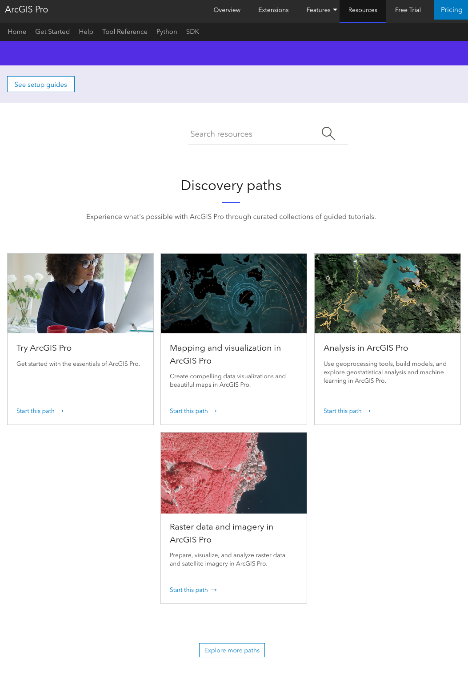

- #procesar
- Detalles sobre la documentación del producto.
- Como herramienta de redacción de la documentación vamos a usar **Google Drive**. Para ello hemos creado un **Shared Drive** en el que crearemos las secciones de la estructura de la documentación.
- # Structure
	- Help or Resources, this is a frequently used alternate name for the Help system
	- Help Home or Resources Home will be the initial entry point of the help system. It will feature as few options as possible, illustrated with big blocks of images as in the picture below
		- #Referencia Esri ArcGIS Pro Home
		  collapsed:: true
			- {:height 599, :width 309}
		- Main sections should be:
			- **Getting Started:**
				- overview of SunnSaaS and what can be achieve with it, highest level of abstraction
				- small tutorial on the workflow of the system:
					- creation of a Project
					- creation of a small field Design and Optimization, quick overview of the main datasets but without entering into any details at Property level, using default settings but in the ones that makes for the smallest field possible
						- Review of results, lowest level of detail, commenting only the purpose of the output's sections, not commenting individual Property results
					- creation of a very simple Energy Yield assessment example, again using the default Property values and without entering details at Property level. Change only default values to allow for the fastest processing time
						- Review of results, lowest level of detail, commenting only the purpose of output's sections, not commenting individual Property results
			- **How to ...?:**
				- This is the main FAQ section. For example, extensive tutorials on the critical topic on how to use Excel to configure and structure meteorological data and the like.
			- **Reference:**
				- This is where we go into details. Extensive information regarding every single Property for each use case. Not meant to be read sequentially, but as an interconnected graph of concepts, as a glossary.
			- **API:**
				- A future reference for software developers who want to interconnect to our services. This is not going to be done by now, but it should contain:
					- its own **Getting Started** section with at least two common programming languages examples, like Python (used a lot in data science and engineering) and JavaScript. Nice to have will be also R, but I'm not fluent with it;
					- its own **Tutorials** to perform interesting tasks, like feeding the system with meteo data automatically;
					- its own full **Reference**, detailing each API entry.
					- #Referencia A great example of API documentation can be found here: [Mapbox API documentation](https://docs.mapbox.com/api/overview/)